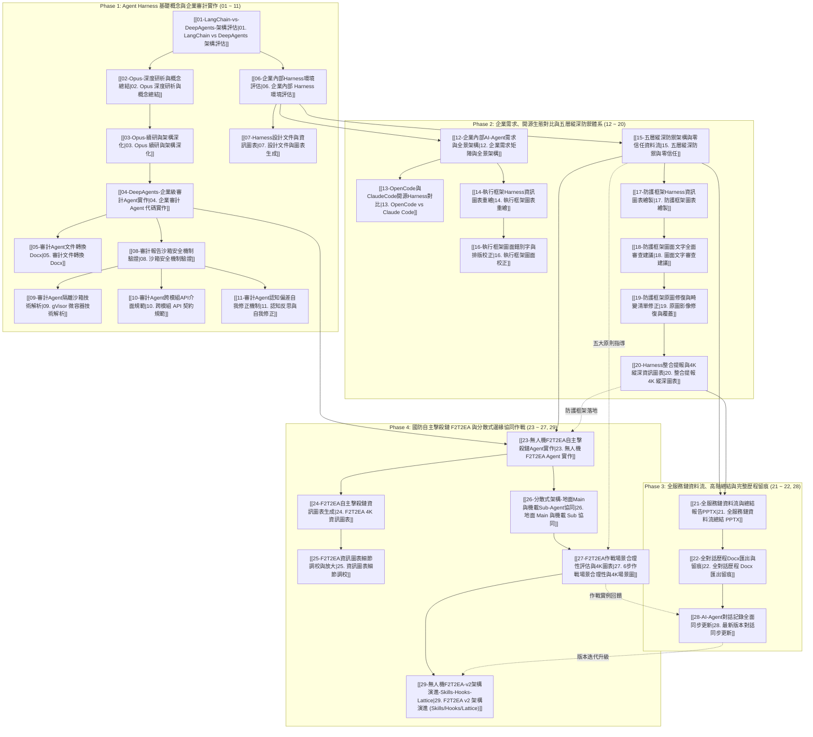

# AI Agent Framework 知識圖譜與全系列對話歷程總覽

- **建立日期**：`2026-09-18`
- **對話主題全景**：完整收錄《AI Agent Framework Analysis Report》共計 28 輪對話之全歷程演進
- **知識庫模組根目錄**：`D:\Obsidian\MyVault\Harness\AI Agent Framework Analysis Report\`
- **多媒體資產目錄**：`D:\Obsidian\MyVault\Harness\AI Agent Framework Analysis Report\assets\`

---

## 一、 全體系知識圖譜 (Comprehensive Knowledge Graph)

本知識庫將 28 輪對話之深入研析與工程實作，提煉為四大演進階段，彼此緊密互聯，形成完整的技術閉環：

---

## 二、 29 篇專題筆記核心導航矩陣 (Navigation Matrix)

| 輪次 | 專題筆記檔案 | 所屬演進階段 | 核心關鍵主題 | 技術交付成果 |
| :---: | :--- | :--- | :--- | :--- |
| **01** | [[01-LangChain-vs-DeepAgents-架構評估]] | Phase 1 | LangChain, DeepAgents, 治理架構 | 架構選型與治理評估報告 |
| **02** | [[02-Opus-深度研析與概念總結]] | Phase 1 | Opus研析, 虛擬檔案系統, 狀態持久化 | 核心概念提煉與機制總結 |
| **03** | [[03-Opus-續研與架構深化]] | Phase 1 | 任務規劃, 動態子代理人, 長效記憶 | 複雜架構解耦分析 |
| **04** | [[04-DeepAgents-企業級審計Agent實作]] | Phase 1 | 實體代碼, enterprise_audit_agent, 沙箱 | `enterprise_audit_agent.py` 實體源碼 |
| **05** | [[05-審計Agent文件轉換Docx]] | Phase 1 | Docx生成, 格式排版, 歷程留痕 | `Deep Agents.docx` 設計規格 |
| **06** | [[06-企業內部Harness環境評估]] | Phase 1 | 開箱即用 vs 客製化, 武器 vs 行政 | 雙軌 Harness 評估架構與五大原則 |
| **07** | [[07-Harness設計文件與資訊圖表]] | Phase 1 | NanoBananaPro, 架構堆疊, 評估矩陣 | `設計文件.docx` 與專業圖表 |
| **08** | [[08-審計報告沙箱安全機制驗證]] | Phase 1 | audit_report.md, 沙箱邊界, 最小權限 | 沙箱安全機制技術論證 |
| **09** | [[09-審計Agent隔離沙箱技術解析]] | Phase 1 | gVisor, 微容器, AST10, 致命三要素 | 系統呼叫層隔離與破除致命三要素 |
| **10** | [[10-審計Agent跨模組API介面規範]] | Phase 1 | 契約設計, 輸入驗證, PydanticSchema | 跨模組安全通訊契約標準 |
| **11** | [[11-審計Agent認知偏差自我修正機制]] | Phase 1 | 認知反思, 自我修正, 幻覺抑制, Reflection | 多步評估與自我回饋迴路 |
| **12** | [[12-企業內部AI-Agent需求與全景架構]] | Phase 2 | 需求架構, 痛點分析, 縱深藍圖 | 企業三層需求分析矩陣 |
| **13** | [[13-OpenCode與ClaudeCode開源Harness對比]] | Phase 2 | OpenCode, ClaudeCode, CLI控制 | 開源社群 Harness 成熟度評估 |
| **14** | [[14-執行框架Harness資訊圖表重繪]] | Phase 2 | 執行框架, NanoBananaPro, 流程優化 | 高對比執行框架資訊圖表 |
| **15** | [[15-五層縱深防禦架構與零信任資料流]] | Phase 2 | 五層縱深, 模型分層, 資料分級, 零信任 | 零信任防禦架構藍圖 |
| **16** | [[16-執行框架圖面錯別字與排版校正]] | Phase 2 | 圖面審查, 錯別字校正, 繁體標準 | 像素座標級修復清單 |
| **17** | [[17-防護框架Harness資訊圖表繪製]] | Phase 2 | 防護框架, PQC, DLP, Guardrails, SOC | 對稱防護框架資訊圖表 |
| **18** | [[18-防護框架圖面文字全面審查建議]] | Phase 2 | 文字審查, 筆畫修復, 國防術語標準 | 國防資安用語修正對照表 |
| **19** | [[19-防護框架原圖修復與畸變清單修正]] | Phase 2 | 原圖修復, 微軟正黑體, 向量覆蓋 | 原圖無損修復交付 |
| **20** | [[20-Harness整合提報與4K縱深資訊圖表]] | Phase 2 | 4K圖表, 整合提報, 微軟正黑體, 銳利度 | 4K UHD 縱深防護資訊圖表 |
| **21** | [[21-全服務鏈資料流與總結報告PPTX]] | Phase 3 | 五大原則, 總結報告, 國際標準, Roadmap | `總結報告.pptx` (11頁高階簡報) |
| **22** | [[22-全對話歷程Docx匯出與留痕]] | Phase 3 | 對話留痕, Docx自動化, 稽核軌跡 | `AI Agent Framework Analysis Report.docx` |
| **23** | [[23-無人機F2T2EA自主擊殺鏈Agent實作]] | Phase 4 | F2T2EA, COP, MCP, Anduril_Lattice, BDA | 完整可執行擊殺鏈 Agent 源碼 |
| **24** | [[24-F2T2EA自主擊殺鏈資訊圖表生成]] | Phase 4 | F2T2EA圖表, 閉環作戰, 4K海報 | 擊殺鏈戰術資訊圖表 |
| **25** | [[25-F2T2EA資訊圖表細節調校與放大]] | Phase 4 | 視覺優化, 字體放大, 排版修復 | 標籤重繪與文字強化圖表 |
| **26** | [[26-分散式架構-地面Main與機載Sub-Agent協同]] | Phase 4 | 分散式協同, 地面Main, 機載Sub, 頻寬優化 | 邊緣端特徵回傳與時空融合機制 |
| **27** | [[27-F2T2EA作戰場景合理性評估與4K圖表]] | Phase 4 | 6步場景論證, Jetson Orin NX, Gemma 31B, MCP | 4K 作戰場景圖與可行性論證 |
| **28** | [[28-AI-Agent對話記錄全面同步更新]] | Phase 3 | 最新同步, 雙版本留痕, 全程留痕 | `...latest.docx` 與知識庫雙向同步 |
| **29** | [[29-無人機F2T2EA-v2架構演進-Skills-Hooks-Lattice]] | Phase 4 | F2T2EA_v2, Skills, Hooks, Lattice, MUM-T | `v2/` 完整實作、AAR報告與4K圖表 |

---

## 三、 深度技術專題橫向研析 (Deep Architectural Insights)

### 專題 1：Harness 架構的雙軌選型哲學 (Dual-Track Selection)
在 [[06-企業內部Harness環境評估]] 與 [[21-全服務鏈資料流與總結報告PPTX]] 中確立：
* **行政庶務型 Agent**：追求快速整合、通用 API 介接與辦公自動化。應選用**開箱即用 Harness**（如 OpenCode、標準 LangChain Agent），降低開發門檻與維護成本。
* **國防武器與工控型 Agent**：追求狀態嚴格受控、不可反悔性與實體環境安全。必須採用 **LangChain DeepAgents 客製化 Harness**，透過強型態狀態機（StateGraph）、虛擬沙箱隔離 ([[08-審計報告沙箱安全機制驗證]]) 及斷路器（Circuit Breaker），確保 Agent 不產生目標漂移或不可控動作。

### 專題 2：五大資安鐵律與五層縱深防禦體系 (Defense-in-Depth)
自 [[15-五層縱深防禦架構與零信任資料流]] 提出，並貫穿至 [[20-Harness整合提報與4K縱深資訊圖表]] 與 [[27-F2T2EA作戰場景合理性評估與4K圖表]]：
1. **模型分層**：公網通用基礎模型 ➔ 地端微調領域模型 ➔ 戰術邊緣嵌入式極致模型。
2. **資料分級**：嚴格落實 DISA IL 1~6 及國防安全標籤，資料主動決定傳輸與運算邊界。
3. **單一閘道**：API / Control Gateway 統一收斂南北向與東西向所有通訊流量。
4. **層層防護**：入向脫敏 ➔ 提示詞過濾 ➔ 狀態機約束 ➔ 微容器沙箱 ➔ 出向過濾 ➔ 實體單向光閘 (Data Diode)。
5. **全程留痕**：8 大核心審計欄位入庫，秒級連動 SOC 威脅情報與 SIEM 聯防。

### 專題 3：現代無人機 F2T2EA 擊殺鏈與美軍 JADC2 戰法對接
在 [[23-無人機F2T2EA自主擊殺鏈Agent實作]]、[[26-分散式架構-地面Main與機載Sub-Agent協同]] 與 [[27-F2T2EA作戰場景合理性評估與4K圖表]] 中構建：
* **邊緣偵察 (Edge ISR)**：利用無人機搭載 NVIDIA Jetson Orin NX (100 TOPS) 運行光電 (EO) 與紅外 (IR) 雙感測 Sub-agent，僅回傳目標特徵向量，解決前線頻寬瓶頸（從 50Mbps 壓降至 <50kbps）。
* **地面指管決策 (Ground C2)**：地面戰術指揮車部署私有化開源大模型（Gemma 4 31B），負責多源感測時空對齊並生成即時 COP 圖資。
* **標準協定對接成熟生態**：主 Agent 透過 **MCP（Model Context Protocol）** 標準契約調用 Anduril Lattice Menace-T 戰術引擎，生成 3 組作戰行動方案 (COA)。
* **零信任資安阻斷**：主 Agent 嘗試跨級調閱戰區戰略相位陣列雷達時，被零信任資安閘道（ABAC）即時攔截並回傳 `403 Forbidden`，防止 Agent 幻覺越權。
* **去中心化動態通訊**：所有空中載具、地面車輛與指管伺服器，全數以 **Tactical MANET Mesh 戰術無線隨意網路** 進行高抗干擾、動態繞徑之加密資料傳輸。

---

## 四、 核心多媒體資產庫 (Core Multimedia & Infographics)

本專案所有高階資訊圖表均已保存至本知識庫專屬資產目錄 `assets/`：

| 圖表檔案 | 規格與解析度 | 對應專題筆記 | 預覽與鏈結 |
| :--- | :--- | :--- | :--- |
| **4K 作戰場景圖** | 3840 x 2160 (16:9 4K) | [[27-F2T2EA作戰場景合理性評估與4K圖表]] | ![[uav_f2t2ea_scenario_infographic_4k.jpg]] |
| **4K 擊殺鏈資訊圖** | 3840 x 2160 (16:9 4K) | [[24-F2T2EA自主擊殺鏈資訊圖表生成]] | ![[uav_f2t2ea_killchain_infographic_4k.jpg]] |
| **4K 防護框架圖** | 3840 x 2160 (16:9 4K) | [[20-Harness整合提報與4K縱深資訊圖表]] | ![[guard_harness_infographic_4k.jpg]] |
| **架構堆疊圖** | 寬螢幕高清 | [[07-Harness設計文件與資訊圖表]] | ![[arch_stack_infographic.jpg]] |
| **評估矩陣圖** | 寬螢幕高清 | [[07-Harness設計文件與資訊圖表]] | ![[eval_matrix_infographic.jpg]] |
| **工作流圖表** | 寬螢幕高清 | [[14-執行框架Harness資訊圖表重繪]] | ![[workflow_harness_infographic.jpg]] |

---

## 五、 外部文檔交付與留痕目錄

* **正式總結簡報**：[`D:\JavaDO\總結報告.pptx`](file:///D:/JavaDO/總結報告.pptx) *(16:9 寬螢幕 11 頁高階科技簡報)*
* **最新對話留痕文檔**：[`D:\JavaDO\對話紀錄\AI Agent Framework Analysis Report_latest.docx`](file:///D:/JavaDO/對話紀錄/AI%20Agent%20Framework%20Analysis%20Report_latest.docx) *(約 3.54 MB)*
* **首版對話留痕文檔**：[`D:\JavaDO\對話紀錄\AI Agent Framework Analysis Report.docx`](file:///D:/JavaDO/對話紀錄/AI%20Agent%20Framework%20Analysis%20Report.docx) *(約 3.54 MB)*
* **服務鏈總結報告**：[`D:\JavaDO\對話紀錄\AI Service Chain Summary Report.docx`](file:///D:/JavaDO/對話紀錄/AI%20Service%20Chain%20Summary%20Report.docx)
* **設計規格文件**：[`D:\JavaDO\Harness\Deep Agents\設計文件.docx`](file:///D:/JavaDO/Harness/Deep%20Agents/設計文件.docx)
* **擊殺鏈實作源碼**：[`D:\JavaDO\Harness\Deep Agents\f2t2ea_killchain_agent.py`](file:///D:/JavaDO/Harness/Deep%20Agents/f2t2ea_killchain_agent.py)
* **企業審計實作源碼**：[`D:\JavaDO\Harness\Deep Agents\enterprise_audit_agent.py`](file:///D:/JavaDO/Harness/Deep%20Agents/enterprise_audit_agent.py)
