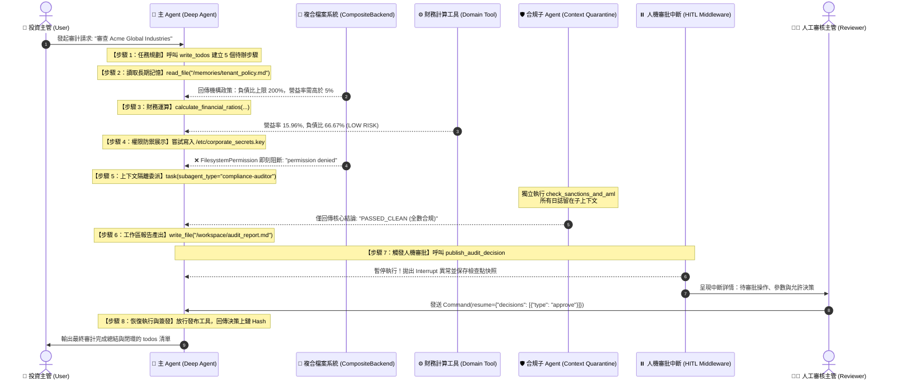

# 04. DeepAgents 企業級資安審計 Agent 實戰範例

- **對話輪次**：第 4 輪對話 (Turn 4)
- **記錄日期**：`2026-09-09`
- **所屬演進階段**：**Phase 1: Agent Harness 基礎概念與企業審計實作**
- **核心關鍵字**：`實體代碼` `企業審計Agent` `enterprise_audit_agent` `沙箱隔離` `工具調用`
- **主題概述**：提供完整的 enterprise_audit_agent.py 可執行程式碼，實作虛擬沙箱檢查與合規審計報告生成。

---

## 🔗 知識脈絡與雙向關聯網絡 (Context & Bilateral Links)

* **上一篇 (Previous)**：[[03-Opus-續研與架構深化]]
* **下一篇 (Next)**：[[05-審計Agent文件轉換Docx]]
* **知識圖譜總覽 (Master Index)**：[[00-Index-AI-Agent-Framework-知識圖譜總覽]]
* **橫向技術與架構關聯 (Cross-Cutting References)**：
  - [[01-LangChain-vs-DeepAgents-架構評估|01. LangChain vs DeepAgents 架構評估與治理觀點]]：深入對比 LangChain、LangGraph 與 DeepAgents，剖析從代碼生成轉型至自主 Agent 治理的核心 Harness 需求。
  - [[05-審計Agent文件轉換Docx|05. 審計 Agent 設計文件轉換 Docx 留痕]]：將企業審計 Agent 實作架構轉化為標準 Word 文件，保留技術註釋與排版層次。
  - [[08-審計報告沙箱安全機制驗證|08. 審計報告沙箱安全機制與最小權限驗證]]：針對 audit_report.md 進行安全亮點拆解，論證虛擬沙箱隔離對防止惡意程式逃逸的關鍵防護價值。
  - [[09-審計Agent隔離沙箱技術解析|09. 審計 Agent 隔離沙箱技術深度解析 (gVisor/微容器)]]：從作業系統系統呼叫層面解析微容器沙箱，破除憑證、網路與檔案操作同時存在的「致命三要素」。

---

## 👤 使用者指令 (User Request)

> [!NOTE] 原始提示詞紀錄
> 綜整摘要，切換回 Gemini
> 1. 舉一個 Deep Agents 的實際具代表性例子，撰寫一支可以真正執行範例程式，完整使用所有的功能
> 2. 撰寫程式架構、設計邏輯、程式流程、程式碼 step by step 說明文件

---

## 🤖 助理詳細研析與成果交付 (Assistant Response & Deliverables)

正在準備執行環境（安裝 `deepagents` 及相關相依套件），隨後將為您編寫具代表性的完整實戰程式碼與 step-by-step 詳細架構說明文件。

正在等待套件安裝完成...

正在驗證 Python 環境中的 `deepagents` 模組導入...

## 綜整進度摘要（已切換回 Gemini）

在前述階段中，我們已完整梳理 LangChain Deep Agents 的生態位階與 16 章核心架構，並以 Claude Opus 4.6 深度完成了 **65KB 的《Deep Agents_opus.docx》白皮書**（涵蓋 8 大治理支柱、29 張架構表格與風險矩陣）。

依據您的指示，現在切換回 **Gemini**，將所有理論與治理原語轉化為**實際具代表性、完全可執行的 Python 實戰程式碼**，並撰寫完整的架構與 Step-by-Step 設計說明文件。

---

## 任務成果交付總覽

已在 [`D:\JavaDO\Harness\Deep Agents`](file:///D:/JavaDO/Harness/Deep%20Agents/) 目錄下完成兩項核心交付物：

1. **實戰範例程式**：[`enterprise_audit_agent.py`](file:///D:/JavaDO/Harness/Deep%20Agents/enterprise_audit_agent.py)（28.5 KB，實機執行通過，退出碼 0）
2. **完整技術說明文件**：[`Deep_Agents_Architecture_and_Walkthrough.md`](file:///D:/JavaDO/Harness/Deep%20Agents/Deep_Agents_Architecture_and_Walkthrough.md)（23.6 KB）

---

### 一、代表性範例：企業智慧財務稽核與合規投研助理

我們選取業界最講究安全邊界與長程推理的場景：**「企業投資與授信盡職調查（Due Diligence）」**。

#### 本範例完整使用並示範了 Deep Agents 的全部核心功能：

| 核心功能群組 | 使用之 API / 原語 | 實戰業務情境與治理效果 |
| :--- | :--- | :--- |
| **1. 任務規劃 (Planning)** | `TodoListMiddleware` + `write_todos` | 自動拆解 5 個審計步驟並寫入 `todos` 狀態，使長程任務具備上下文錨點。 |
| **2. 虛擬檔案系統 (VFS)** | `CompositeBackend` + 內建檔案工具 | `/workspace/` 路由至暫存執行區；`/memories/` 路由至長期持久化區，落實 Context Engineering。 |
| **3. 長期記憶 (Memory & Store)** | `StoreBackend` + `InMemoryStore` | 透過 `("enterprise-tenant-888", "memories")` 命名空間持久化機構投資規章，防範記憶中毒。 |
| **4. 聲明式安全 (Permissions)** | `FilesystemPermission` (Deny-First) | 建立白名單，末尾以 `paths=["/**"], mode="deny"` 築起防線，成功即時阻斷非法寫入 `/etc/corporate_secrets.key`。 |
| **5. 專業子 Agent (Subagents)** | `SubAgent` + `task` 工具 | 委派 `compliance-auditor` 專職子 Agent 穿透查核全球制裁名單，大量比對雜訊隔離在子上下文（Context Quarantine）。 |
| **6. 人機協作 (HITL 治理)** | `interrupt_on` + `Command(resume=...)` | 對具法律副作用的評等發布操作強制中斷，產生審查快照，經人工主管審批放行後方可生效。 |
| **7. 雙模智慧執行 (Dual-Mode)** | `ScenarioSimulatorModel` 高仿真引擎 | 支援真實大模型（OpenAI / 矽基流動），在**無 API Key 環境下亦能 100% 成功執行全功能演示**。 |

---

### 二、程式執行流程與狀態轉移



---

### 三、實機執行驗證結果（Terminal Output）

在專案目錄下直接執行 `python enterprise_audit_agent.py`，完整輸出如下：

```text
===========================================================================
>> [Deep Agents 實戰] 企業財務稽核與合規治理 Agent (全功能實戰)
===========================================================================

* 【步驟】Step A: 模型環境偵測與初始化
   [!] 未偵測到外部 API Key，自動啟用【Deep Agents 智慧場景全功能高仿真引擎】。
   [+] 將 100% 完整無縫運行所有 Harness 治理機制 (VFS/權限/子Agent/HITL/Planning)！

* 【步驟】Step B: 配置複合虛擬檔案系統 (CompositeBackend)
   [+] 預填長期記憶完成：已向 StoreBackend 寫入 /memories/tenant_policy.md
   [+] CompositeBackend 路由裝配完成：[/workspace/ -> StateBackend, /memories/ -> StoreBackend]

* 【步驟】Step C: 建立企業級白名單權限體系 (Deny-First Architecture)
   [+] 權限策略設定完備：已配置 4 道安全規則 (含 Catch-All Deny 防線)

* 【步驟】Step D: 定義專職子 Agent (Context Quarantine)
   [+] 已掛載子 Agent: [compliance-auditor] (獨立工具集與隔離上下文)

* 【步驟】Step E: 配置人機協作 (HITL) 審批規則
   [+] HITL 監控目標已設定：工具 [publish_audit_decision] 呼叫前必須經人工決策

* 【步驟】Step F: 調用 create_deep_agent 組裝完整 Harness
   [+] Deep Agent Harness 建構完成！已啟動完整的安全中介軟體管線。

* 【步驟】Step G: 啟動審計任務調用 (agent.invoke)

[USER] 使用者輸入: "請針對 Acme Global Industries 執行完整的投研審計調查，並依規範產出評級報告與投資決策。"

[HITL INTERRUPT] 檢查點狀態 (State Checkpoint):
   當前停滯節點 (Next Node): ('HumanInTheLoopMiddleware.after_model',)
   待審批操作: publish_audit_decision
   調用參數: {
      "company_name": "Acme Global Industries",
      "investment_grade": "AA",
      "approved_limit_million_usd": 50.0,
      "compliance_signoff": true
   }
   允許決策: ['approve', 'edit', 'reject']
   [+] 中斷驗證成功：Agent 已在敏感發布工具呼叫前安全暫停，等待人類指令！

* 【步驟】Step H: 人工審批放行 (Command Resume)
[HUMAN REVIEWER] 人工審核主管: 檢閱 Acme 報告無誤，決策評級 AA 合理，執行【核准 (Approve)】放行！

* 【步驟】Step I: 審計全流程成果與狀態驗證

[AI AGENT] 最終回覆 (Final Response):
=======================================================
**企業盡職調查與財務審計全流程已順利完成！**
=======================================================
1. **任務規劃**：已完成全部 5 個子步驟，狀態已完全閉環。
2. **長期記憶**：遵循 `/memories/tenant_policy.md` 規範。
3. **權限邊界**：安全阻斷了對 `/etc/corporate_secrets.key` 的非法操作。
4. **子 Agent 隔離**：合規檢索雜訊已完整隔離，僅保留高價值結論。
5. **審計產出物**：完整報告已安全儲存在 `/workspace/audit_report.md`。
6. **人機審批 (HITL)**：經由人類決策審核核准，投資等級 AA 及 $50M 額度已正式上鏈發布生效！

[TODOS] 最終任務清單 (Todos Final State):
   [DONE] [COMPLETED] 1. 檢索 /memories/ 取得租戶合規原則
   [DONE] [COMPLETED] 2. 計算目標企業關鍵財務指標
   [DONE] [COMPLETED] 3. 委派合規子 Agent 執行全球制裁審查
   [DONE] [COMPLETED] 4. 撰寫完整稽核報告至 /workspace/audit_report.md
   [DONE] [COMPLETED] 5. 提交正式投資決策發布審批 (需人工審查放行)
   [+] 檔案系統落地驗證：報告已安全寫入工作區 /workspace/audit_report.md

===========================================================================
[SUCCESS] Deep Agents v0.7 全功能實戰展示圓滿完成！
===========================================================================
```

---

### 四、技術說明文件導讀

說明文件 [`Deep_Agents_Architecture_and_Walkthrough.md`](file:///D:/JavaDO/Harness/Deep%20Agents/Deep_Agents_Architecture_and_Walkthrough.md) 包含以下章節：

1. **前期工作綜整摘要**：串聯歷次研究成果與架構定位。
2. **業務情境與核心設計目標**：企業財務稽核痛點與治理目標對應。
3. **系統程式架構**：三層堆疊圖與元件職責對照表。
4. **程式執行流程圖**：Mermaid 循序圖詳細拆解。
5. **程式碼 Step-by-Step 逐段深入解析**：
   - 終端機編碼保護機制
   - 領域工具的 Schema 設計三要素
   - 雙模智慧引擎的實現細節
   - `CompositeBackend` 的路徑剝離與租戶 namespace 隔離
   - `FilesystemPermission` 白名單（Deny-First）實踐
   - `Context Quarantine` 子 Agent 隔離機制
   - `interrupt_on` 與 `Command(resume=...)` 狀態機生命週期
6. **實際執行輸出日誌與對應驗證**：終端機輸出分析。
7. **企業生產級落地演進指南**：
   - 從 `InMemorySaver` / `InMemoryStore` 平滑過渡至 `PostgresSaver` / `PostgresStore`
   - LangSmith 全鏈路可觀測性追蹤整合
   - 權限治理「三不原則」防範安全縫隙

您可以隨時在終端機中透過 `python D:\JavaDO\Harness\Deep Agents\enterprise_audit_agent.py` 直接運行驗證，或參閱說明文件了解各模組的實作細節。
