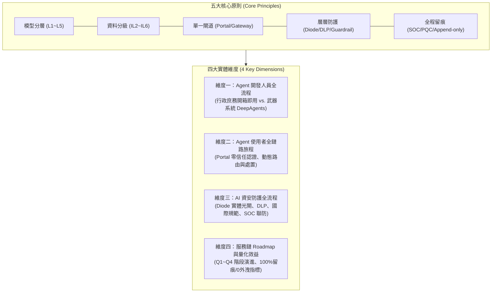

# 22. 全對話歷程審計留痕與 Docx 格式化匯出

- **對話輪次**：第 22 輪對話 (Turn 22)
- **記錄日期**：`2026-09-13`
- **所屬演進階段**：**Phase 3: 全服務鏈資料流、高階總結與完整歷程留痕**
- **核心關鍵字**：`對話留痕` `Docx匯出` `稽核軌跡` `完整歷程` `微軟正黑體`
- **主題概述**：實作全自動化 transcript 解析與 python-docx 渲染器，將全系列對話歷程匯出為標準報告。

---

## 🔗 知識脈絡與雙向關聯網絡 (Context & Bilateral Links)

* **上一篇 (Previous)**：[[21-全服務鏈資料流與總結報告PPTX]]
* **下一篇 (Next)**：[[23-無人機F2T2EA自主擊殺鏈Agent實作]]
* **知識圖譜總覽 (Master Index)**：[[00-Index-AI-Agent-Framework-知識圖譜總覽]]
* **橫向技術與架構關聯 (Cross-Cutting References)**：
  - [[21-全服務鏈資料流與總結報告PPTX|21. 全服務鏈資料流與五大原則高階簡報 (總結報告.pptx)]]：統整五大原則、Agent 開發者/使用者/資安三條鏈路工作流、AISVS 國際標準及四期建置 Roadmap，產出高階簡報。
  - [[23-無人機F2T2EA自主擊殺鏈Agent實作|23. 無人機 F2T2EA 自主擊殺鏈實戰 Agent 實作]]：完整展示利用 LangChain DeepAgents 構建 F2T2EA 擊殺鏈：COP 融合、MCP 叫起 Lattice、MITL 中斷與 BDA 報告。
  - [[28-AI-Agent對話記錄全面同步更新|28. AI Agent 全系列對話紀錄最新版本同步更新]]：即時執行自動化留痕管線，將 1~28 輪所有代碼、論證與 4K 資訊圖表無縫同步至最新 Docx 與 Obsidian 知識庫。

---

## 👤 使用者指令 (User Request)

> [!NOTE] 原始提示詞紀錄
> 將這個對話的所有內容寫到以對話名稱命名的 docx 中，將 docx 儲存到 "對話紀錄" 資料夾下

---

## 🤖 助理詳細研析與成果交付 (Assistant Response & Deliverables)

已為您完成深度研析並產出兩大核心成果檔案：

1. **高階總結簡報**：[`總結報告.pptx`](file:///d:/JavaDO/總結報告.pptx)（儲存於 `D:\JavaDO\`）
2. **完整對話紀錄彙編**：[`AI Agent Framework Analysis Report.docx`](file:///d:/JavaDO/對話紀錄/AI%20Agent%20Framework%20Analysis%20Report.docx)（儲存於 `D:\JavaDO\對話紀錄\`）

---

### 成果一：`總結報告.pptx` 核心架構與內容研析

本份簡報採 **16:9 寬螢幕**、**微軟正黑體** 與 **高階資安科技白／海軍藍** 配色設計，嚴格貫穿五大治理原則：**「模型分層、資料分級、單一閘道、層層防護、全程留痕」**，共計 11 頁，完整涵蓋四大維度：

#### 投影片目錄結構與內容摘要：

* **Slide 1｜封面**：AI 服務鏈全生命週期治理與安全防護總結研析報告。
* **Slide 2｜核心原則**：五大防護原則（模型分層、資料分級、單一閘道、層層防護、全程留痕）頂層設計。
* **Slide 3｜架構全景**：前端入口（Portal）、門禁樞紐（Gateway）、隨行保全（Harness 執行／防護框架）、五層縱深能力（L1~L5）與實體邊界（Air-gap／Diode／VPC）全服務鏈拓撲。
* **Slide 4｜4K 視覺全景**：完整內嵌無錯別字、高解析度之 `guard_harness_infographic_4k.jpg` 資訊圖表。
* **Slide 5｜維度一：Agent 開發人員全生命週期流程與管控軌跡**：
  * **需求與選型**：依行政／作戰屬性劃分；宣告工具契約（OpenAPI／MCP）與安全邊界。
  * **靜態檢核**：SAST 弱點掃描、開源套件供應鏈檢查、Hardcoded 金鑰自動審查。
  * **隔離沙箱動態測試**：於 L1~L3 容器／隔絕環境執行合成測資注入、抗提示越獄與對抗性樣本攻擊。
  * **評測合規與簽核發布**：產出 AISVS 評測卡，經雙重數位簽章核准後註冊至 Registry，Gateway 即時同步路由規則。
  * **開發軌跡**：GitOps 代碼提交、沙箱鏡像雜湊、測試報告全鏈路存證，保證 100% 可復現性。
* **Slide 6｜專題對比：行政庶務 Agent vs. 武器系統 Agent**：
  * **行政庶務**：選用**開箱即用型 Harness**；L1 標準容器隔離；標準辦公工具唯讀調用；HITL 事後審查；強調個資 DLP。
  * **武器系統**：選用 **LangChain DeepAgents 客製化狀態機 Harness**；L3 實體隔離硬體安全沙箱（物理斷網 Air-gap）；武器專用匯流排（CAN/MIL-STD-1553）嚴格數值熔斷；關鍵節點強制事前雙人密鑰放行（Dual-Control）；對齊軍規抗干擾與零幻覺確定性要求。
* **Slide 7｜維度二：Agent 使用者全流程操作、動態管控與軌跡紀錄**：
  * ① Portal 統一入口 PKI/卡片多因子鑑別 ➔ ② 需求範本與部門知識庫選集綁定 ➔ ③ Control Gateway 驗證短時效 JWT 並按資料等級路由 ➔ ④ 雙向 Guardrail 實時過濾注入與輸出脫敏 ➔ ⑤ 交付確定性結果並推送 SOC 集中留痕。
* **Slide 8｜維度三：AI 資安防護全鏈路工作流：從單閘 Diode 到 SOC 監控**：
  * **Diode 單向光閘**：實體單向傳輸，阻斷反向滲透；
  * **DLP 與資料治理**：敏感座標、軍武代號、個人隱私正則偵測與自動遮蔽；
  * **Guardrail 處置矩陣**：放行 (Pass)、脫敏 (Mask)、改寫 (Rewrite)、攔截 (Block)、告警 (Alert) 五大動作，延遲 < 50ms；
  * **國際規範貫通**：ISO 42001 (AIMS)、NIST AI RMF 1.0、OWASP Top 10 for LLM/Agents、MITRE ATLAS 紅隊演練；
  * **SOC 聯防**：SIEM 行為關聯分析，異常呼叫 10 秒內阻斷 Token 並銷毀沙箱。
* **Slide 9｜國防資料四級分級與落點紅線授權矩陣**：
  * **IL2（公開資料）**：允許受控環境下呼叫外部大模型；
  * **IL4（公務秘密）**：院內地端模型處理，嚴禁直連公有雲 Commercial LLM；
  * **IL5（核心營業秘密）**：專屬研發獨立運算叢集，Diode 單向光閘交換，嚴禁原始碼脫離實體圍籬；
  * **IL6（國家極機密）**：封閉專用硬體主機，物理斷網（Air-gap），關機即刻擦除記憶體。
* **Slide 10｜維度四：AI 服務鏈推動 Roadmap 與建置期程規劃**：
  * **階段一（Q1）**：Portal/Gateway 基線部署、基礎護欄建立、ISO 42001 制度導入、行政庶務 Agent 試點。
  * **階段二（Q2）**：Diode 光閘對接、L0~L2 動態容器沙箱、PQC 後量子加密升級、技術文件 Agent 上線。
  * **階段三（Q3）**：LangChain DeepAgents 狀態機導入、L3 實體隔離沙箱、HITL 雙人密鑰放行、武器代碼分析 Agent。
  * **階段四（Q4）**：全院 SOC/SIEM 秒級聯防、AI 評測實驗室常態化運行、全生態納管。
* **Slide 11｜量化效益評估與未來展望**：
  * **三大核心指標**：100% 全鏈路呼叫留痕、0 起機密資料跨線外洩、< 50ms 護欄實時決策延遲。
  * **作業與研發效能**：行政庶務提效 60%、武器研發輔助代碼產出提速 40%、打破院內資料孤島。
  * **戰略自主可控**：掌握 Harness 執行與防護原始碼，擺脫單一模型廠商綁定，平戰結合韌性切換。

---

### 成果二：`AI Agent Framework Analysis Report.docx` 對話紀錄彙編

* **儲存位置**：[`D:\JavaDO\對話紀錄\AI Agent Framework Analysis Report.docx`](file:///d:/JavaDO/對話紀錄/AI%20Agent%20Framework%20Analysis%20Report.docx)
* **規格與樣式**：
  * 命名取自系統原生會話主題 `AI Agent Framework Analysis Report`；
  * 完整收錄本會話共 **22 輪對話** 之所有使用者需求指令與系統研析技術回覆；
  * 配備標準封面橫幅、會話識別碼中繼資料表、User 指令高光卡片框、微軟正黑體排版、格式化代碼區塊與對比表格，便於院內存檔、技術交接與專案管理查閱。
