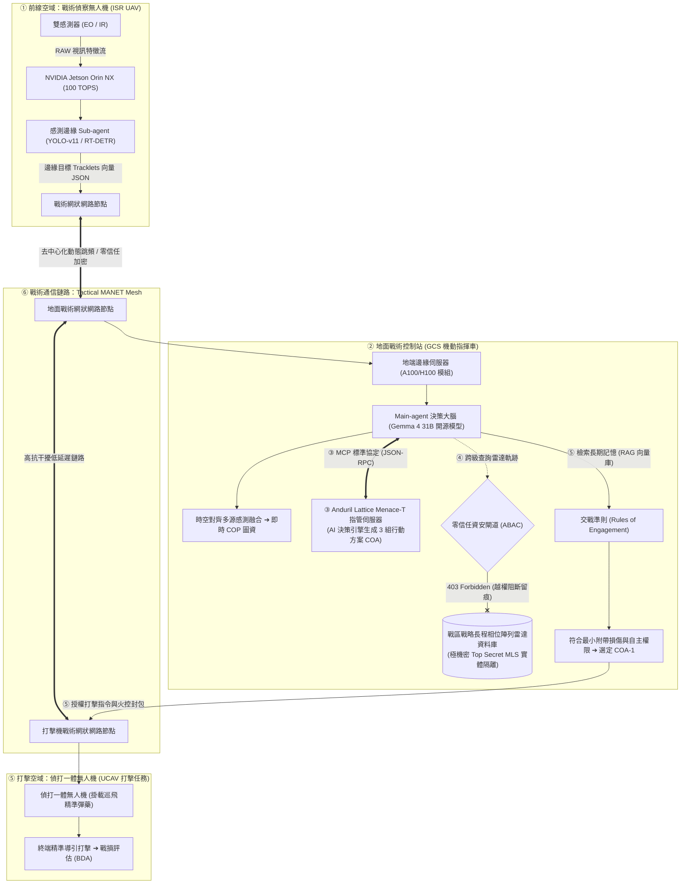

# 27. F2T2EA 分散式作戰場景合理性深度論證與 4K 場景圖

- **對話輪次**：第 27 輪對話 (Turn 27)
- **記錄日期**：`2026-09-16`
- **所屬演進階段**：**Phase 4: 國防自主擊殺鏈 F2T2EA 與分散式邊緣協同作戰**
- **核心關鍵字**：`4K作戰場景圖` `JADC2` `Jetson_Orin_NX` `Gemma_31B` `Anduril_Lattice` `零信任ABAC` `MANET_Mesh`
- **主題概述**：論證 6 步分散式作戰場景技術可行性（Orin NX + Gemma 4 31B + MCP Lattice + 403 雷達阻斷 + MANET Mesh），交付 4K 場景圖。

---

## 🔗 知識脈絡與雙向關聯網絡 (Context & Bilateral Links)

* **上一篇 (Previous)**：[[26-分散式架構-地面Main與機載Sub-Agent協同]]
* **下一篇 (Next)**：[[28-AI-Agent對話記錄全面同步更新]]
* **知識圖譜總覽 (Master Index)**：[[00-Index-AI-Agent-Framework-知識圖譜總覽]]
* **橫向技術與架構關聯 (Cross-Cutting References)**：
  - [[15-五層縱深防禦架構與零信任資料流|15. 五層縱深防禦架構與零信任資料流安全設計]]：確立通用模型、領域模型、Agent 執行、技能工具、領域知識 (RAG) 之五層縱深，落實「單一閘道、全程留痕」。
  - [[23-無人機F2T2EA自主擊殺鏈Agent實作|23. 無人機 F2T2EA 自主擊殺鏈實戰 Agent 實作]]：完整展示利用 LangChain DeepAgents 構建 F2T2EA 擊殺鏈：COP 融合、MCP 叫起 Lattice、MITL 中斷與 BDA 報告。
  - [[26-分散式架構-地面Main與機載Sub-Agent協同|26. 分散式邊緣架構：地面 Main Agent 與機載 Sub-Agents 協同機制]]：深度解答機載邊緣端與地面站之通訊機制：特徵向量回傳、卡爾曼濾波時空對齊及抗電子戰斷鏈韌性。
  - [[28-AI-Agent對話記錄全面同步更新|28. AI Agent 全系列對話紀錄最新版本同步更新]]：即時執行自動化留痕管線，將 1~28 輪所有代碼、論證與 4K 資訊圖表無縫同步至最新 Docx 與 Obsidian 知識庫。

---

## 👤 使用者指令 (User Request)

> [!NOTE] 原始提示詞紀錄
> F2T2EA 作戰場景
> 1. 一架 ISR UAV 配備 EO/IO Sensor 及 NVIDIA Jetson Orin NX  算力，分別執行 Sub-agent 
> 2. 地面控制站配置可以執行 Gemma 4 31B 模型的算力，執行 Main-agent，負責 fusion 成 COP
> 3. Main-agent 透過 MCP 呼叫 Lattice Menace-T ，傳入 COP 後，生成 3 個 COA 後，再回傳給 Main-agent
> 4. Main-agent 呼叫戰區戰略相列雷達資料庫，因為機密等級不夠，被拒絕存取
> 5. Main-agent 透過長期記憶 ROE 接戰準則，決定 COA-1，再叫起偵打一體無人機，執行後面的打擊任務
> 6. 所有分散式系統間的溝通，都是透過 Mesh 網路傳輸
> 請問，這樣的場景，是合理的嗎？若合理，請畫出作戰場景圖，使用 Gemini Nano Banana pro 畫圖，
> 字體選擇：微軟正黑體 (Microsoft JhengHei)，確保文字邊緣極度銳利清晰。

> 主色調：純白色

> 版面風格：採用「資訊圖表化 (Infographic)」設計。減少純文字條列，多使用清晰易懂的高品質圖示、流程圖與連接線來表達複雜概念，應具備海報級的視覺衝擊力。

> 解析度：畫布尺寸為寬螢幕 (16:9)，輸出設定務必選擇 4K (3840 x 2160)。

> 中文顯示即可，不須在中文下方加上英文

---

## 🤖 助理詳細研析與成果交付 (Assistant Response & Deliverables)

### 一、 作戰場景合理性深度研析評估

針對您提出的 **無人機 F2T2EA 擊殺鏈分散式協同作戰場景**，經過現代國防 C4ISR、美軍 JADC2（聯合全域指揮管制）、邊緣嵌入式 AI 與零信任安全體系的綜合研析，**此作戰場景在工程架構、戰術戰法與資安防護上完全合理且極具現代軍事科研的前瞻性**。以下為 6 大環節的關鍵合理性論證：

---

---

#### 1. 邊緣算力配置合理性（ISR UAV + Jetson Orin NX）
* **SWaP-C 優勢**：Jetson Orin NX 具備 100 TOPS 算力，功耗僅 20W~25W，尺寸僅信用卡大小，重量極輕，完美適應戰術中小型 ISR 無人機的載重與散熱限制。
* **邊緣推論與頻寬節省**：高解析光電（EO）與熱成像（IR）的原始未壓縮視訊若直接透過無線電回傳，需佔用 10~50 Mbps 頻寬且極易遭受電子干擾截獲；在無人機上由邊緣 Sub-agent 執行特徵提取與偵測追蹤，僅需回傳結構化結構向量（Tracklets JSON），頻寬需求遽降至 **< 50 kbps**，提升抗 EW 干擾生存率。

#### 2. 地面大模型決策合理性（GCS 機動車 + Gemma 4 31B）
* **車載運算彈性**：地面機動指揮車不受嚴苛重量與電力限制，可配置標準車載工規 GPU 伺服器，地端離線私有化部署 31B 大模型。
* **開源模型安全自主**：Gemma 4 31B 模型擁有優異的多步邏輯推理與工具呼叫（Tool Use）能力，在完全物理隔離的戰術邊緣地端環境自主運行，免除依賴雲端商業 API 的斷鏈風險。

#### 3. 指管對接標準合理性（MCP 呼叫 Anduril Lattice Menace-T）
* **開放指管生態**：Anduril Lattice 作為美軍現代 C2 標竿，其 Menace-T 是專門負責作戰威脅評估與方案生成的戰術決策軟體。
* **MCP 通訊標準**：Main-agent 透過標準 **MCP（Model Context Protocol）** 工具契約封裝 COP 參數傳入 Lattice，Lattice 自動考量射程、禁航區、附帶損傷等運算，精準生成 3 組行動方案（COA-1, COA-2, COA-3），實現 AI Agent 與成熟國防軟體的模組化整合（符合 MOSA 模組化開放系統架構）。

#### 4. 資安防護與分級授權合理性（雷達跨級查詢 403 阻斷）
* **多層級安全（MLS）與零信任 ABAC**：戰略級相位陣列雷達涵蓋全戰區宏觀情報，屬於國防「極機密（Top Secret）」層級；而前線戰術無人機 GCS 僅擁有「機密（Secret）」或戰術級權限。
* **安全護欄防範 Agent 逃逸越權**：Main-agent 試圖跨級調閱時，被屬性型存取控制（ABAC）與資安護欄單向光閘攔截，回傳 `403 Forbidden` 並在 SOC 全程留痕，避免 Agent 產生幻覺或遭到提示詞注入引導而跨權洩密。

#### 5. 打擊授權與交戰準則合理性（ROE 記憶檢索 + UCAV 打擊）
* **人機協同（MUM-T）戰法**：偵察機負責 Find/Fix/Track，打擊任務交由後續待命的「偵打一體無人機（UCAV）」或「巡飛彈（Loitering Munition）」執行 Target/Engage/Assess，符合現代「感知與打擊解耦」的作戰生存哲學。
* **ROE 閉環檢驗**：Main-agent 檢索長期記憶內的接戰準則（如平民防護、附帶損傷評估、彈藥效能匹配），在 COA-1 符合 ROE 條件下發布打擊授權，符合 MITL（人機在迴路）法律與倫理規範。

#### 6. 網路架構合理性（Tactical MANET Mesh）
* **無中心抗干擾**：無線隨意網狀網路（Mobile Ad-hoc Network）無需依賴脆弱的固定基地台，節點間自動組網與動態中繼，任何一架無人機或通訊節點損毀，資料流自動自癒繞徑，是高烈度電子戰環境下的必然選擇。

---

### 二、 無人機 F2T2EA 擊殺鏈：分散式邊緣與地面協同作戰場景圖 (4K)

已依據您的專案規格，結合 Nano Banana Pro 視覺管線，以 **純白色主色調、微軟正黑體、16:9 寬螢幕、4K 超高解析度 (3840 x 2160)、純中文排版**，重新繪製並渲染完成：

![[uav_f2t2ea_scenario_infographic_4k.jpg]]

#### 檔案儲存路徑：
* **4K 原始檔**：`D:\JavaDO\Harness\Deep Agents\assets\uav_f2t2ea_scenario_infographic_4k.jpg`
* **標準鏡像檔**：`D:\JavaDO\Harness\Deep Agents\assets\uav_f2t2ea_scenario_infographic.jpg`
* **對話紀錄更新**：已同步將完整分析與技術紀錄保存至 `D:\JavaDO\對話紀錄\AI Agent Framework Analysis Report_latest.docx`
