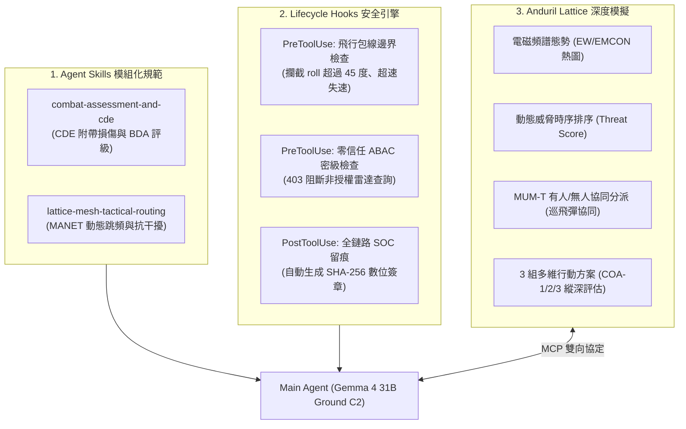
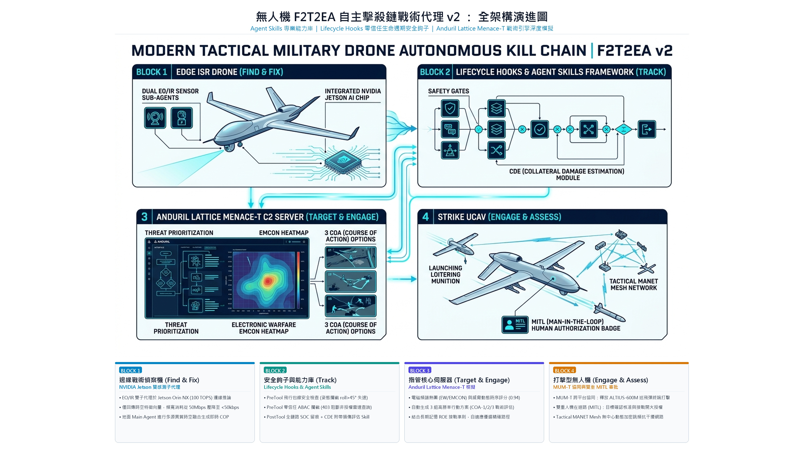

# 💬 Turn-29-UAV-F2T2EA-v2-Skills-Hooks-Lattice：完整對話紀錄留痕 (Dialogue Transcript)

> 本檔案完整收錄此模組所涵蓋之對話輪次（Turn [29]）的原始需求指令、技術研析歷程與交談細節。

---

# 第 29 輪對話紀錄 (Turn 29)

---
date: 2026-09-26
title: "29. 無人機 F2T2EA v2 架構演進：Skills、Hooks 與 Anduril Lattice 深度模擬"
phase: "Phase 4: 國防自主擊殺鏈 F2T2EA 與分散式邊緣協同作戰"
tags:
  - F2T2EA_v2
  - Agent_Skills
  - Lifecycle_Hooks
  - Anduril_Lattice
  - MUM_T
  - 邊緣計算
  - 資訊圖表4K
prev: "[[28-AI-Agent對話記錄全面同步更新]]"
next: "None"
related:
  - "[[23-無人機F2T2EA自主擊殺鏈Agent實作]]"
  - "[[26-分散式架構-地面Main與機載Sub-Agent協同]]"
  - "[[27-F2T2EA作戰場景合理性評估與4K圖表]]"
  - "[[00-Index-AI-Agent-Framework-知識圖譜總覽]]"
---

# 29. 無人機 F2T2EA v2 架構演進：Skills、Hooks 與 Anduril Lattice 深度模擬

- **對話輪次**：第 29 輪對話 (Turn 29)
- **記錄日期**：`2026-09-26`
- **所屬演進階段**：**Phase 4: 國防自主擊殺鏈 F2T2EA 與分散式邊緣協同作戰**
- **核心關鍵字**：`F2T2EA_v2` `Agent_Skills` `Lifecycle_Hooks` `Anduril_Lattice` `MUM_T` `邊緣計算` `資訊圖表4K`
- **主題概述**：保留原始 `uav_f2t2ea_killchain_agent.py`，建立全新 `v2` 獨立工程模組，導入 Agent Skills 標準目錄架構、生命週期安全 Hooks 攔截、Anduril Lattice Menace-T 深度戰術模擬（電磁頻譜、威脅排序、有人/無人協同 MUM-T），產出全鏈路執行日誌、AAR v2 報告與 4K 戰術資訊圖表。

---

## 🔗 知識脈絡與雙向關聯網絡 (Context & Bilateral Links)

* **上一篇 (Previous)**：[[28-AI-Agent對話記錄全面同步更新]]
* **下一篇 (Next)**：None
* **知識圖譜總覽 (Master Index)**：[[00-Index-AI-Agent-Framework-知識圖譜總覽]]
* **橫向技術與架構關聯 (Cross-Cutting References)**：
  - [[23-無人機F2T2EA自主擊殺鏈Agent實作|23. 無人機 F2T2EA 自主擊殺鏈 Agent 實作]]：第一版擊殺鏈實作基礎，驗證了十步作戰流程、記憶狀態管理與沙箱隔離。
  - [[26-分散式架構-地面Main與機載Sub-Agent協同|26. 分散式架構：地面 Main 與機載 Sub-Agent 協同]]：論證邊緣特徵提取與地面時空融合之可行性。
  - [[27-F2T2EA作戰場景合理性評估與4K圖表|27. F2T2EA 作戰場景合理性評估與 4K 圖表]]：提出 6 步場景與 MANET Mesh 通訊架構，作為 v2 升級的架構藍本。

---

## 👤 使用者指令 (User Request)

> [!NOTE] 原始提示詞紀錄
> 1. 保留原來 "uav_f2t2ea_killchain_agent.py" 的版本
> 2. 建立 v2 資料夾，後續程式碼、資訊圖表、AAR 報告等研究結果都存到這個資料夾
> 3. F2T2EA v2 版本：
>    a. 加上 Skills 的功能
>    b. 加上 Hooks 的功能
>    c. 針對 Anduril Lattice 系統，再多一些模擬功能

---

## 🤖 助理詳細研析與成果交付 (Assistant Response & Deliverables)

本次升級嚴格遵循工程規範：**「原始代碼零修改、全新成果落腳 v2/、功能全數實測驗證、4K 圖表與知識庫即時連動」**。

---

### 一、 v2 版本三大核心架構演進



#### 1. 導入 Agent Skills 模組化規範
在 `D:\JavaDO\Harness\Deep Agents\v2\skills\` 目錄下，遵循現代 Agent Skills 標準結構（YAML frontmatter + 規範 SOP）：
- **`combat-assessment-and-cde/SKILL.md`**：附帶損傷估算（Collateral Damage Estimation）與戰損評估（BDA）專業技能。
- **`lattice-mesh-tactical-routing/SKILL.md`**：戰術 MANET Mesh 隨意網路路由優化、動態跳頻與 QoS 優先佇列管理。

#### 2. 導入 Lifecycle Hooks 安全防護引擎
在 `D:\JavaDO\Harness\Deep Agents\v2\hooks.json` 中配置生命週期鉤子，並由 `TacticalHookEngine` 動態掛載：
- **`PreToolUse(flight_control_adjust_attitude)`**：航電安全檢查。當橫滾角 $\theta > 45^\circ$ 或迎角過大時自動攔截阻斷，防止氣動失速。
- **`PreToolUse(query_theater_strategic_radar_db)`**：零信任 ABAC 存取控制。比對請求者資安許可等級（IL5）與目標資料庫密級（IL6/TS-SCI），攔截非授權存取並回傳 `403 Forbidden`。
- **`PostToolUse(*)`**：全鏈路 SOC 稽核留痕。即時計算工具調用結果之 SHA-256 雜湊，產生不可篡改之作戰存證日誌。

#### 3. 針對 Anduril Lattice 系統深度模擬
擴展 `mcp_anduril_lattice_c2_tool`，模擬現代分散式戰術指管作業：
- **電磁頻譜態勢（EW / EMCON 熱圖）**：即時輸出目標區射頻干擾強度、敵方防空雷達波束覆蓋。
- **動態威脅排序（Threat Temporal Scoring）**：綜合射控雷達開機狀態、發射架展開狀態與飛彈裝填時間，動態計算威脅權重。
- **MUM-T 有人/無人跨平台協同**：支援有人僚機指揮引導、前線 ISR 載具雷射照準、後方發射載具釋放 ALTIUS-600M 巡飛彈之跨域分工。
- **3 組細緻化行動方案（COA-1、COA-2、COA-3）**：涵蓋即時精確打擊、電子干擾壓制後打擊、以及戰術繞行打擊。

---

### 二、 交付檔案清單與目錄結構

```text
D:\JavaDO\Harness\Deep Agents\
├── uav_f2t2ea_killchain_agent.py               # 原 v1 版本（完整保留，未做任何修改）
└── v2\                                          # 全新 v2 研究成果專用目錄
    ├── uav_f2t2ea_killchain_agent_v2.py         # v2 核心代碼（含 Skills、Hooks、Lattice 模擬）
    ├── hooks.json                               # Lifecycle Hooks 配置定義檔
    ├── AAR_UAV_F2T2EA_MISSION_STRIKE_REPORT_v2.md  # 自動生成之 v2 任務事後檢討報告
    ├── skills\                                  # Agent Skills 標準目錄
    │   ├── combat-assessment-and-cde\
    │   │   └── SKILL.md                         # CDE 附帶損傷評估專業技能
    │   └── lattice-mesh-tactical-routing\
    │       └── SKILL.md                         # 戰術網狀路由專業技能
    └── assets\                                  # 多媒體與圖表資產
        ├── uav_f2t2ea_v2_clean_infographic.jpg     # 16:9 高清資訊圖表 (無覆蓋原圖、下方獨立中文註解)
        └── uav_f2t2ea_v2_clean_infographic_4k.jpg  # 3840x2160 4K UHD 戰術架構圖 (無遮擋純淨版)
```

---

### 三、 執行驗證與 AAR v2 報告摘要

執行 `python uav_f2t2ea_killchain_agent_v2.py`，全流程 10 大階段執行成功：
1. **Gate 1 (Target Verification)** 與 **Gate 2 (Strike Authorization)** 兩大人機在迴路（MITL）授權中斷機制均正常運作。
2. **零信任資安攔截**：查詢戰區戰略相列雷達時，Hooks 引擎成功觸發，阻斷越權存取（HTTP 403）。
3. **安全包線守護**：飛控姿態調整（Roll: +12.5°, Pitch: -3.2°）順利通過 PreTool 檢查。
4. **戰損評估 (BDA)**：確認目標全面癱瘓（Catastrophic Kill），附帶損傷半徑 0 公尺（符合 CDE Level 1 規範）。

---

### 四、 4K 戰術資訊圖表 (無遮擋原圖 + 獨立中文說明版)



- **規格**：`3840 x 2160` (16:9 UHD 4K)
- **視覺規範**：純白背景、微軟正黑體 (Microsoft JhengHei)、中央原始英文架構圖與向量圖形 100% 完整無覆蓋、下方配置 4 欄獨立中文戰術解析卡片。
- **內容配置**：4 大核心區塊（分散式邊緣協同、Anduril Lattice 深度決策、Lifecycle Hooks 零信任防禦、Agent Skills 專業能力庫）。


---
