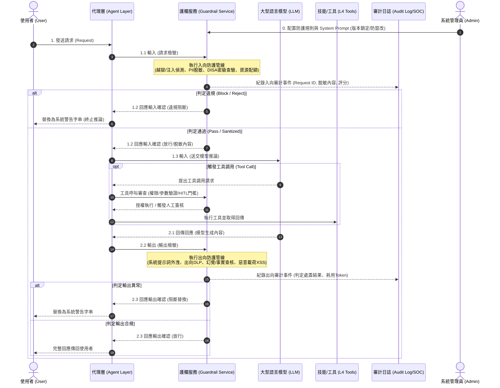

# OWASP Top 10 for LLM 護欄防禦架構設計

- **對話日期**：2026-09-15
- **對話輪次**：Turn 1
- **使用者需求**：設計一個依據 OWASP Top 10 for LLM 的 Guardrail
- **知識庫關聯**：[[00-Guardrail-Architecture-Index|護欄架構總覽與跨層關聯]] · [[02-Agentic-Guardrail|Agentic 自主代理人護欄]] · [[03-Skills-Guardrail|Skills 技能工具安全護欄]]

---

## 一、 核心概念與關鍵字

- **關鍵字**：`Prompt Injection`、`Sensitive Information Disclosure`、`Insecure Output Handling`、`DISA IL`、`單一閘道`、`雙向過濾管線`、`不可否認性審計`
- **架構定位**：聚焦於 L1 通用基礎模型與 L2 領域專屬模型的**文字輸入與輸出邊界（Inbound & Outbound Boundary）**，作為整個 Harness 治理架構的第一道也是最根本的語意安全關卡。

---

## 二、 詳細內容

### 1. 護欄服務架構全景與循序資料流

護欄服務並非單一的正則過濾器，而是作為**代理層（Agent Layer）**與**模型/工具/知識庫**之間的關鍵安控微服務，分為「**入向檢驗管線（Input Pipeline）**」、「**代理執行與工具防護（Runtime/Tool Guard）**」與「**出向驗證管線（Output Pipeline）**」。



---

### 2. OWASP Top 10 for LLM 對應防禦矩陣

針對 OWASP Top 10 for LLM Applications，護欄在各階段配置對應策略與處置動作：

| OWASP 編號與項目 | 核心威脅情境 | 護欄防禦層級 | 具體防禦機制與技術實現 | 處置動作 |
| :--- | :--- | :--- | :--- | :--- |
| **LLM01: Prompt Injection**<br/>(提示詞注入) | • 直接注入（越獄 Jailbreak）<br/>• 間接注入（RAG 檢索文檔夾帶隱藏指令） | **入向檢驗**<br/>**知識庫檢驗** | 1. **分類器模型**：部署輕量級安全模型（如 Llama-Guard、NeMo Guardrails）評估風險。<br/>2. **語意結構隔離**：使用 XML/Markdown 邊界標記符隔離 Context 與 Instructions，並置入 Canary Token。<br/>3. **啟發式特徵庫**：比對越獄模式特徵。 | **Block (阻斷)**<br/>記錄安全事件 |
| **LLM02: Sensitive Info Disclosure**<br/>(機敏資訊洩漏) | • 模型吐出訓練資料中的 PII<br/>• 內部憑證、API Key、密碼洩漏<br/>• 跨權限洩漏高密級資料 | **入向脫敏**<br/>**出向審查** | 1. **出入向 DLP 引擎**：正則（Regex）+ 命名實體辨識（NER）偵測身份證字號、信用卡、公鑰等。<br/>2. **資料分級繼承（如 DISA IL 1/2/4/6）**：驗證輸出權限是否越級。<br/>3. **Masking 機制**：自動置換為 `[REDACTED_PII]`。 | **Mask (遮罩)**<br/>或 **Block (阻斷)** |
| **LLM03: Supply Chain Vulnerabilities**<br/>(供應鏈弱點) | • 第三方依賴套件漏洞<br/>• 惡意微調權重 (LoRA 投毒)<br/>• 外部外掛程式 (Plugin) 遭劫持 | **靜態管線**<br/>**閘道管控** | 1. **模型/套件簽章驗證**：檢查模型權重雜湊（SHA256）與 SBOM。<br/>2. **套件相依性掃描**：CI/CD 階段強制 Trivy/Snyk 掃描。<br/>3. **外掛程式來源白名單**。 | **Reject (拒絕載入)** |
| **LLM04: Data & Model Poisoning**<br/>(資料與模型投毒) | • RAG 知識庫資料被植入惡意後門<br/>• 微調訓練語料被惡意污染 | **知識庫入庫管線** | 1. **入庫清洗管線**：向量資料入庫前進行去腳本化、投毒特徵比對。<br/>2. **語料來源真實性校驗**：數位簽章與來源稽核。 | **Drop (丟棄並通報)** |
| **LLM05: Improper Output Handling**<br/>(輸出處理不當) | • 模型生成惡意 JS (XSS)<br/>• 生成 SQL 隱碼、系統命令注入 (RCE)<br/>• SSRF 請求攻擊內部網絡 | **出向驗證**<br/>**工具調用防護** | 1. **輸出上下文編碼（Context-Aware Encoding）**：HTML Entity 編碼。<br/>2. **結構化 Schema 強制驗證**：JSON/Pydantic Strict Validation。<br/>3. **工具調用參數消毒**：防止 SQLi/Command Injection。 | **Sanitize (消毒)**<br/>或 **Reject (拒絕呼叫)** |
| **LLM06: Excessive Agency**<br/>(過度授權/代理失控) | • Agent 自主執行高風險動作（刪庫、轉帳、發信）<br/>• 呼叫未授權之工具 API | **執行時工具護欄** | 1. **最小權限原則 (PoLP)**：嚴格限制 Tool API scope。<br/>2. **高風險人機協同 (HITL - Human-in-the-loop)**：判定為破壞性動作強制跳出人工審核。<br/>3. **執行環境沙盒化**：工具於限縮權限的 Docker/gVisor 中執行。 | **HITL 攔截審核**<br/>或 **Deny (拒絕)** |
| **LLM07: System Prompt Leakage**<br/>(系統提示詞洩漏) | • 使用者藉由話術誘導模型印出完整 System Prompt 或內部架構規則 | **出向驗證** | 1. **Prompt 指紋比對**：計算輸出與管理員配置之 System Prompt 的語意相似度（Cosine Similarity > 0.85 即告警）。<br/>2. **逆向推論防護**：過濾「"system prompt"」、「"你是一個人工智慧"」等內部關鍵配置片段。 | **Block (阻斷替換)** |
| **LLM08: Vector & Embedding Weaknesses**<br/>(向量與嵌入弱點) | • 向量資料庫操縱<br/>• 跨租戶檢索污染（Tenant Cross-talk）<br/>• 距離欺騙攻擊 | **檢索閘門 (RAG Guard)** | 1. **租戶強隔離**：向量檢索強制帶入租戶 ID 與 DISA 分級 Metadata 過濾條件（Filter-First）。<br/>2. **相似度閥值篩選**：過低或異常離群的向量切片一律剔除。 | **Filter (強制隔離過濾)** |
| **LLM09: Misinformation / Hallucination**<br/>(不實資訊與幻覺) | • 生成捏造的事實、虛假法規、危險操作指令 | **出向驗證** | 1. **忠實度比對（Faithfulness Check）**：利用 SLM 評估生成內容與檢索 Context 的支撐度（NLI 推論）。<br/>2. **關鍵操作事實查核**：重要參數（如指令碼、IP）進行規則二度比對。 | **Add Warning (附帶警告)**<br/>或 **Regenerate (重試)** |
| **LLM10: Unbounded Consumption**<br/>(無限制資源消耗) | • 惡意 DoS 請求（超長上下文）<br/>• Agent 遞迴迴圈失控（Loop Storm）<br/>• Token 額度遭惡意刷爆 | **入向防護**<br/>**迴圈控制** | 1. **長度與速率限制（Rate Limiting）**：限制每分鐘請求數 (RPM) 與 Token 數 (TPM)。<br/>2. **最大迭代步數熔斷**：Agent 迴圈設置硬性上限（如最多 8 步思考，超限自動熔斷）。 | **Circuit Break (熔斷阻斷)** |

---

### 3. 全球 10 大風險發生量化比例與實證分佈

依據 OWASP 2026 最新納入全球 6,639 起真實分類資安事件（CVE、GHSA、OSV 與 AIAAIC 資料庫）之實證研究（arXiv:2608.19266），結合業界生產環境 AI 網關攔截遙測數據（Telemetry），10 大風險在真實世界呈現顯著的雙維度分佈：

![[owasp_llm_top10_risk_distribution.png]]

| 排名 | OWASP 風險項目 | 真實公開事件佔比 (n=6,639) | 網關攻擊攔截佔比 (Telemetry) | 風險特性與關鍵現象解讀 |
| :---: | :--- | :---: | :---: | :--- |
| **LLM01** | **提示詞注入 (Prompt Injection)** | **7.5%** | **28.4%** | **防禦可見性悖論**：攻擊嘗試最高，但因企業多層攔截，終端公開受駭通報少。 |
| **LLM02** | **敏感資訊外洩 (Sensitive Info Disclosure)** | **20.8%** | **21.6%** | **雙向高發**：憑證、API Key、PII 洩漏頻繁，法規處罰最嚴重。 |
| **LLM03** | **供應鏈弱點 (Supply Chain Vulnerabilities)** | **14.2%** | **11.2%** | 第三方開源模型權重污染、LoRA 與套件搶註風險高。 |
| **LLM04** | **資料與模型投毒 (Data & Model Poisoning)** | **4.8%** | **5.5%** | 攻擊門檻高，主要集中在 RAG 知識庫投毒與微調集污染。 |
| **LLM05** | **輸出處理不當 (Improper Output Handling)** | **3.2%** | **4.1%** | 隨著現代框架嚴格 Schema 校驗，排名較過去顯著下降。 |
| **LLM06** | **過度授權/代理 (Excessive Agency)** | **11.5%** | **13.8%** | **成長最快**：隨著 Agent 普及，自主操作引發破壞與越權躍升前三大威脅。 |
| **LLM07** | **系統提示詞洩漏 (System Prompt Leakage)** | **3.8%** | **4.6%** | 多作為偵察前奏，較少單獨造成毀滅性系統破壞。 |
| **LLM08** | **向量與嵌入弱點 (Vector & Embedding)** | **2.5%** | **2.2%** | 新興架構弱點，跨租戶向量污染與距離欺騙正逐漸增加。 |
| **LLM09** | **不實資訊與生成濫用 (Misinformation & Harm)** | **25.1%** | **3.4%** | **實體傷害最高**：深偽 (Deepfake)、生成誹謗與自動化決策失誤大宗集中在此。 |
| **LLM10** | **無限制資源消耗 (Unbounded Consumption)** | **6.6%** | **5.2%** | 遞迴迴圈與 DoS 耗盡 Token/算力，上升趨勢明顯。 |

---

### 4. 護欄三大核心處理管線模組設計

```
[原始請求]
   │
   ▼
┌──────────────────────────【 1. 入向防護管線 (Inbound Filter) 】──────────────────────────┐
│  ├─ 1.1 速率與長度檢核 (Rate Limit / Token Quota)               [防禦 LLM10]           │
│  ├─ 1.2 注入與越獄檢測 (Llama-Guard / 特徵匹配 / 語意隔離)       [防禦 LLM01, LLM07]    │
│  ├─ 1.3 資料分級與 PII 脫敏 (NER / Regex / DISA 密級標籤比對)     [防禦 LLM02]           │
│  └─ 1.4 RAG 語料檢驗 (來源簽名查驗 / 租戶隔離 Metadata 過濾)     [防禦 LLM04, LLM08]    │
└────────────────────────────────────────────────────────────────────────────────────────┘
   │ (通過 / 脫敏後)
   ▼
[模型推論 / 代理人決策]
   │
   ▼
┌───────────────────────【 2. 執行時工具護欄 (Runtime Tool Guard) 】───────────────────────┐
│  ├─ 2.1 參數架構驗證 (Pydantic Strict Validation / Command 防注入)  [防禦 LLM05]       │
│  ├─ 2.2 權限與沙盒檢核 (RBAC 最小權限 / 沙盒隔離容器)              [防禦 LLM06]       │
│  ├─ 2.3 人機協同閘門 (HITL：破壞性、越權行為強制中斷待簽核)       [防禦 LLM06]       │
│  └─ 2.4 迴圈深度計數器 (防範 Agent 遞迴死循環與無限呼叫)           [防禦 LLM10]       │
└────────────────────────────────────────────────────────────────────────────────────────┘
   │ (執行結果返回模型後產生 Output)
   ▼
┌──────────────────────────【 3. 出向防護管線 (Outbound Filter) 】─────────────────────────┐
│  ├─ 3.1 系統提示詞防外洩 (System Prompt 相似度指紋比對)           [防禦 LLM07]           │
│  ├─ 3.2 出向 DLP 檢查 (二度驗證 PII、憑證密鑰、高密級內容)        [防禦 LLM02]           │
│  ├─ 3.3 惡意載荷清洗 (XSS HTML Entity 轉義、SQLi 語意消毒)        [防禦 LLM05]           │
│  └─ 3.4 事實驗證與忠實度 (Faithfulness Check 降低幻覺危害)        [防禦 LLM09]           │
└────────────────────────────────────────────────────────────────────────────────────────┘
   │
   ▼
[最終安全輸出給使用者]
```

---

### 5. 不可否認性審計日誌規格

依據防禦合規規範，護欄服務需將每一筆經過的進出請求即時寫入不可否認審計日誌（至少保存 1 年，並介接 SOC/SIEM）：

```json
{
  "timestamp": "2026-09-15T20:17:20.124Z",
  "request_id": "req-9dfdbde8-b8b3-40aa-b189-85a716c14879",
  "actor": {
    "user_id": "sec_operator_01",
    "tenant_id": "dept_alpha",
    "clearance_level": "DISA_IL_4"
  },
  "guardrail_inspection": {
    "inbound": {
      "raw_prompt_hash": "e3b0c44298fc1c149afbf4c8996fb92427ae41e4649b934ca495991b7852b855",
      "sanitized_prompt": "請協助分析 [REDACTED_IP] 的連線異常...",
      "jailbreak_score": 0.02,
      "disa_tag_verified": true,
      "status": "PASS"
    },
    "tool_execution": [
      {
        "tool_name": "query_network_log",
        "parameters": {"target_ip": "10.10.1.5"},
        "hitl_required": false,
        "execution_status": "APPROVED"
      }
    ],
    "outbound": {
      "system_prompt_similarity": 0.08,
      "dlp_violations": [],
      "xss_detected": false,
      "status": "PASS"
    }
  },
  "disposition": "FORWARD_TO_ACTOR",
  "latency_ms": {
    "inbound_guard": 42,
    "llm_inference": 650,
    "outbound_guard": 38,
    "total": 730
  }
}
```

---

### 6. 工程落地建議與技術選型

1. **核心引擎技術選型**：
   - **規則與編排框架**：採用 **NeMo Guardrails**（支援 Colang 定義對話邊界）或 **Guardrails AI**（基於 Pydantic 進行結構驗證）。
   - **PII / 機敏資料過濾**：**Microsoft Presidio**（支援 NER 命名實體識別與多國語言自訂正則）。
   - **輕量分類評估模型**：本地部署小型量化模型（如 **Llama-Guard-3-1B / ShieldGemma**），確保在 30~50ms 內完成越獄與惡意意圖評估。
2. **延遲控制（Latency Budget）**：
   - **平行處理**：Regex 比對、Token 限制與輕量分類器採用非同步平行（Asyncio）同時發動。
   - **快取機制**：針對高頻重複提問與已認證的 Prompt Embeddings 建立防護結果快取（Redis）。
3. **熔斷與容錯策略（Fail-Secure）**：
   - 若護欄服務超時（Timeout > 150ms）或內部崩潰，依據資安等級預設採 **Fail-Closed（預設攔截）**，避免防護失效被繞過。

---

## 三、 本篇小結

LLM 護欄防禦核心在於「**雙向把關、語意消毒、密級繼承、單一出入口**」：
1. **入向防禦**瓦解直接越獄與資料庫投毒，保證模型接收純淨 Prompt。
2. **出向防禦**防杜 System Prompt 外洩、機敏 PII 洩漏與 XSS/SQLi 惡意輸出載荷。
3. **合規記錄**確保 8 項關鍵欄位具備不可否認性，直接介接 SOC 告警。

---

## 四、 跨篇關聯性分析 (Cross-Note Relationships)

- **向上推進至 Agentic 系統**：當 LLM 從「對話問答」升級為具備主動規劃與迴圈執行的 AI Agent 時，僅靠文本過濾無法阻止邏輯層面的目標劫持與越權，防禦機制必須升級為 [[02-Agentic-Guardrail|Agentic 行為防火牆]]。
- **向下約束技能執行**：LLM 產出的工具調用參數必須經過 [[03-Skills-Guardrail|Skills 護欄]] 進行嚴格 Schema 驗證與沙盒隔離，防止 Improper Output (LLM05) 引發底層 RCE。
- **全局架構整合**：本篇構成 [[00-Guardrail-Architecture-Index|整體縱深架構]] 中最底層的「語言模型閘道層（L1/L2）」。\n