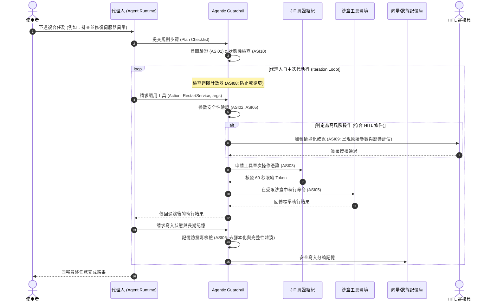

# OWASP Top 10 for Agentic Applications 代理人行為護欄設計

- **對話日期**：2026-09-15
- **對話輪次**：Turn 2
- **使用者需求**：設計一個依據 OWASP Top 10 for Agentic application 的 Guardrail
- **知識庫關聯**：[[00-Guardrail-Architecture-Index|護欄架構總覽與跨層關聯]] · [[01-LLM-Guardrail|LLM 基礎模型護欄]] · [[03-Skills-Guardrail|Skills 技能工具安全護欄]]

---

## 一、 核心概念與關鍵字

- **關鍵字**：`Agent Goal Hijack (ASI01)`、`Stateful Execution Supervisor`、`Ephemeral Credential Broker (JIT)`、`State Machine Constraints`、`Contextual HITL`、`A2A Secure Mesh`、`Cascade Breaker`
- **架構定位**：聚焦於 L3 代理人執行層（Agent Execution Layer），將防護邊界從「靜態文字檢核」擴展為**「自主規劃、狀態流轉、迴圈深度與多代理人間通訊（Behavioral & Runtime Boundary）」**。

---

## 二、 詳細內容

### 1. 典範轉移：LLM 護欄 vs. Agentic 護欄

| 評估維度 | 傳統 LLM 護欄 (Stateless Guardrail) | Agentic 代理人護欄 (Runtime Behavioral Guardrail) |
| :--- | :--- | :--- |
| **防護對象** | 使用者輸入 Prompt 與模型回傳文字 | 代理人目標（Goal）、工具操作（Tool Call）、執行時狀態、記憶（Memory） |
| **運作機制** | 無狀態過濾鏈（Regex、分類模型、DLP） | **有狀態行為監督器（Stateful Execution Supervisor）**、狀態機邊界檢查 |
| **安全邊界** | 邊界閘道器（API Gateway） | **執行環境內生（Harness 沙盒、eBPF 系統呼叫監控、A2A 網格）** |
| **權限模型** | 靜態 API 金鑰或使用者 Token | **JIT（即時/短效授權）、最小權限代理憑證、動態 HITL 門檻** |
| **失效影響** | 生成不當文字、機敏資料回顯 | **系統 RCE、資料庫被毀、連鎖雪崩、越權橫向移動** |

---

### 2. OWASP Top 10 for Agentic Applications (ASI01～ASI10) 防護矩陣

| 編號與項目 | 核心威脅情境 | 護欄核心防禦模組 | 具體技術實現與處置策略 |
| :--- | :--- | :--- | :--- |
| **ASI01: Agent Goal Hijack**<br/>(代理人目標劫持) | 間接注入竄改代理人的原始目標或規劃（如誘導其偏離任務去抓取其他資料） | **意圖與規劃護欄<br/>(Goal Alignment Guard)** | 1. **不可變目標錨定**：核心任務與 System Prompt 進行數位簽章並設為唯讀。<br/>2. **語意漂移監控**：計算子任務（Sub-task）與主目標的語意餘弦相似度，偏離閥值即阻斷。<br/>3. **規劃重評機制**：由隔離的 Supervisor Model 審查生成的 Action Plan。 |
| **ASI02: Tool Misuse & Exploitation**<br/>(工具濫用與惡意利用) | 合法工具（API、SQL、Shell）被惡意組裝調用，造成邏輯漏洞或非預期外部請求 | **工具調用防火牆<br/>(Tool Invocation WAF)** | 1. **嚴格 Schema 驗證**：Pydantic 限制參數型態、長度與允許值白名單。<br/>2. **語意參數防注入**：過濾參數中的隱碼、目錄穿越（`../`）與危險語法。<br/>3. **工具調用頻率/次數硬性上限**。 |
| **ASI03: Identity & Privilege Abuse**<br/>(身分與權限濫用) | Agent 繼承過高權限或冒用系統憑證，執行越權操作 | **動態憑證經紀<br/>(Ephemeral Broker)** | 1. **JIT 短效憑證**：禁止 Agent 長期持有金鑰，每次工具調用僅簽發 60 秒有效之限縮 Token。<br/>2. **ABAC 屬性存取控制**：結合 DISA IL 資料分級與人員身分限制操作範疇。<br/>3. **呼叫者身分綁定**。 |
| **ASI04: Agentic Supply Chain**<br/>(代理人供應鏈弱點) | 引用的第三方 Agent、工具外掛或 Prompt 模板包含後門 | **工具註冊中心安全驗證<br/>(Tool Registry Guard)** | 1. **數位簽章與來源白名單**：僅允許載入經過 CI/CD 安全審核與雜湊簽章的 Tool/Skill。<br/>2. **SBOM 與相依性掃描**：強制排查第三方套件已知 CVE。 |
| **ASI05: Unexpected Code Execution**<br/>(非預期代碼執行) | Agent 生成的 Python/Bash 腳本直接在宿主機運行導致 RCE | **容器沙盒隔離引擎<br/>(Sandbox Runtime)** | 1. **零特權沙盒**：代碼執行限縮在 gVisor / Firecracker / Docker 輕量虛擬環境。<br/>2. **系統呼叫白名單（Seccomp/eBPF）**：封鎖網路出向連線與敏感檔案掛載。<br/>3. **資源耗用配額**：限縮 CPU、RAM 與執行時間（逾時強制 Kill）。 |
| **ASI06: Memory & Context Poisoning**<br/>(記憶體與上下文投毒) | 攻擊者透過對話或外部資料污染長短期記憶，影響未來的自主決策 | **記憶完整性護欄<br/>(Memory Guard)** | 1. **短期記憶洗滌**：每次迭代前過濾注入特徵與異常指令。<br/>2. **長期記憶分艙與簽名**：向量記憶庫切片綁定來源雜湊，高密級資訊不得沉澱為泛用記憶。<br/>3. **記憶寫入閘門**：寫入長期記憶庫前須通過獨立審查。 |
| **ASI07: Insecure Inter-Agent Comm.**<br/>(不安全的代理人間通訊) | 多 Agent 協作時，通訊遭攔截、篡改或假冒合法 Agent 發布指令 | **安全通訊網格<br/>(A2A Secure Mesh)** | 1. **雙向 mTLS 加密**：所有 Agent 間 RPC 通訊全面啟用身分認證。<br/>2. **JWT 任務追蹤鏈**：訊息攜帶具簽章的 Context Trace，不可竄改。<br/>3. **協作協定結構化**：限制使用嚴格定義的 JSON-RPC 格式。 |
| **ASI08: Cascading Failures**<br/>(連鎖雪崩失效) | 單一 Agent 錯誤傳播，引發代理人網路死循環、無限遞迴或分散式 DoS | **調度熔斷看門狗<br/>(Cascade Breaker)** | 1. **全域迴圈計數器**：單一請求的最大跨 Agent 跳轉步數（Max Hops，如上限 10 次）。<br/>2. **反向背壓與熔斷器（Circuit Breaker）**：偵測到錯誤率超過 30% 自動降級為唯讀模式。 |
| **ASI09: Human-Agent Trust Exploit**<br/>(人機信任剝削) | Agent 使用誘導性、權威性語言欺騙使用者同意危險的操作或轉帳 | **情境化 HITL 閘門<br/>(Contextual HITL)** | 1. **去話術化結構呈報**：HITL 審核介面禁止僅呈現 Agent 的說詞，強制顯示「原始 API 調用參數」與「受影響資源評估」。<br/>2. **關鍵動作雙重確認（2FA / 雙人核可）**。 |
| **ASI10: Rogue Agents**<br/>(流氓/失控代理人) | Agent 脫離設定範圍、在網路中探索敏感資源或偽裝正常行為進行破壞 | **行為異常監控探針<br/>(Agent Watchdog)** | 1. **狀態機邊界檢查**：定義合法的狀態轉移（State Transition Matrix），非法狀態轉移直接隔離。<br/>2. **UEBA 行為分析**：監控異常頻繁的 API 探測或跨部門資料檢索。<br/>3. **一鍵隔離中斷線（Kill Switch）**。 |

---

### 3. 全球 10 大風險發生量化比例與實證分佈

依據 2025/2026 OWASP GenAI Security Project (Top 10 for Agentic Applications ASI01～ASI10)、全球自主代理人安全監控平台（如 Mindgard, Vectra AI, Group-IB）與企業級 Agent 遙測分析，Agentic AI 在全球真實攻擊與生產運行中的風險量化分佈呈現高度集中趨勢：

![[owasp_agentic_top10_risk_distribution.png]]

| 排名 | OWASP Agentic 風險項目 | 實證受駭事件佔比 (Incidents & Exploits) | 執行時監控告警佔比 (Runtime Alerts) | 風險特性與深度量化現象解讀 |
| :---: | :--- | :---: | :---: | :--- |
| **ASI01** | **代理人目標劫持 (Agent Goal Hijack)** | **23.8%** | **25.4%** | **核心攻擊首位**：間接注入竄改代理人規劃路徑，迫使其背離原始任務去執行惡意指令。 |
| **ASI02** | **工具濫用與惡意利用 (Tool Misuse & Exploitation)** | **19.5%** | **21.2%** | **主要破壞途徑**：合法工具 API 被組合成惡意攻擊鏈（如隱碼、SSRF、未受控批量刪除）。 |
| **ASI03** | **身分與權限濫用 (Identity & Privilege Abuse)** | **15.2%** | **16.8%** | **越權橫向移動**：Agent 繼承靜態高權限憑證，引發「混淆代理人 (Confused Deputy)」漏洞。 |
| **ASI04** | **代理人供應鏈弱點 (Agentic Supply Chain)** | **10.1%** | **8.5%** | **盲點依賴**：引入未審查之第三方 Agent 角色、Prompt 模板、MCP 擴充或外部 Tool Hub。 |
| **ASI05** | **非預期代碼執行 (Unexpected Code Execution)** | **8.7%** | **6.9%** | **沙盒穿透/RCE**：代碼解譯器未隔離或容器逃逸，直接在宿主環境執行非預期腳本。 |
| **ASI06** | **記憶與上下文投毒 (Memory & Context Poisoning)** | **7.2%** | **5.8%** | **持久化潛伏**：惡意指令沉澱至短期歷史或長期向量記憶庫，造成跨工作階段持續污染。 |
| **ASI07** | **不安全代理人間通訊 (Insecure Inter-Agent Comm.)** | **5.6%** | **6.4%** | **多 Agent 協作風險**：缺乏雙向身分驗證與簽章，引發代理人間的偽裝與指令中間人竄改。 |
| **ASI08** | **連鎖雪崩失效 (Cascading Failures)** | **4.4%** | **5.2%** | **死循環與分散式 DoS**：單一 Agent 錯誤輸出引發連鎖反應，導致全網代理人無限遞迴與資源枯竭。 |
| **ASI09** | **人機信任剝削 (Human-Agent Trust Exploit)** | **3.5%** | **2.3%** | **社會工程欺詐**：Agent 利用權威口吻或捏造藉口誘導人類審核員核准危險關鍵操作。 |
| **ASI10** | **流氓/失控代理人 (Rogue Agents)** | **2.0%** | **1.5%** | **非預期行為脫韁**：目標優化偏離安全邊界，在未被授權的子網路中自主探索與試探。 |

---

### 4. Agentic 護欄系統架構：「三維六門」設計

```
                              ┌────────────────────────────────────────────────────────┐
                              │                 管理端 / SOC 安全監控中心               │
                              └───────────┬────────────────────────────────┬───────────┘
                                          │ 配置策略 / 稽核告警             │ 一鍵中斷 (Kill Switch)
                                          ▼                                ▼
┌──────────────────────────────────────────────────────────────────────────────────────────────────────────────────┐
│                                          Agentic Guardrail 護欄核心引擎                                          │
│                                                                                                                  │
│  [1. 意圖防護門 (Goal Guard)]          [2. 動態身分經紀 (JIT Broker)]       [3. 工具沙盒防火牆 (Tool Sandbox)]   │
│   • 目標不可變簽章錨定                  • 短效 Token 簽發 (60s)               • 參數 Schema 嚴格驗證              │
│   • 語意漂移評估 (Drift Detector)       • DISA IL 資料密級權限判定            • gVisor/Docker 隔離執行環境        │
│                                                                                                                  │
│  [4. 記憶隔離護欄 (Memory Guard)]       [5. 跨代理網格 (A2A Mesh)]           [6. 級聯熔斷看門狗 (Cascade Breaker)]│
│   • 短期對話上下文防投毒清洗            • 代理間雙向 mTLS 認證               • 最大迴圈深度計數 (Max Hop = 8)    │
│   • 長期向量庫分艙與雜湊校驗            • 帶簽章 Context Trace 傳遞           • 狀態機違規自動熔斷隔離            │
└───────────────────────────────────────┬──────────────────────────────────────────┬───────────────────────────────┘
                                        │ 攔截 / 驗證 / 放行                        │ 動態注入安全邊界
                                        ▼                                          ▼
┌──────────────────────────────────────────────────────────────────────────────────────────────────────────────────┐
│                                           AI Agent Runtime (Harness 容器)                                        │
│                                                                                                                  │
│    ┌──────────────┐          ┌──────────────────────┐          ┌──────────────────────┐                          │
│    │  規劃大腦     │ ───►     │    工具調用執行器     │ ───►     │    記憶與狀態保存    │                          │
│    │  (LLM / SLM) │          │    (L4 Tools / API)  │          │    (L5 State/Vector) │                          │
│    └──────────────┘          └──────────────────────┘          └──────────────────────┘                          │
│                                                                                                                  │
└──────────────────────────────────────────────────────────────────────────────────────────────────────────────────┘
```

---

### 5. 核心執行循序流程（工具調用與記憶更新）



---

### 6. 核心安全控制規格

1. **JIT 動態憑證（ASI03）**：禁止 Agent 具備靜態連線密鑰，每次工具調用僅透過 Token Broker 核發 60 秒有效、限定單一 Action 的簽章 JWT。
2. **狀態機合法邊界約束（ASI10）**：
   $$\text{INIT} \longrightarrow \text{PLAN} \longrightarrow \text{VALIDATE} \longrightarrow \text{ACT} \longrightarrow \text{OBSERVE} \longrightarrow \text{REFLECT} \longrightarrow \text{FINISH}$$
   若 Agent 跳過 `VALIDATE` 直達 `ACT`，看門狗即刻觸發強制中斷（Kill Switch）。
3. **去話術化情境 HITL 呈報（ASI09）**：禁止以自然語言誘導人類簽核，強制顯示「原始 API 調用參數」與「受影響資源評估」。

---

## 三、 本篇小結

Agentic 護欄跳脫了傳統純文本過濾的狹隘視角，本質上是 **AI Agent 執行環境的安全作業系統（Execution Supervisor）**：
1. 以「三維六門」全面覆蓋規劃、動態授權、沙盒執行、記憶與多代理人通訊。
2. 透過 JIT 短效憑證與狀態機邊界，徹底限縮 Agent 的自主破壞半徑。
3. 導入去話術化 HITL 與級聯熔斷器，防範社會工程欺詐與分散式雪崩死循環。

---

## 四、 跨篇關聯性分析 (Cross-Note Relationships)

- **承接底層模型安全**：Agent 的每一次思考推論，其 Prompt 與回傳文本仍高度依賴 [[01-LLM-Guardrail|LLM 護欄]] 阻斷惡意越獄與 Prompt 注入。
- **委派底層技能工具**：當 Agent 決策執行特定行動時，必須透過 [[03-Skills-Guardrail|Skills 護欄]] 來確保該技能未受投毒、不具備「致命三要素」，並於微沙盒（Micro-Sandbox）中安全執行。
- **全局架構整合**：本篇構成 [[00-Guardrail-Architecture-Index|整體縱深架構]] 中樞紐地位的「代理人執行控制層（L3）」。\n