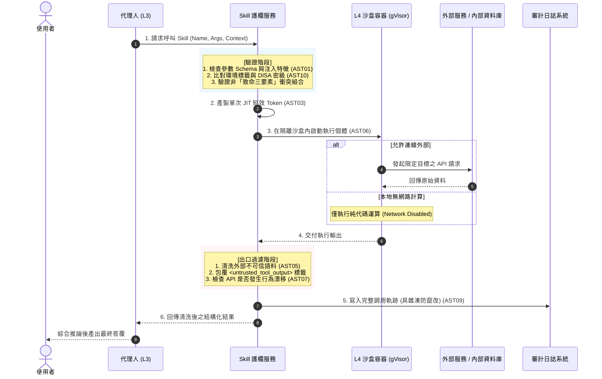

# OWASP Top 10 for Skills (AST10) 技能工具安全護欄設計

- **對話日期**：2026-09-15
- **對話輪次**：Turn 3
- **使用者需求**：設計一個依據 OWASP Top 10 for skills 的 Guardrail
- **知識庫關聯**：[[00-Guardrail-Architecture-Index|護欄架構總覽與跨層關聯]] · [[01-LLM-Guardrail|LLM 基礎模型護欄]] · [[02-Agentic-Guardrail|Agentic 自主代理人護欄]]

---

## 一、 核心概念與關鍵字

- **關鍵字**：`The Lethal Trifecta (致命三要素)`、`Malicious Skills (AST01)`、`Supply Chain Compromise (AST02)`、`Over-Privileged Skills (AST03)`、`Insecure Metadata (AST04)`、`gVisor / Firecracker 沙盒`、`Update Drift (AST07)`
- **架構定位**：聚焦於 L4 技能工具層（L4 Tools & Skills Layer）。Skill 是 Agent 與實體環境互動的「手腳」，具備執行代碼、讀寫檔案、操作資料庫與呼叫外部 API 的實際破壞力。

---

## 二、 詳細內容

### 1. 核心威脅模型：破解「致命三要素 (The Lethal Trifecta)」

在 AST10 規範中，最具毀滅性的安全災難來自於技能同時具備以下 **致命三要素**：
1. **存取機敏資料（Access to Sensitive Data）**：具有讀取 SSH Key、Token、個資或內部資料庫之權限。
2. **接觸不可信內容（Exposure to Untrusted Content）**：處理未經清洗的外部網頁、不可信輸入或惡意 Prompt。
3. **具備外部通訊能力（External Network Capabilities）**：具備發送 HTTP POST、Webhook 等出向網路連線能力。

> **Skill 護欄的核心設計哲學**：透過 Harness 強制隔離，**絕對阻斷任何單一 Skill 同時具備這三項要素**（例如：可接觸機敏資料的 Skill 強制封鎖對外連線；可對外連線的 Skill 絕對禁止掛載內部憑證）。

---

### 2. OWASP Agentic Skills Top 10 (AST10) 防護對齊矩陣

| 編號與項目 | 核心威脅樣態 | 護欄防禦層級 | 具體防禦機制與技術落實 | 處置動作 |
| :--- | :--- | :--- | :--- | :--- |
| **AST01: Malicious Skills**<br/>(惡意技能) | 攻擊者偽造合法功能的 Skill（如假冒日誌分析工具），內部夾帶木馬或後門程式碼 | **註冊驗證門** | 1. **技能市集私有化與簽名機制**：僅允許載入具備企業內部 PKI 數位簽章的 Skill。<br/>2. **靜態 AST 語法樹分析**：檢測危險函式（如 `os.system`、`eval`、`subprocess`）。 | **Reject (拒絕註冊)** |
| **AST02: Supply Chain Compromise**<br/>(供應鏈入侵) | 技能依賴的第三方 Python/Node 套件遭搶註（Typosquatting）或上游版本被篡改 | **靜態掃描門** | 1. **SBOM 軟體清單檢驗**：強制生成 SPDX/CycloneDX SBOM。<br/>2. **套件相依性鎖定**：比對 `requirements.lock` 之 SHA-256 雜湊值。<br/>3. **CI/CD 自動 CVE 掃描**（Trivy / Snyk）。 | **Block (阻止上架)** |
| **AST03: Over-Privileged Skills**<br/>(過度特權技能) | 僅需查詢 DNS 的技能卻被賦予 Root 權限、全域檔案讀寫或全開放資料庫帳號 | **動態授權門** | 1. **最小權限宣告（Capability-based Security）**：Skill 必須以 YAML 明確宣告所需資源（如 `network: none`, `fs: read-only`）。<br/>2. **JIT 短效 Token 經紀**：禁止靜態金鑰，動態指派限縮 API 範圍。 | **Enforce PoLP (降權隔離)** |
| **AST04: Insecure Metadata**<br/>(不安全的中繼資料) | Skill 的 Docstring、Description 被植入 Prompt Injection，誘導 Agent 優先呼叫或跳過檢查 | **中繼資料驗證門** | 1. **Metadata 消毒與長度限制**：去除中繼資料中的特殊符號、控制指令與隱藏提示詞。<br/>2. **語意意圖查核**：利用輕量模型比對 Skill「宣稱功能」與「實際實作代碼」是否相符。 | **Sanitize (消毒)**<br/>或 **Reject (拒絕)** |
| **AST05: Untrusted External Instructions**<br/>(不可信外部指令) | 技能從外部網站擷取資料時，回傳結果包含惡意指令，反向劫持 Agent 後續決策 | **執行時輸入門** | 1. **內容隔離封裝**：將 Skill 執行結果強制封裝於特定結構化標籤內（如 `<untrusted_tool_output>`），提示 LLM 不得將其視為系統指令。<br/>2. **內容過濾清洗**：去除可執行腳本與注入關鍵字。 | **Encapsulate (封裝)**<br/>並降低置信度 |
| **AST06: Weak Isolation**<br/>(脆弱隔離) | 多個 Skill 共享同一個宿主作業系統進程，導致記憶體遭讀取或橫向滲透 | **沙盒防護門** | 1. **極限輕量沙盒**：以 **gVisor / Firecracker MicroVM / Docker Rootless** 啟動獨立容器運行單一 Skill。<br/>2. **Seccomp / eBPF 核心過濾**：封鎖未授權的 Linux 系統呼叫。 | **Sandbox Isolation (強制沙盒化)** |
| **AST07: Update Drift**<br/>(更新漂移) | 技能引用的遠端第三方 API 行為改變，或依賴版本未控管，產生非預期的行為漂移 | **變更稽核門** | 1. **API Contract 測試**：定期對 Skill API 執行合約驗證與漂移比對。<br/>2. **版本雜湊鎖定**：外部 API 定義若有更動，未經二次審核立即凍結呼叫。 | **Freeze (凍結停權)** |
| **AST08: Poor Scanning**<br/>(掃描不足) | 缺乏動態測試，Skill 存在未捕捉到的 SQL 注入、邏輯漏洞或命令注入 | **全自動掃描門** | 1. **AI Red Teaming / Fuzzing**：對 Skill 執行自動化模糊測試（輸入極端字串、異常 Payload）。<br/>2. **DAST 動態安全測試**：攔截非預期出向流量與未授權寫檔。 | **Quarantine (隔離待修)** |
| **AST09: Governance Missing**<br/>(治理缺失) | 殭屍技能未下線、缺乏擁有者（Owner）、缺乏審計軌跡，無法追溯責任 | **生命週期治理門** | 1. **Skill 存活心跳與 TTL**：超過 90 天未審核之 Skill 自動失效。<br/>2. **不可否認之 8 項調用軌跡記錄**（包含呼叫者、參數、執行耗時、沙盒狀態等）。 | **Auto-Deprecate (自動除役)** |
| **AST10: Cross-Platform Reuse**<br/>(跨平台複用風險) | 將為開發環境設計的高權限 Skill 直接部署至生產環境，突破安全邊界 | **情境感知門** | 1. **環境指紋綁定**：Skill 註冊時綁定目標環境標籤（Dev/Staging/Prod）與 DISA IL 密級。<br/>2. **跨環境遷移強制阻斷**：跨網段或跨密級呼叫一律視為越權。 | **Deny (跨界拒絕)** |

---

### 3. 全球 10 大風險發生量化比例與實證分佈

依據 2025/2026 OWASP GenAI Tooling/Skills Security 專案、全球 2,400+ 開源與企業級 Agent 外掛/工具（涵蓋 MCP Servers、LangChain Tools、LlamaIndex Tools 與 AutoGPT Skills）安全審計統計，並結合生產環境沙盒執行時攔截與日誌遙測，Skills 工具層呈現高度集中於「特權失控」與「不可信輸入劫持」的雙軸特徵：

![[owasp_skills_top10_risk_distribution.png]]

| 排名 | OWASP Skills 風險項目 | 實證弱點/受駭佔比 (Audits & Incidents) | 執行時沙盒阻斷告警 (Runtime Alerts) | 風險特性與深度量化現象解讀 |
| :---: | :--- | :---: | :---: | :--- |
| **AST03** | **過度特權技能 (Over-Privileged Skills)** | **24.6%** | **22.5%** | **發生率首位**：開發者預設給予全域檔案讀寫、通配符出向連線（`*`）或 Root 執行權限。 |
| **AST05** | **不可信外部指令 (Untrusted External Instructions)** | **20.4%** | **24.2%** | **動態劫持主因**：擷取未清洗外部網頁或 API 回傳，被間接注入指令反向劫持 Agent 決策。 |
| **AST02** | **供應鏈入侵 (Supply Chain Compromise)** | **15.8%** | **13.5%** | **第三方盲點**：引用的 Python/Node 套件遭搶註（Typosquatting）或上游版本包含惡意惡意腳本。 |
| **AST06** | **脆弱隔離 (Weak Isolation / Sandbox Escape)** | **11.2%** | **9.8%** | **橫向滲透根因**：多個 Skill 共享宿主進程或沙盒配置薄弱，導致環境變數與主機權限遭穿透。 |
| **AST01** | **惡意技能與後門 (Malicious Skills & Trojans)** | **8.3%** | **7.1%** | **假冒偽裝**：公開註冊中心未實施簽章認證，被上架偽裝成實用工具的木馬外掛。 |
| **AST04** | **不安全中繼資料 (Insecure Metadata)** | **6.5%** | **8.4%** | **語意路由投毒**：Docstring 或 Tool Description 夾帶提示詞，誘使 Agent 優先呼叫或規避審查。 |
| **AST08** | **掃描與測試不足 (Poor Scanning & Testing)** | **5.2%** | **6.0%** | **靜動態盲區**：缺乏對 Skill 參數解析的自動化模糊測試（Fuzzing），隱藏 SQL 隱碼與命令注入。 |
| **AST07** | **更新漂移 (Update Drift & Silent Mutation)** | **3.8%** | **4.1%** | **合約突變**：遠端依賴之外部 API 行為未宣告變更，造成非預期的語意理解錯誤或邊界溢位。 |
| **AST09** | **治理與審計缺失 (Governance & Audit Missing)** | **2.6%** | **2.8%** | **殭屍工具**：缺乏生命週期管理、TTL 與調用審計軌跡，導致受駭後無法追溯責任。 |
| **AST10** | **跨平台與跨環境複用 (Cross-Platform Reuse)** | **1.6%** | **1.6%** | **邊界錯置**：將測試/內部環境特權 Skill 直接部署至生產或跨密級環境，產生越權存取。 |

---

### 4. Skill 護欄系統架構：四階段生命週期防線

```
┌────────────────────────────────────────────────────────────────────────────────────────┐
│                        Phase 1: 註冊與準入管線 (Registration Guard)                    │
│   • 數位簽章與來源白名單 (AST01)        • SBOM 與相依套件 Hash 鎖定 (AST02)            │
│   • AST 靜態代碼與模糊測試 (AST08)      • 宣告權限最小化核定 (AST03)                   │
└──────────────────────────────────────────┬─────────────────────────────────────────────┘
                                           │ 通過審核入庫 (Skill Registry)
                                           ▼
┌────────────────────────────────────────────────────────────────────────────────────────┐
│                        Phase 2: 發現與意圖綁定 (Discovery Guard)                       │
│   • Metadata / Docstring 消毒防注入 (AST04)                                            │
│   • 運行環境與 DISA 密級標籤綁定 (AST10)                                               │
└──────────────────────────────────────────┬─────────────────────────────────────────────┘
                                           │ Agent 調用請求
                                           ▼
┌────────────────────────────────────────────────────────────────────────────────────────┐
│                        Phase 3: 執行時沙盒與動態憑證 (Runtime Guard)                   │
│   • 參數 Schema 嚴格型別校驗 (AST01)    • JIT 短效 (60s) 憑證核發 (AST03)               │
│   • gVisor / MicroVM 零網路/限網路沙盒 (AST06)                                         │
│   • 致命三要素破除：(機敏資料 ⨂ 外部網路 ⨂ 不可信內容) 強制隔離                        │
└──────────────────────────────────────────┬─────────────────────────────────────────────┘
                                           │ 回傳結果
                                           ▼
┌────────────────────────────────────────────────────────────────────────────────────────┐
│                        Phase 4: 出口過濾與持續監控 (Egress & Drift Guard)              │
│   • 外部回傳語料結構化標籤封裝 (AST05)   • API 行為漂移即時偵測 (AST07)                 │
│   • 調用行為不可否認性審計寫入 (AST09)   • 異常流量/頻率熔斷告警 (AST08)                │
└────────────────────────────────────────────────────────────────────────────────────────┘
```

---

### 5. Skill 執行時循序防護流程



---

### 6. 核心技術規範與落地原則

#### (1) 技能權限清單標準 (Skill Manifest YAML - AST03)
```yaml
skill_id: "sec-network-analyzer-v1"
version: "1.2.0"
signature: "SHA256-RSA:a98f12c..." # 企業 PKI 簽名 (AST01)
disa_clearance_allowed: ["DISA_IL_2", "DISA_IL_4"] # 密級邊界 (AST10)

capabilities:
  network:
    allowed_egress_domains: ["api.threat-intel.internal"] # 嚴禁通配符 "*"
    max_payload_bytes: 1048576 # 限制 1MB
  filesystem:
    mode: "read-only"
    allowed_paths: ["/tmp/sandbox_data"] # 嚴禁存取 /etc 或 /root
  credentials:
    allow_ambient_credentials: false # 禁止讀取主機預設環境變數 (AST03)
    token_ttl_seconds: 60            # JIT 動態 Token 有效期 60 秒

runtime:
  isolation_type: "gvisor"           # 強制沙盒技術 (AST06)
  cpu_limit: "0.5"
  memory_limit: "512Mi"
  timeout_seconds: 15
```

#### (2) 外部不可信回傳隔離封裝標籤 (AST05)
```xml
<!-- 護欄強制封裝：明確告知模型此為不可信任的資料物件，非系統指令 -->
<untrusted_tool_execution_result skill_id="sec-network-analyzer-v1" status="SUCCESS">
  <![CDATA[
  [已過濾可能包含的惡意腳本與隱藏 Prompt]
  原始查詢結果：...
  ]]>
</untrusted_tool_execution_result>
```

---

## 三、 本篇小結

Skill 護欄是阻止 AI 系統造成實體系統損害的最終防線：
1. **破除致命三要素**：絕不容許單一技能同時掌握機敏憑證、外部網路連線與不可信語料輸入。
2. **極限沙盒化隔離**：透過 gVisor 與 Seccomp/eBPF 限縮系統呼叫，即使代碼被 RCE 也無法穿透宿主機。
3. **生命週期四階段管線**：從註冊簽章、Metadata 消毒、JIT 動態憑證到 API 漂移偵測，確保工具生態的純淨與合規。

---

## 四、 跨篇關聯性分析 (Cross-Note Relationships)

- **受 Agentic 護欄調度指揮**：當 [[02-Agentic-Guardrail|Agentic 護欄]] 審核完工具呼叫意圖與 HITL 人工簽核後，具體動作由本篇之沙盒機制落地執行。
- **回流輸出至 LLM 護欄審查**：Skill 執行的結果在封裝為 `<untrusted_tool_output>` 後，必須回傳給 [[01-LLM-Guardrail|LLM 護欄]] 進行二次防注入與敏感資訊檢核，才可送入模型上下文中。
- **全局架構整合**：本篇構成 [[00-Guardrail-Architecture-Index|整體縱深架構]] 中最靠近底層作業系統與外部服務的「技能工具執行層（L4）」。\n