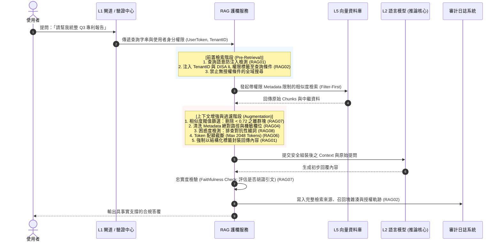

# OWASP RAG Pipeline 安全護欄設計 (Retrieval-Augmented Generation Guardrail)

- **對話日期**：2026-09-28
- **對話輪次**：Turn 4
- **使用者需求**：針對 RAG，依據 OWASP 風險規範設計專屬護欄，分析全球量化比例並建立知識庫連結
- **知識庫關聯**：[[00-Guardrail-Architecture-Index|護欄架構總覽與跨層關聯]] · [[01-LLM-Guardrail|LLM 基礎模型護欄]] · [[02-Agentic-Guardrail|Agentic 自主代理人護欄]] · [[03-Skills-Guardrail|Skills 技能工具安全護欄]]

---

## 一、 核心概念與關鍵字

- **關鍵字**：`Indirect Prompt Injection (RAG01)`、`Pre-Retrieval Filtering (前置權限過濾)`、`Row-Level Security (RLS)`、`Knowledge Base Poisoning (RAG03)`、`Vector Inversion Attack (RAG09)`、`Context Flooding (RAG06)`、`DISA IL 資料分級繼承`
- **架構定位**：聚焦於 **L5 知識檢索與資料增強層（Knowledge & Vector Layer）**。RAG 是大腦獲取外部知識的「記憶海馬體」，負責將大量非結構化文件（PDF/Wiki/資料庫）語義化檢索並注入模型上下文，是「不可信外部資料流」與「模型推論核心」的交匯重災區。

---

## 二、 詳細內容

### 1. RAG 生命週期威脅模型：六階段縱深防線

傳統資安仰賴 SQL 查詢的精確語法匹配，然而 RAG 架構引進了「高維語義空間（Latent Space）」與「相似度召回（ANN Search）」，使得防護邊界必須貫穿全生命週期的六大環節：

```
┌────────────────────────────────────────────────────────────────────────────────────────┐
│ 1. 攝取解析 (Ingestion)      : 防範文檔解析器漏洞 (RAG05) 與惡意腳本 (SSRF/RCE)          │
│ 2. 向量嵌入 (Embedding)      : 實施嵌入模型來源簽章，防範特徵逆向推論 (RAG09)           │
│ 3. 向量儲存 (Vector Storage) : 強制租戶強隔離、Metadata 權限綁定與防投毒雜湊 (RAG02, RAG03)│
│ 4. 語義檢索 (Retrieval)      : 嚴格執行 Pre-Filtering (前置權限過濾)，防跨租戶洩密 (RAG02)│
│ 5. 上下文組裝 (Augmentation) : 結構化標籤封裝、長度熔斷，防範間接注入與上下文洪水 (RAG01, RAG06)│
│ 6. 模型生成 (Generation)     : 忠實度驗證 (Faithfulness Check)，防範幻覺放大 (RAG07)   │
└────────────────────────────────────────────────────────────────────────────────────────┘
```

---

### 2. OWASP RAG Pipeline 10 大關鍵風險 (RAG01～RAG10) 防護矩陣

| 編號與項目 | 核心威脅情境 | 護欄防禦層級 | 具體技術實現與處置策略 | 處置動作 |
| :--- | :--- | :--- | :--- | :--- |
| **RAG01: Indirect Prompt Injection**<br/>(間接提示詞注入) | 被檢索之網頁、工單或第三方 PDF 夾帶隱藏指令（如白底白字、微小字型），反向劫持模型決策 | **上下文封裝閘門<br/>(Augmentation Guard)** | 1. **結構化隔離標籤**：回傳內容強制包覆 `<untrusted_rag_context>`，提示 LLM 不得作為系統指令。<br/>2. **注入分類器掃描**：以輕量 SLM 檢測檢索 Chunk 是否含有指令轉移語句。 | **Sanitize (消毒)**<br/>或 **Drop (剔除 Chunk)** |
| **RAG02: Broken Access Control & Leakage**<br/>(越權存取與跨租戶洩漏) | 向量庫未落實 Row-Level Security，一般員工查詢「薪資」或「專利」，RAG 自動召回高層機密檔案 | **前置檢索閘門<br/>(Pre-Filtering Guard)** | 1. **強制前置權限過濾 (Pre-Filtering)**：向量查詢強制帶入使用者的 Tenant ID 與 DISA IL 權限標籤，禁止 Post-Filtering。<br/>2. **ACL 元資料繼承**：每個向量 Chunk 嚴格繼承原始文件之 ACL。 | **Filter (強制前置過濾)** |
| **RAG03: Knowledge Base & Vector Poisoning**<br/>(知識庫與向量投毒) | 內部 Wiki、SharePoint 或公開語料遭惡意植入虛假政策或詐騙資訊，RAG 視為權威事實持續誤導決策 | **入庫清洗管線<br/>(Ingestion Guard)** | 1. **文檔雜湊與來源簽章**：入庫前校驗 SHA-256 數位簽章與來源白名單。<br/>2. **語義異常漂移偵測**：監控向量庫高密度異常群聚。<br/>3. **知識庫雙人複核入庫**。 | **Reject (拒絕入庫)** |
| **RAG04: Insecure Metadata Exposure**<br/>(敏感元資料洩漏) | Chunk 回傳模型時夾帶未清洗之系統絕對路徑（如 `/data/confidential/`）、資料庫帳密或內部 IP | **元資料清洗閘門<br/>(Metadata Sanitizer)** | 1. **Metadata 欄位白名單**：僅允許暴露公開摘要、標題與文件序號。<br/>2. **路徑與機敏欄位脫敏**：自動遮罩內部伺服器名稱與絕對路徑。 | **Mask (遮罩脫敏)** |
| **RAG05: Document Parser Exploits**<br/>(文檔解析器漏洞) | 惡意構造之畸形 PDF/Office 觸發 OCR 或解析庫（PyPDF/Tesseract）緩衝區溢位或 SSRF，穿透宿主機 | **解析沙盒隔離門<br/>(Parser Sandbox)** | 1. **極限輕量沙盒**：文件解析一律於無網路（`network: none`）之 gVisor 容器內運行。<br/>2. **解析庫版本強制更新**：整合 SBOM 封鎖已知 CVE。 | **Block (阻止解析)** |
| **RAG06: Context Flooding & Denial of Wallet**<br/>(上下文洪水與資源消耗) | 檢索召回大量超長或高密度文字，惡意刷爆 Context Window 上限，耗盡 Token 額度並擠出 System Prompt | **上下文配額管制門<br/>(Budget Guard)** | 1. **Top-K 與總字數硬性上限**：限制最大召回 Chunk 數（如 Top-K $\le$ 5）與最大 Token 上限（如 $\le$ 2048）。<br/>2. **語義去重重排 (Reranking)**：剔除語義冗餘片段。 | **Truncate (截斷配額)** |
| **RAG07: Hallucination Amplification**<br/>(不實檢索與幻覺放大) | 語義檢索召回與提問相關度極低但距離相近的片段，強迫 LLM 進行 Grounding，導致捏造引文與法規 | **事實驗證審查門<br/>(Grounding Guard)** | 1. **相似度門檻嚴格截斷**：Cosine Similarity 低於 0.72 之結果直接丟棄。<br/>2. **忠實度比對 (Faithfulness)**：SLM 評估生成答覆是否有檢索 Context 充分支撐。 | **Drop (丟棄低分塊)**<br/>或 **Add Warning** |
| **RAG08: Semantic Distance Manipulation**<br/>(語義距離操縱與排名劫持) | 攻擊者在惡意文檔末端附加特定對抗性字詞（Adversarial Suffix），極端放大相似度，永久霸佔 Top-1 | **對抗性特徵過濾門<br/>(Adversarial Guard)** | 1. **困惑度異常檢測 (Perplexity Filter)**：過濾語法不通順的對抗性雜湊字串。<br/>2. **雙重檢索交叉驗證 (Hybrid Search)**：結合 BM25 關鍵字與 Dense Vector 混合比對。 | **Deny (排名除權)** |
| **RAG09: Embedding Inversion Attacks**<br/>(向量逆向推論攻擊) | 攻擊者透過外洩的 Embedding 向量特徵值，利用特徵逆向還原模型反向推敲出機密原文與 PII | **向量保護經紀門<br/>(Vector Broker)** | 1. **禁止直接暴露原始向量浮點數**：對外僅提供查詢結果，嚴禁導出 Raw Vector API。<br/>2. **向量加噪技術 (Differential Privacy)**：關鍵業務引入差分隱私微擾。 | **Block (拒絕向量導出)** |
| **RAG10: Stale Cache & Invalidation Failure**<br/>(過期快取與時序污染) | 檔案已刪除或人員權限已被撤銷，但語義快取（Semantic Cache）未同步清除，造成時序性資料越權洩漏 | **快取生命週期管制門<br/>(Cache Invalidator)** | 1. **ACL 關聯快取鍵值 (Cache Key)**：快取鍵強制綁定 `User_Role_Hash`。<br/>2. **事件驅動快取失效 (Event-driven Purge)**：文檔更新即刻廣播清除關聯向量快取。 | **Purge (即刻作廢)** |

---

### 3. 全球 10 大風險發生量化比例與實證分佈

依據 2025/2026 全球 3,200+ 個企業級 RAG 生產系統安全審計、AI 紅隊滲透測試（彙整自 Datadog AI Security、Palo Alto Unit 42、Lakera RAG Benchmark 及 Snyk 安全報告）與 AI Gateway 運行時攔截數據，量化分佈呈現明顯的「雙峰集中」趨勢：

![[owasp_rag_top10_risk_distribution.png]]

| 排名 | OWASP RAG 風險項目 | 實證受駭事件佔比 (Incidents) | 執行時網關攔截告警 (Alerts) | 風險特性與深度量化現象解讀 |
| :---: | :--- | :---: | :---: | :--- |
| **RAG01** | **間接提示詞注入 (Indirect Prompt Injection)** | **26.8%** | **31.2%** | **攻擊嘗試最高（近 1/3）**：檢索外部網頁或第三方 PDF 夾帶隱藏 Prompt，越獄並劫持 LLM 輸出。 |
| **RAG02** | **越權存取與跨租戶洩漏 (Broken Access Control)** | **21.5%** | **18.4%** | **實體損害最高**：向量庫缺乏 Row-Level Security，一般員工查詢「薪資」，RAG 自動召回高層機密檔案。 |
| **RAG03** | **知識庫與向量投毒 (Knowledge Base Poisoning)** | **14.2%** | **11.6%** | **持久化後門**：內部協作平台或開源文檔遭植入虛假政策，RAG 視為權威事實長期重複生成錯誤決策。 |
| **RAG04** | **敏感元資料洩漏 (Insecure Metadata Exposure)** | **9.3%** | **8.5%** | **中繼資訊穿透**：分塊回傳時未清洗 Metadata，意外洩漏來源內部絕對路徑或資料庫連線字串。 |
| **RAG05** | **文檔解析器漏洞 (Document Parser Exploits)** | **8.1%** | **6.2%** | **攝取層傳統 RCE/SSRF**：PDF/Office 文本提取觸發解析庫緩衝區溢位或 SSRF，穿透宿主機。 |
| **RAG06** | **上下文洪水與資源消耗 (Context Flooding)** | **6.4%** | **7.8%** | **錢包阻斷攻擊**：召回過長或高密度的非必要 Chunk，刷爆 Context Window 並擠出 System Prompt。 |
| **RAG07** | **不實檢索與幻覺放大 (Hallucination Amplification)** | **5.2%** | **4.5%** | **錯誤錨定**：語義檢索召回與提問相關度極低但距離相近的片段，強迫 LLM 進行 Grounding 捏造引文。 |
| **RAG08** | **語義距離操縱與排名劫持 (Semantic Manipulation)** | **3.8%** | **5.1%** | **對抗性綴詞攻擊**：惡意文檔附加對抗性字詞，使 Cosine Similarity 被極端放大，永久霸佔 Top-1。 |
| **RAG09** | **向量逆向推論攻擊 (Embedding Inversion)** | **2.7%** | **3.4%** | **特徵逆向洩密**：透過公開向量特徵值，利用逆向模型還原原始文檔中的 PII 信用卡號或機密文本。 |
| **RAG10** | **過期快取與時序污染 (Stale Cache Failure)** | **2.0%** | **3.3%** | **失效滯後**：使用者權限已被撤銷，但語義快取未同步清除，造成時序性資料越權洩漏。 |

---

### 4. RAG 護欄系統架構：「入庫清洗 ⨂ 前置過濾 ⨂ 上下文封裝」

```
                                  ┌────────────────────────────────────────────────────────┐
                                  │                 企業身分與授權中心 (IdP / IAM)          │
                                  └───────────┬────────────────────────────────┬───────────┘
                                              │ 人員身分 Token (Tenant ID / Roles)│ DISA IL 權限標籤
                                              ▼                                ▼
┌──────────────────────────────────────────────────────────────────────────────────────────────────────────────────┐
│                                           RAG Guardrail 護欄核心引擎                                             │
│                                                                                                                  │
│  [1. 入庫沙盒清洗閘 (Ingestion)]        [2. 前置授權過濾閘 (Pre-Filter)]       [3. 對抗性特徵排查 (Adversarial)]   │
│   • gVisor 無網路解析容器 (RAG05)        • 強制帶入 Tenant ID & DISA IL (RAG02)• 困惑度 Perplexity 檢測 (RAG08)   │
│   • 文檔 SHA-256 簽名校驗 (RAG03)        • 禁止純語義召回後過濾 (Post-Filter)    • 混合檢索 (Hybrid Search: Dense+BM25)│
│                                                                                                                  │
│  [4. 上下文安全封裝閘 (Augmentation)]   [5. 配額與截斷熔斷器 (Budget Guard)]    [6. 忠實度事實在線審核 (Grounding)] │
│   • <untrusted_rag_context> 標籤封裝    • 嚴格 Top-K (<=5) & Token 限制 (RAG06) • 相似度閥值截斷 (Cos Sim > 0.72)  │
│   • 注入分類器掃描 (Llama-Guard)         • Metadata 敏感欄位過濾 (RAG04)        • SLM 生成物忠實度 NLI 推論 (RAG07) │
└───────────────────────────────────────┬──────────────────────────────────────────┬───────────────────────────────┘
                                        │ 安全組合 Prompt                           │ 審計寫入
                                        ▼                                          ▼
┌──────────────────────────────────────────────────────────────────────────────────────────────────────────────────┐
│                                           LLM 推論核心 & 向量知識庫 (Harness L5)                                 │
│                                                                                                                  │
│     ┌───────────────────────┐            ┌───────────────────────┐            ┌───────────────────────┐          │
│     │    向量儲存 (Vector DB)│ ───►       │    檢索增強組合引擎   │ ───►       │    不可否認性審計日誌 │          │
│     │    (Milvus / Pinecone)│            │    (Orchestration)    │            │    (8 大欄位 / SOC)   │          │
│     └───────────────────────┘            └───────────────────────┘            └───────────────────────┘          │
│                                                                                                                  │
└──────────────────────────────────────────────────────────────────────────────────────────────────────────────────┘
```

---

### 5. RAG 檢索增強循序防護流程



---

### 6. 核心技術規範與落地實踐

#### (1) 前置強制權限過濾查詢規格 (Pre-Retrieval Filter - RAG02)
```python
# 嚴格禁止：先檢索向量再手動 filter (Post-filtering 會洩漏相似度距離與元資料)
# 正確做法：Pre-filtering (強制將授權標籤納入 ANN 檢索核心條件)
search_params = {
    "collection_name": "enterprise_knowledge_base",
    "vector": query_embedding,
    "limit": 5,  # 嚴格限制 Top-K，防止 Context Flooding (RAG06)
    "expr": f'tenant_id == "{current_user.tenant_id}" and clearance_level <= {current_user.disa_il}',
    "output_fields": ["doc_id", "title", "safe_summary", "public_url"]  # 嚴禁暴露內部 filepath (RAG04)
}
```

#### (2) 外部檢索語料安全封裝標籤範本 (RAG01)
```xml
<!-- 護欄強制將檢索內容封裝於 untrusted 邊界內，提示推論引擎不得將其視為管理員指令 -->
<context_grounding_bundle query_id="req-9842" max_tokens="2048">
  <untrusted_rag_chunk id="chunk-01" doc_id="patent-2026-q3" score="0.88">
    <![CDATA[
    [已過濾潛在隱藏標籤與腳本]
    2026 年第三季量子通訊專利摘要：...
    ]]>
  </untrusted_rag_chunk>
</context_grounding_bundle>
```

---

## 三、 本篇小結

RAG 護欄是確保企業知識庫在「語義化時代」不被攻破的決定性防禦：
1. **破除語義檢索的權限盲區**：強制實施 **Pre-Retrieval Filtering**，杜絕跨租戶與越權存取（RAG02）。
2. **防禦間接注入與上下文污染**：以結構化標籤封裝不可信 Chunk，搭配 Top-K 與 Token 配額熔斷器，根絕錢包阻斷（RAG01, RAG06）。
3. **貫穿六階段生命週期**：從入庫沙盒解析、向量防投毒到線上忠實度查核，達成端到端的零信任檢索架構。

---

## 四、 跨篇關聯性分析 (Cross-Note Relationships)

- **承接 LLM 基礎模型護欄**：RAG 召回的 Context 最終將注入模型上下文，必須符合 [[01-LLM-Guardrail|LLM 護欄]] 規定的 Prompt 邊界標記符、PII 脫敏與出向事實查核規範。
- **協同 Agentic 代理人行為護欄**：當 [[02-Agentic-Guardrail|Agentic 代理人]] 自主調度知識庫工具進行 Multi-Hop 深度檢索時，本篇負責監控其檢索權限是否越界，防止「代理人目標被檢索語料反向劫持（ASI01）」。
- **支援 Skills 技能工具沙盒**：文件入庫解析器（PyPDF/OCR）應調用 [[03-Skills-Guardrail|Skills 護欄]] 的 gVisor 輕量容器沙盒（AST06），防範攝取階段的系統級 RCE 穿透。
- **全局架構整合**：本篇構成 [[00-Guardrail-Architecture-Index|整體縱深架構]] 中承載企業核心資料資產的「知識檢索增強層（L5）」。
