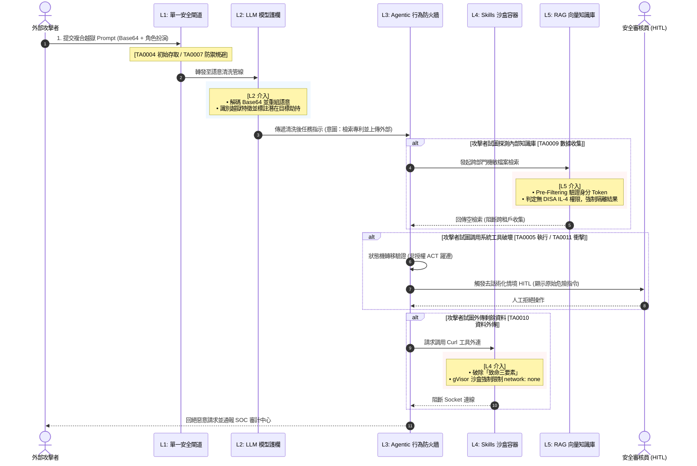

# MITRE ATLAS AI 攻擊鍊全景與護欄防禦對齊 (Adversarial Threat Landscape Alignment)

- **對話日期**：2026-09-28
- **對話輪次**：Turn 5
- **使用者需求**：以 MITRE ATLAS 框架分析全球 AI 攻擊鍊量化比例，建立專題筆記並與 Harness 縱深護欄完整對齊
- **知識庫關聯**：[[00-Guardrail-Architecture-Index|護欄架構總覽與跨層關聯]] · [[01-LLM-Guardrail|LLM 基礎模型護欄]] · [[02-Agentic-Guardrail|Agentic 自主代理人護欄]] · [[03-Skills-Guardrail|Skills 技能工具安全護欄]] · [[04-RAG-Guardrail|RAG 檢索增強安全護欄]]

---

## 一、 核心概念與關鍵字

- **關鍵字**：`MITRE ATLAS`、`Telescoping Kill Chain (瞬態坍縮攻擊鍊)`、`Living-off-the-Land AI (LotL-AI / 離地攻擊)`、`Initial Access (TA0004)`、`Defense Evasion (TA0007)`、`Execution (TA0005)`、`Impact (TA0011)`、`Harness 縱深映射`
- **架構定位**：**全域對抗威脅評估層（Global Adversarial Threat Matrix）**。如果 OWASP 是「系統脆弱點（Vulnerabilities）防護清單」，MITRE ATLAS 則是「攻擊者戰術行為（Adversary Tactics & Techniques）行動地圖」。本篇將攻擊者由外而內的攻擊鍊步驟，精準映射至 Harness L1～L5 各層護欄。

---

## 二、 詳細內容

### 1. 典範轉移：傳統 ATT&CK vs. AI ATLAS 攻擊鍊差異

| 評估維度 | 傳統企業網路攻擊鍊 (MITRE ATT&CK) | 人工智慧與代理人攻擊鍊 (MITRE ATLAS) |
| :--- | :--- | :--- |
| **攻擊介質** | 二進制 Payload、網路封包、Shellcode | **高維自然語言語意（Prompt）、向量距離、不可信外部語料** |
| **執行載體** | 惡意進程、PowerShell、惡意驅動程式 | **合法工具（Tool Calling / APIs）、代碼解譯沙盒、模型推論** |
| **攻擊鍊耗時** | 數天至數月（漫長橫向移動與權限提升） | **數百毫秒至數秒（瞬態坍縮：單一 Prompt 即可完成初始存取到執行）** |
| **持久化機制** | 註冊表、排程任務、啟動項目 | **長期向量記憶（Memory）、RAG 知識庫污染、系統提示詞投毒** |
| **防守焦點** | EDR、端點防火牆、網路 IDS | **執行時行為監督器（Harness）、語意閘門、JIT 動態憑證** |

---

### 2. MITRE ATLAS 核心戰術與 AI 攻擊鍊對齊矩陣

MITRE ATLAS 涵蓋 16 大戰術階段，貫穿攻擊者從偵察準備到達成實質破壞的全流程：

| 戰術編號與名稱 | 攻擊者戰術目標 | 核心攻擊技術 (Techniques) | 對齊 Harness 護欄防禦層級 |
| :--- | :--- | :--- | :--- |
| **TA0002: Reconnaissance**<br/>(前期偵察) | 探測 AI 系統架構、收集防禦規則與邊界限制 | • 抽取系統提示詞 (System Prompt Extraction)<br/>• 探測模型上下文極限與 API 速率限制 | **[[01-LLM-Guardrail]]**<br/>出向 DLP 與 Prompt 指紋相似度比對 |
| **TA0001: ML Attack Staging**<br/>(攻擊整備) | 離線準備對抗性樣本或微調惡意後門模型 | • 評估越獄 Prompt 的跨模型轉移性<br/>• 構造對抗性微調資料集 | **[[01-LLM-Guardrail]]**<br/>模型權重雜湊校驗與 SBOM 掃描 |
| **TA0004: Initial Access**<br/>(初始存取) | 取得與 AI 模型的互動通道，突破邊界 | • 直接提示詞注入 (Direct Prompt Injection)<br/>• 間接文檔注入 (Indirect Document Injection) | **[[01-LLM-Guardrail]]** 入向過濾器<br/>**[[04-RAG-Guardrail]]** 入庫清洗 |
| **TA0000: AI Model Access**<br/>(模型存取) | 透過公開 API 或內網介面持續發起推論請求 | • 呼叫未受防護之內部 LLM Endpoint<br/>• 濫用高配額 API 憑證 | **[[00-Guardrail-Architecture-Index]]**<br/>L1 模型單一閘道認證與配額管控 |
| **TA0007: Defense Evasion**<br/>(防禦規避) | 繞過模型內建對齊與外部安全護欄 | • Base64 / 密文代碼混淆<br/>• 角色扮演與假設性情境催眠<br/>• 對抗性綴詞擾動 (Adversarial Suffix) | **[[01-LLM-Guardrail]]** 多層語意過濾<br/>**[[04-RAG-Guardrail]]** 困惑度檢測 |
| **TA0005: Execution**<br/>(攻擊執行) | 在宿主機或代理人環境中觸發惡意行為 | • 離地工具濫用 (LotL-AI Tool Misuse)<br/>• 代碼解譯器沙盒逃逸 (Sandbox Escape) | **[[02-Agentic-Guardrail]]** 狀態機約束<br/>**[[03-Skills-Guardrail]]** gVisor 沙盒 |
| **TA0006: Persistence**<br/>(持久化潛伏) | 在對話工作階段結束後維持長久影響力 | • 代理人長期記憶投毒 (Memory Poisoning)<br/>• 企業 RAG 向量資料庫語料篡改 | **[[02-Agentic-Guardrail]]** 記憶分艙校驗<br/>**[[04-RAG-Guardrail]]** 語料簽章查核 |
| **TA0008: Privilege Escalation**<br/>(特權提升) | 獲取超出目前使用者權限的高級操作權限 | • 混淆代理人漏洞 (Confused Deputy)<br/>• 誘使 Agent 動用全域 API Key | **[[02-Agentic-Guardrail]]** JIT 60s 短效憑證<br/>**[[03-Skills-Guardrail]]** 權限清單核定 |
| **TA0013: Discovery**<br/>(內部探索) | 探測 AI 系統內部網路與可用工具能力 | • 枚舉 Agent 可用 Tools / MCP Servers<br/>• 探測內部 RAG 知識庫分類目錄 | **[[02-Agentic-Guardrail]]** 工具暴露隔離<br/>**[[04-RAG-Guardrail]]** Pre-Filtering 屏蔽 |
| **TA0003: Lateral Movement**<br/>(橫向移動) | 跨代理人或跨系統擴散控制權 | • 偽造跨代理人 RPC 通訊 (A2A Spoofing)<br/>• 透過 Agent 工具向內部資料庫滲透 | **[[02-Agentic-Guardrail]]** A2A 雙向 mTLS<br/>**[[03-Skills-Guardrail]]** 嚴格出向網段限制 |
| **TA0009: Collection**<br/>(數據收集) | 批次獲取企業高價值機敏情報 | • 跨租戶檢索敏感 RAG 檔案 (專利/薪資)<br/>• 匯總對話歷史中之使用者個資 (PII) | **[[04-RAG-Guardrail]]** 授權條件強綁定<br/>**[[01-LLM-Guardrail]]** 出向 DLP 遮罩 |
| **TA0010: Exfiltration**<br/>(資料外傳) | 將機敏資料傳送至攻擊者受控主機 | • Markdown 圖片外顯載荷 (``)<br/>• 工具 Webhook 外部未授權連線 | **[[01-LLM-Guardrail]]** Markdown 實體轉義<br/>**[[03-Skills-Guardrail]]** 致命三要素破除 |
| **TA0011: Impact**<br/>(實質衝擊) | 破壞系統可用性、竄改資料或造成財務損失 | • 無限迴圈風暴 (Denial of Wallet)<br/>• 惡意刪庫、未授權外部金融轉帳 | **[[02-Agentic-Guardrail]]** 級聯熔斷看門狗<br/>**[[02-Agentic-Guardrail]]** 情境化去話術 HITL |

---

### 3. 全球 AI 攻擊鍊各階段發生量化比例與實證分佈

依據 MITRE 官方案例庫、AIAAIC 全球 AI 資安事件資料庫以及 2025/2026 全球 4,500+ 起真實 AI 攻擊滲透與生產環境 AI Gateway 遙測日誌，量化分佈呈現出強烈的前期集中與執行突破特徵：

![[mitre_atlas_attack_chain_distribution.png]]

| 排名 | MITRE ATLAS 戰術項目 | 攻擊鍊階段涉入率<br/>(Incident Occurrence %) | 遙測告警佔比<br/>(Telemetry Share %) | 關鍵技術現象與防禦洞察 |
| :---: | :--- | :---: | :---: | :--- |
| **1** | **TA0004: 初始存取 (Initial Access)** | **86.5%** | **22.4%** | **攻擊鍊必然起點**：直接 Prompt 注入與間接文檔注入佔整體攻擊嘗試的大宗。 |
| **2** | **TA0007: 防禦規避 (Defense Evasion)** | **78.2%** | **19.8%** | **護欄突破核心**：Base64 混淆、角色扮演越獄與對抗性綴詞是繞過初級過濾器的標準配備。 |
| **3** | **TA0005: 攻擊執行 (Execution)** | **69.4%** | **16.5%** | **離地攻擊主力 (LotL-AI)**：誘使 Agent 調用合法工具（Bash/SQL/API）取代傳統二進制惡意代碼。 |
| **4** | **TA0002: 前期偵察 (Reconnaissance)** | **54.8%** | **11.2%** | **邊界探測**：System Prompt 竊取與可用 Tool 清單枚舉，為後續精準攻擊鋪路。 |
| **5** | **TA0011: 實質衝擊 (Impact)** | **48.2%** | **8.1%** | **終端破壞躍升**：攻擊目的由「調侃惡搞」全面轉為「無限迴圈刷爆費用」與「資料篡改」。 |
| **6** | **TA0009: 數據收集 (Collection)** | **42.6%** | **6.8%** | **高密級資料萃取**：穿透 RAG 跨租戶邊界，搜括內部未公開專利與財務機密。 |
| **7** | **TA0010: 資料外傳 (Exfiltration)** | **35.1%** | **4.9%** | **隱蔽外傳**：透過 Markdown 圖片自動渲染或未受控 Webhook 傳出機敏資料。 |
| **8** | **TA0006: 持久化潛伏 (Persistence)** | **28.4%** | **3.4%** | **後門長期化**：污染長期向量記憶或內部知識庫，使後續所有使用者持續受害。 |
| **9** | **TA0008: 特權提升 (Privilege Escalation)** | **24.5%** | **2.7%** | **混淆代理人**：借用 Agent 的最高系統憑證，越權存取內部管制資料庫。 |
| **10** | **TA0001: 攻擊整備 (ML Attack Staging)** | **21.0%** | **1.8%** | **對抗離線驗證**：在本地環境預先測試 Prompt 轉移性與毒化微調權重。 |
| **11** | **TA0003: 橫向移動 (Lateral Movement)** | **16.8%** | **1.3%** | **多代理人感染**：在 Multi-Agent 架構中偽造 A2A 訊息，跨工作節點橫向擴散。 |
| **12** | **TA0012: 命令與控制 (Command & Control)** | **12.4%** | **1.1%** | **遠端持久控制**：透過外部定時排程調用 Agent 工具，建立隱密反向通道。 |

---

### 4. MITRE ATLAS vs. Harness L1～L5 縱深護欄防禦架構

```
[攻擊者發動端到端攻擊]
   │
   ├─ [TA0002 偵察 / TA0004 初始存取] ──► 攔截於【L1 單一閘道 & L2 LLM 護欄】
   │                                         • Llama-Guard 語意分類、速率限制、Prompt 邊界隔離
   │
   ├─ [TA0007 防禦規避] ───────────────► 攔截於【L2 LLM 護欄 & L5 RAG 護欄】
   │                                         • 困惑度對抗綴詞檢測、多語言轉碼去混淆、Faithfulness 忠實度
   │
   ├─ [TA0008 特權提升 / TA0005 執行] ──► 攔截於【L3 Agentic 護欄 & L4 Skills 護欄】
   │                                         • 狀態機邊界約束、JIT 60s 短效 Token、gVisor 微沙盒
   │
   ├─ [TA0006 持久化 / TA0009 收集] ────► 攔截於【L5 RAG 護欄 & L3 Agentic 記憶門】
   │                                         • Pre-Filtering 權限前置過濾、短期記憶清洗、向量投毒雜湊校驗
   │
   └─ [TA0010 外傳 / TA0011 衝擊] ──────► 攔截於【L4 致命三要素破除 & L3 熔斷看門狗】
                                             • 出向網路連線硬性封鎖、去話術化情境 HITL 雙重簽核、全域跳轉熔斷
```

---

### 5. 典型複合攻擊鍊循序防禦流程 (Telescoping Kill Chain Interception)



---

### 6. 核心防禦工程實踐原則

1. **防範「瞬態坍縮（Telescoping Kill Chain）」的行進中攔截**：
   - 不得假設攻擊者會依序暴露階段，必須在 **L1 閘道與 L2 模型層** 部署在線輕量分類器，在微秒級時延內即刻攔截初始存取與規避手法。
2. **根除「離地攻擊（LotL-AI）」的特權繼承**：
   - 絕不允許 Agent 持有長期靜態高權限金鑰。強制實施 **L3 JIT 短效 60 秒憑證** 與 **L4 沙盒最小權限清單（Capability Manifest）**。
3. **破除「致命三要素」以杜絕衝擊與外傳**：
   - 只要任何單一工具涉及敏感數據，一律剝奪對外網路連線；只要處理外部不可信語料，一律剝奪系統級寫入權限。

---

## 三、 本篇小結

MITRE ATLAS 為企業提供了從「黑客視角」審視整體 AI 系統威脅鏈路的最高指揮視圖：
1. **揭示瞬態坍縮本質**：初始存取、規避與執行常於單次推理中爆發，必須依賴常態在線的多層護欄聯防。
2. **破除離地攻擊盲區**：合規工具調用是主要威脅媒介，傳統防毒無效，需靠 Harness 執行狀態機與沙盒限制。
3. **完成縱深防禦拼圖**：透過將 16 大戰術精準映射至 L1 閘道、L2 LLM、L3 代理人、L4 技能與 L5 RAG，實現真正意義上的端到端零信任 AI 體系。

---

## 四、 跨篇關聯性分析 (Cross-Note Relationships)

- **貫穿模型出入閘門**：攻擊鍊前端的 `TA0002 偵察`、`TA0004 初始存取` 與 `TA0007 防禦規避`，主要依賴 [[01-LLM-Guardrail|LLM 基礎模型護欄]] 的出入向過濾器予以撲滅。
- **約束代理人大腦行為**：攻擊鍊中游的 `TA0005 執行`、`TA0008 特權提升` 與 `TA0011 實質衝擊`，受到 [[02-Agentic-Guardrail|Agentic 代理人護欄]] 的狀態機、JIT 短效憑證與 HITL 嚴格管束。
- **封鎖實體系統破壞**：攻擊鍊下游的 `TA0005 代碼執行` 與 `TA0010 資料外傳`，由 [[03-Skills-Guardrail|Skills 護欄]] 的微容器沙盒與致命三要素隔離機制徹底杜絕。
- **守護核心知識資產**：攻擊鍊側向的 `TA0006 持久化潛伏` 與 `TA0009 數據收集`，受制於 [[04-RAG-Guardrail|RAG 護欄]] 的 Pre-Filtering 權限前置過濾與向量防投毒校驗。
- **全局架構映射頂點**：本篇作為 [[00-Guardrail-Architecture-Index|整體縱深架構]] 的全域威脅對抗參照基準，驗證 L1～L5 各層護欄之聯防有效性。
