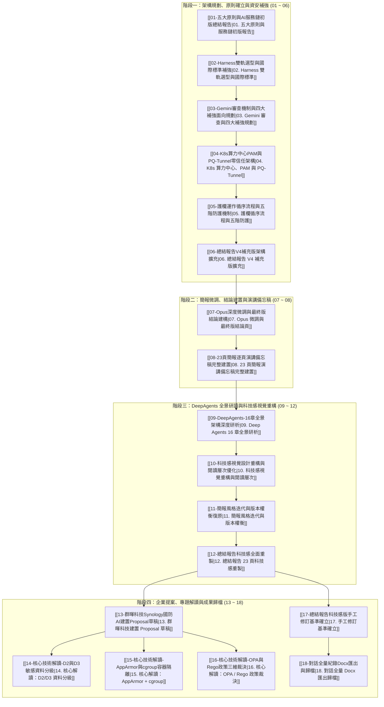

# AI Service Chain Summary Report 知識地圖與雙向關聯總覽

- **知識庫主題**：`AI Service Chain Summary Report`
- **對話 ID**：`4be13bbb-2ae7-4c18-938f-a204665099e4`
- **所屬領域**：國防 AI 服務鏈、Harness 治理外框、零信任架構、AI Agent 安全工程、企業建置提案
- **儲存目錄**：`D:\Obsidian\MyVault\Harness\AI Service Chain Summary Report\`
- **附件圖檔**：`D:\Obsidian\MyVault\Harness\AI Service Chain Summary Report\assets\`

---

## 🗺️ 體系架構圖譜 (Architecture & Knowledge Graph)

本知識庫將整個對話歷程的 21 輪交互梳理為 **四大核心演進階段**，每篇筆記皆以原子化主題形式收錄完整圖表、對話脈絡與深度技術思考，並以雙向鏈結環環相扣：

---

## 📑 筆記章節目錄與主題導覽

### 階段一：架構規劃、原則確立與資安補強
- [[01-五大原則與AI服務鏈初版總結報告|01. 五大原則與AI服務鏈初版總結報告]]：確立「模型分層、資料分級、單一閘道、層層防護、全程留痕」五大鋼鐵原則，建立 17 頁總結報告初版骨幹。
- [[02-Harness雙軌選型與國際標準補強|02. Harness雙軌選型與國際標準補強]]：確立開箱即用 Harness (Claude Code / Codex / Antigravity 2.0) 與客製化 Harness (LangChain DeepAgents) 雙軌矩陣，對齊四大國際標準支柱（NIST RMF, OWASP AISVS, MITRE ATLAS）。
- [[03-Gemini審查機制與四大補強面向規劃|03. Gemini審查機制與四大補強面向規劃]]：以 Gemini 3.1 Pro 視角執行深入審查，規劃四大維度補強策略（實體架構拓撲、護欄時序流、標準對齊、安全控制矩陣）。
- [[04-K8s算力中心PAM與PQ-Tunnel零信任架構|04. K8s算力中心PAM與PQ-Tunnel零信任架構]]：結合使用者附圖一，深入解析院內 GPU 算力中心 Kubernetes 叢集架構、PAM 特權帳號治理、以及符合 NIST SP 800-207 的後量子密碼學 (PQC) PQ-Tunnel 零信任存取隧道。
- [[05-護欄運作循序流程與五階防護機制|05. 護欄運作循序流程與五階防護機制]]：結合使用者附圖二，完整繪製使用者、Portal、Gateway、Guardrail、模型與 Audit Log 的完整時序互動圖，建構五類護欄與處置矩陣。
- [[06-總結報告V4補充版架構擴充|06. 總結報告V4補充版架構擴充]]：嚴格維持 V2 前 17 頁不變，以「補充篇」形式成功追加 5 頁核心技術投影片（擴充至 22 頁）。

### 階段二：簡報微調、結論建置與演講備忘稿
- [[07-Opus深度微調與最終版結論建構|07. Opus深度微調與最終版結論建構]]：以 Claude Opus 4.6 深度審視補充篇內容，針對 Slide 18/20 進行字體呼吸感微調，並撰寫第 23 頁「跨五大原則全景結論頁」，定稿《總結報告_最終版.pptx》。
- [[08-23頁簡報逐頁演講備忘稿完整建置|08. 23頁簡報逐頁演講備忘稿完整建置]]：為全套 23 頁簡報逐頁建立高階專業提報備忘稿（Speaker Notes），兼顧演講節奏、論述邏輯與防護深度。

### 階段三：DeepAgents 全景研讀與科技感視覺重構
- [[09-DeepAgents-16章全景架構深度研析|09. DeepAgents-16章全景架構深度研析]]：啟動 4 組並行研究代理人，深度精讀 Ch01~Ch16 共 400KB 的 LangChain DeepAgents v0.7 官方文件，產出 18 頁高水準《心得報告.pptx》。
- [[10-科技感視覺設計重構與閱讀層次優化|10. 科技感視覺設計重構與閱讀層次優化]]：重構視覺語言，採用極深藍黑背景 (`#0A0F1E`)、科技青 (`#00B4D8`)、左側色條錨定、細邊線與卡片呼吸感，生成《心得報告_v2.pptx》。
- [[11-簡報風格迭代與版本權衡復原|11. 簡報風格迭代與版本權衡復原]]：記錄樣式同步測試歷程，評估總結報告舊版色盤與心得報告科技版視覺差異，精準果斷回復高品質科技感版本。
- [[12-總結報告科技感全面重製|12. 總結報告科技感全面重製]]：將 23 頁總結報告完整重寫並套用科技感設計語言，生成《總結報告_科技感版.pptx》，達到雙簡報設計語言的高度統一。

### 階段四：企業提案、專題解讀與成果歸檔
- [[13-群暉科技Synology國防AI建置Proposal草稿|13. 群暉科技Synology國防AI建置Proposal草稿]]：以群暉科技 (Synology) 儲存安全 DNA 與 DSM Agent 商業實戰經驗為基礎，撰寫 12 大章節《國防AI服務鏈建置Proposal_草稿版.docx》。
- [[14-核心技術解讀-D2與D3敏感資料分級|14. 核心技術解讀-D2與D3敏感資料分級]]：專題剖析 D0~D3 四級資料分類法、DISA IL 等級映射、TLP 交通燈標記、以及「D2/D3 資料零出境」的實體隔離邊界。
- [[15-核心技術解讀-AppArmor與cgroup容器隔離|15. 核心技術解讀-AppArmor與cgroup容器隔離]]：專題剖析 Linux 核心級安全隔離機制：AppArmor（管能做什麼，MAC 行為白名單）與 cgroup（管能用多少，防範死迴圈與 Fork Bomb 資源消耗）。
- [[16-核心技術解讀-OPA與Rego政策三維裁決|16. 核心技術解讀-OPA與Rego政策三維裁決]]：專題剖析 Open Policy Agent (OPA) 與 Rego 語言之「政策即程式碼」理念，解析身分 × 分級 × 用途之三維動態裁決與 fail-closed 預設拒絕防線。
- [[17-總結報告科技感版手工修訂基準確立|17. 總結報告科技感版手工修訂基準確立]]：確認使用者手工修改後之《總結報告_科技感版.pptx》為後續專案之主版本 (Single Source of Truth)。
- [[18-對話全量紀錄Docx匯出與歸檔|18. 對話全量紀錄Docx匯出與歸檔]]：解析完整 21 輪交互日誌，於 `D:\JavaDO\對話紀錄` 建立《AI Service Chain Summary Report.docx》，達成對話紀錄的結構化封裝。

---

## 🎯 核心技術映射矩陣 (Five Principles vs Artifacts)

| 五大安全治理原則 | 核心技術實作 | 關聯筆記鏈結 | 核心產出成果 |
|:---|:---|:---|:---|
| **模型分層** (Model Tiering) | L1 通用基礎 → L2 領域 DSLM → L3 Agent → L4 Skill → L5 知識庫；T1~T3 地端 / T4 雲端路由 | [[01-五大原則與AI服務鏈初版總結報告]] [[09-DeepAgents-16章全景架構深度研析]] | 總結報告 S3, S6 心得報告 S3 |
| **資料分級** (Data Classification) | D0 公開(IL-2) / D1 內部(IL-3) / D2 敏感(IL-4) / D3 機密(IL-5~6)；C-I-A 三元組；標籤切片繼承 | [[01-五大原則與AI服務鏈初版總結報告]] [[14-核心技術解讀-D2與D3敏感資料分級]] | 總結報告 S3, S10 Proposal 第 4, 6 章 |
| **單一閘道** (Single Gateway) | Portal 單一入口 + Gateway 單一出口；API 直連封鎖；OPA/Rego 三維授權；fail-closed | [[01-五大原則與AI服務鏈初版總結報告]] [[16-核心技術解讀-OPA與Rego政策三維裁決]] | 總結報告 S4, S8, S9 Proposal 第 4 章 |
| **層層防護** (Defense in Depth) | 六節點縱深防禦 + 五類 Guardrail + 四級沙箱 (AppArmor+cgroup) + PQ-Tunnel 零信任 + HITL | [[04-K8s算力中心PAM與PQ-Tunnel零信任架構]] [[05-護欄運作循序流程與五階防護機制]] [[15-核心技術解讀-AppArmor與cgroup容器隔離]] | 總結報告 S4, S11, S19, S20 心得報告 S8, S9, S14 |
| **全程留痕** (Full Auditability) | 8 欄位不可否認紀錄；append-only 防竄改保存 ≥ 1年；SOC 7×24 SIEM；熔斷斷路器；季度紅隊攻防 | [[01-五大原則與AI服務鏈初版總結報告]] [[08-23頁簡報逐頁演講備忘稿完整建置]] [[18-對話全量紀錄Docx匯出與歸檔]] | 總結報告 S7, S9, S13 對話紀錄 Docx |
