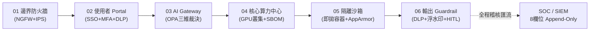

# 01. 五大原則與 AI 服務鏈初版總結報告

- **對話輪次**：第 1 輪對話 (Turn 1 / Step 0)
- **記錄日期**：`2026-09-13`
- **所屬階段**：**Phase 1: 架構規劃、原則確立與資安補強**
- **核心關鍵字**：`五大原則` `AI服務鏈` `總結報告` `架構研析` `縱深防禦`
- **主題概述**：依據五大安全治理原則（模型分層、資料分級、單一閘道、層層防護、全程留痕），從全生命週期資料流視角出發，規劃並生成 17 頁《總結報告.pptx》。

---

## 🔗 知識脈絡與雙向關聯網絡 (Context & Bilateral Links)

* **上一篇 (Previous)**：None (本對話起始起點)
* **下一篇 (Next)**：[[02-Harness雙軌選型與國際標準補強]]：因應使用者回饋，精準界定開箱即用與客製化 Harness，並大幅補強國際標準矩陣。
* **中央索引 (Master Index)**：[[00-Index-AI-Service-Chain-Summary-Report-知識地圖]]
* **橫向架構關聯 (Cross References)**：
  - [[14-核心技術解讀-D2與D3敏感資料分級|14. 核心技術解讀：D2/D3 資料分級]]：深入解構資料分級原則在三落點路由中的強制界限。
  - [[16-核心技術解讀-OPA與Rego政策三維裁決|16. 核心技術解讀：OPA / Rego 政策裁決]]：深入解構單一閘道原則的政策裁決核心。

---

## 👤 使用者原始需求指令

> 請總結目前完成的進度摘要，將以 opus 4.6 進行研析及 pptx 製作，以我們規劃的整個 AI 服務鏈資料流角度，記住五大原則："模型分層、資料分級、單一閘道、層層防護、全程留痕"，生成 "總結報告.pptx" 存在 "d:\JavaDO" 底下。

---

## 🤖 AI 助理深入研析與方案產出

### 1. 五大安全治理原則核心內涵

AI 服務鏈之所有技術規劃與安全防線，皆牢牢錨定於以下五大核心原則：

| 原則名稱 | 英文代稱 | 核心架構內涵 | 落地技術控制措施 |
|:---|:---|:---|:---|
| **模型分層** | Model Tiering | 依照推理能力、部署成本與安全邊界，劃分為 L1 基礎模型、L2 領域 DSLM、L3 Agent 代理、L4 技能工具、L5 領域知識庫。 | 算力中心分級調度；敏感推論落於地端獨立節點；外部公網呼叫嚴格限縮。 |
| **資料分級** | Data Classification | 實施 DISA IL-2 ~ IL-6 四級資料管控（D0 公開、D1 內部、D2 敏感、D3 機密）；落實 C-I-A 三元組評定。 | 標籤繼承至 RAG 向量切塊；D2/D3 實施「資料零出境」；三落點動態路由。 |
| **單一閘道** | Single Gateway | 確立 Portal 為全院單一入口、AI Gateway 為全院單一出口，阻斷所有繞道與影子 AI。 | 防火牆封鎖對外 API 直連；金鑰集中於 Gateway 密鑰庫；OPA/Rego 三維授權裁決；fail-closed。 |
| **層層防護** | Defense in Depth | 建構「六節點縱深防禦」，並在各生命週期佈設 Harness 治理外框、五類 Guardrail 護欄與四級隔離沙箱。 | AppArmor/cgroup 容器隔離；HITL 人工核可中斷點；輸入/輸出雙向 DLP 檢查。 |
| **全程留痕** | Full Auditability | 實施不可否認、防竄改之 8 欄位稽核紀錄，儲存於 append-only 儲存庫，法規保存 ≥ 1 年。 | 全鏈路 Trace ID 追蹤；日誌即時匯流至 SOC SIEM；異常行為觸發自動斷路器熔斷。 |

---

### 2. AI 服務鏈全景資料流：六節點縱深防禦

1. **節點 01 邊界防火牆**：NGFW + IPS，預設拒絕、白名單放行，出向阻斷任何直連外部 AI API 之流量。
2. **節點 02 使用者 Portal**：雙因素認證 (SSO+MFA)，提示詞前置 DLP 檢驗，防止未授權提示注入與機敏外洩。
3. **節點 03 AI Gateway**：全院核心管控樞紐，執行身分 × 分級 × 用途三維裁決，依資料密級分流至地端或隔離 VPC。
4. **節點 04 核心算力中心**：地端與圍籬算力，模型權重雜湊驗簽與 SBOM 料件管理，切分部門配額。
5. **節點 05 隔離沙箱**：程式碼執行與工具呼叫環境，每次呼叫使用即拋式容器，預設斷網與唯讀保護。
6. **節點 06 輸出 Guardrail**：機敏資訊偵測與遮罩，幻覺與來源真實性比對，高衝擊動作強制觸發 HITL 審批。

---

### 3. 初版 17 頁簡報架構大綱

* **Slide 01: 封面** — 國防 AI 服務鏈總結報告、五大原則徽章。
* **Slide 02: 報告目錄** — 涵蓋 14 大核心主題章節。
* **Slide 03: 五大原則總覽** — 模型分層、資料分級、單一閘道、層層防護、全程留痕。
* **Slide 04: AI 服務鏈全景架構** — 六節點縱深防禦與 Harness 橫向貫穿。
* **Slide 05: Agent 開發者 — 行政庶務流程** — 開發生命週期與安全基線。
* **Slide 06: Agent 開發者 — 武器系統流程** — 高密級戰術代理人與多層沙箱。
* **Slide 07: Agent 開發者 — 管控與軌跡** — Harness 四項強制功能與 8 欄位留痕。
* **Slide 08: Agent 使用者 — Portal 操作流程** — 11 步端到端資料流與 HITL 流程。
* **Slide 09: Agent 使用者 — 管控與軌跡** — Portal/Gateway 雙管控與 fail-closed。
* **Slide 10: 資安防護（一）** — 單向閘道 Diode/CDS、DLP 即時掃描、三落點路由。
* **Slide 11: 資安防護（二）** — 資料治理五步管線、Guardrail 五類佈設點。
* **Slide 12: 資安防護（三）** — 國際標準與法規體系總覽。
* **Slide 13: 資安防護（四）** — SOC 監控、異常斷路器熔斷、季度紅隊演練。
* **Slide 14: 端到端全景工作流程** — 完整資料鏈路與 16 項資安防護檢核清單。
* **Slide 15: AI 服務鏈 Roadmap** — Q1~Q4 四階段建置藍圖。
* **Slide 16: 效益評估與 KPI** — 100% 閘道覆蓋率、0 件資料出境、風險降低矩陣。
* **Slide 17: 結論與下一步行動** — 核心建置成果與近期行動建議。

---

## 💡 深度理解與架構啟示

1. **戰略價值**：五大原則並非孤立的規範，而是緊密互鎖的防禦矩陣。例如，「單一閘道」確保所有流量必經檢核，方能支撐「資料分級」與「全程留痕」的實現。
2. **工程挑戰**：初版報告確立了整體框架，但對於實體網路部署（如 K8s 算力調度、零信任網路技術）以及業界標準之細化對標，仍需進一步深化補強。
