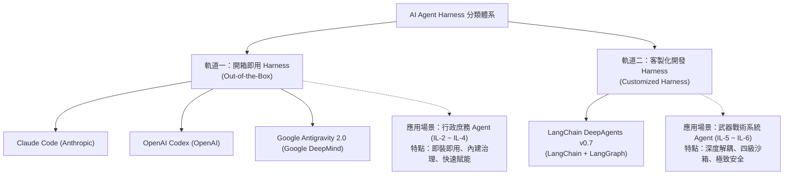

# 02. Harness 雙軌選型與國際標準補強

- **對話輪次**：第 2 輪對話 (Turn 2 / Step 32)
- **記錄日期**：`2026-09-13`
- **所屬階段**：**Phase 1: 架構規劃、原則確立與資安補強**
- **核心關鍵字**：`Harness選型` `ClaudeCode` `OpenAI_Codex` `Antigravity` `LangChain_DeepAgents` `國際標準`
- **主題概述**：明確界定「開箱即用 Harness」與「客製化 Harness」的分類標準，並將 AI 國際標準全面補強至四大支柱 29 項規範。

---

## 🔗 知識脈絡與雙向關聯網絡 (Context & Bilateral Links)

* **上一篇 (Previous)**：[[01-五大原則與AI服務鏈初版總結報告]]：初版總結報告建立了 17 頁架構骨幹。
* **下一篇 (Next)**：[[03-Gemini審查機制與四大補強面向規劃]]：在概念界定清楚後，啟動多視角審查與補強規劃。
* **中央索引 (Master Index)**：[[00-Index-AI-Service-Chain-Summary-Report-知識地圖]]
* **橫向架構關聯 (Cross References)**：
  - [[09-DeepAgents-16章全景架構深度研析|09. Deep Agents 16 章全景研析]]：詳盡探討客製化 Harness 的底層機制（VFS、中間件、沙箱、權限）。
  - [[13-群暉科技Synology國防AI建置Proposal草稿|13. 群暉科技建置 Proposal 草稿]]：將雙軌 Harness 選型作為提案書第 5 章的核心工作範疇。

---

## 👤 使用者原始需求指令

> 請依據下面，修調 pptx 內容：
> 1. 我說的開箱即用的 Harness 指的是像：claude code、OpenAI codex、Google antigravity 2.0 這些工具，LangChain DeepAgents 我定義為需客製化開發的 Harness
> 2. AI 國際標準，需包括 NISP RMF 1.0、OWASP AISVS、OWASP Top 10 for LLM/Agents/Skills、MITRE ATLAS 等，不足的話，請你務必補充
> 3. 務必參考 "D:\JavaDO\AI_Agent_Harness整合提報版_20260906.pptx" 的內容，內容非常詳細

---

## 🤖 AI 助理深入研析與方案產出

### 1. Harness 雙軌分類體系定義

針對國防與高安全組織需求，將 Agent Harness 明確拆解為雙軌選型架構：



#### 開箱即用 vs 客製化 Harness 對照矩陣

| 評估維度 | 開箱即用 Harness (OOB) | 客製化開發 Harness (Customized) |
|:---|:---|:---|
| **代表工具** | Claude Code, OpenAI Codex, Google Antigravity 2.0 | LangChain DeepAgents v0.7 (基於 LangGraph) |
| **適用業務場景** | 行政庶務、公文撰擬、內部問答、報表整理 | 武器系統、情資研析、戰術決策支援、交戰模擬 |
| **支援資料密級** | DISA IL-2 ~ IL-4 (D0 公開 / D1 內部 / D2 敏感) | DISA IL-5 ~ IL-6 (D2 核心營業秘密 / D3 軍事機密) |
| **權限控制模式** | 工具自帶 Deny-First 白名單與工作區綁定 | 多層檔案系統 ACL (VFS) + 四級沙箱 (L0~L3) 隔離 |
| **HITL 審批能力** | 工具層單點審核 (Prompt 前置確認) | 多節點鏈式中斷 `interrupt()` + 狀態快照保存 |
| **模型適配彈性** | 依賴特定廠商雲端/端點 API | 抽象化介面，相容 100+ 地端隔離模型與私有雲 |
| **治理擴展性** | 封閉或半封閉治理外框 | 開放式三層中間件 (Middleware) 任意自訂插拔 |
| **開發建置週期** | 數天至 1~2 週內快速部署 | 2~3 個月深度客製化研發與紅隊驗證 |

---

### 2. AI 國際標準與法規四大支柱體系

全面梳理並對齊國際頂級 AI 資安治理標準，構築四大支柱矩陣：

```
┌────────────────────────────────────────────────────────────────────────┐
│                   AI 國際標準與法規體系（四大支柱）                    │
├──────────────────┬──────────────────┬──────────────────┬───────────────┤
│  01. ISO 治理框架│  02. NIST 風險   │  03. OWASP 技術  │  04. 威脅法制 │
├──────────────────┼──────────────────┼──────────────────┼───────────────┤
│• ISO/IEC 42001   │• NIST AI RMF 1.0 │• LLM Top 10 2025 │• MITRE ATLAS  │
│  (AI 管理系統)   │  (治理/測繪/評量)│  (注入/外洩/鏈)  │  (對抗戰術庫) │
│• ISO/IEC 27001   │• NIST AI 600-1   │• Agentic AI Top10│• EU AI Act    │
│  (資安管理體系)  │  (GenAI 剖繪)    │  (記憶投毒/越權) │  (風險分級法) │
│• ISO/IEC 27017/18│• NIST SP 800-53  │• OWASP AISVS     │• CISA/NSA     │
│  (雲端安全/個資) │  (安全控制基線)  │  (安全驗證分級)  │  (部署指引)   │
│• ISO/IEC 27040   │• NIST SP 800-218A│• ML Security Top │• CNSSI 1253   │
│  (儲存安全)      │  (安全開發 SSDF) │  (投毒/逆向工程) │  (國安等級)   │
│• ISO/IEC 27701   │• NIST SP 800-207 │• AI Exchange     │• DISA CC SRG  │
│  (隱私資訊管理)  │  (零信任架構)    │  (威脅對映標準)  │  (IL2~IL6軍規)│
│• ISO 17025       │• NIST SP 800-171 │• Red Teaming 指引│• 資通安全管理法│
│  (實驗室稽核能力)│  (CUI 受控保護)  │  (紅隊演練規範)  │  (A級防護基準)│
└──────────────────┴──────────────────┴──────────────────┴───────────────┘
```

---

## 💡 深度理解與架構啟示

1. **務實的落地策略**：若全院均採用客製化開發，將面臨極高的研發與維護成本；若全院皆用開箱即用工具，則無法滿足武器系統 IL-5/IL-6 的極端隔離要求。**雙軌架構精準化解了「開發速度」與「極致安全」的矛盾。**
2. **標準體系的縱向貫通**：治理制度（ISO 42001）由高層向下指導；風險流程（NIST AI RMF）建立操作指引；技術控制（OWASP）防禦具體攻擊；威脅驗證（MITRE ATLAS）提供紅隊攻防語料。四者形成完整閉環。
