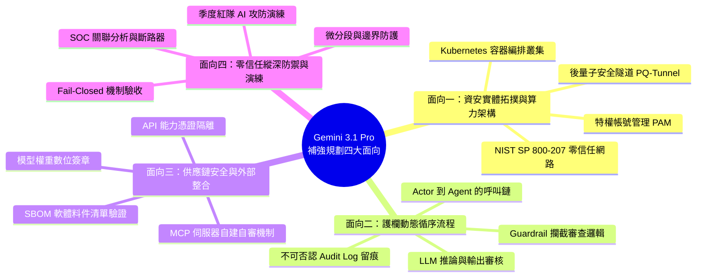

# 03. Gemini 審查機制與四大補強面向規劃

- **對話輪次**：第 3~4 輪對話 (Turn 3~4 / Step 55~57)
- **記錄日期**：`2026-09-13`
- **所屬階段**：**Phase 1: 架構規劃、原則確立與資安補強**
- **核心關鍵字**：`Gemini審查` `補強規劃` `拓撲架構` `護欄時序` `標準對齊`
- **主題概述**：切換至 Google Gemini 3.1 Pro 視角執行深入架構審查，鎖定四大不足之處並提出具體補強規劃方案，等待使用者拍板同意。

---

## 🔗 知識脈絡與雙向關聯網絡 (Context & Bilateral Links)

* **上一篇 (Previous)**：[[02-Harness雙軌選型與國際標準補強]]：確立了雙軌選型與四大標準支柱。
* **下一篇 (Next)**：[[04-K8s算力中心PAM與PQ-Tunnel零信任架構]]：使用者批准規劃並要求依據附圖一深化 K8s 與 PAM 實作。
* **中央索引 (Master Index)**：[[00-Index-AI-Service-Chain-Summary-Report-知識地圖]]
* **橫向架構關聯 (Cross References)**：
  - [[05-護欄運作循序流程與五階防護機制|05. 護欄運作循序流程與五階防護]]：落實四大面向中「護欄運作動態循序流程」之深化。
  - [[06-總結報告V4補充版架構擴充|06. 總結報告 V4 補充版擴充]]：將本規劃轉化為具體補充篇投影片。

---

## 👤 使用者原始需求指令

> 請總結目前完成的進度，將以 Gemini 3.1 pro 來 review pptx 內容，並進行必要及補強性的補充：
> 1. 先研究相關的內容，可以去外面找
> 2. 先提出你的規劃內容，等我同意後再進行

---

## 🤖 AI 助理深入研析與方案產出

### 1. 進度總結與審查現況分析

* **已完成資產**：`總結報告_v2.pptx`（共 17 頁），具備雙軌 Harness 分類與 29 項國際標準支柱。
* **Gemini 3.1 Pro 審查洞察**：
  1. 現有架構偏向「概念層」與「邏輯層」，缺乏地端算力中心與實體網路硬體配置的**具體拓撲層**。
  2. 護欄（Guardrail）機制列出了靜態類別，但缺乏使用者發送請求後，各節點間的**動態時序互動流（Sequence Flow）**。
  3. 軟體供應鏈安全（SBOM）與微服務/工具整合（MCP）的安全驗證流程尚未展開。
  4. 零信任架構（ZTA）與後量子密碼（PQC）在資料通道中的具體實踐有待加強。

---

### 2. 四大補強面向規劃提案

1. **補強面向一：資安方案與算力中心實體拓撲**
   - 院內算力中心 Kubernetes (K8s) GPU 節點調度與租戶資源隔離。
   - PAM (Privileged Access Management) 特權帳號存取管控。
   - 導入 PQC (Post-Quantum Cryptography) 之 PQ-Tunnel 建立零信任傳輸通道，符合 NIST SP 800-207。

2. **補強面向二：護欄運作循序流程說明 (Sequence Diagram)**
   - 繪製清晰的時序互動圖：使用者 (Actor) → Portal → Gateway → Guardrail → LLM → Audit Log。
   - 明確標示「請求前置檢查」、「檢索過濾」、「輸出淨化」與「違規阻斷」的即時處置流。

3. **補強面向三：軟體供應鏈安全 (SBOM) 與 MCP 工具治理**
   - 模型權重簽章驗證、開源元件 SBOM 清單比對與漏洞掃描。
   - Model Context Protocol (MCP) 自建自審政策，工具呼叫強制進行 Schema 驗證與沙箱隔離。

4. **補強面向四：零信任微分段與紅隊驗證閉環**
   - 強化南北向/東西向微分段防禦，落實 Policy as Code。
   - 建立紅隊 AI 演練量化指標（越獄成功率、誤攔率 FPR、洩漏率）。

---

## 💡 深度理解與架構啟示

* **多模型交叉審查的價值**：自 Claude Opus 4.6 切換至 Gemini 3.1 Pro，能跳脫單一模型的思維定勢，敏銳發現架構中「邏輯完備但實體缺失」的斷層。
* **規範化提案原則**：遵守「先規劃、獲同意、後執行」的敏捷溝通規範，確保架構擴展完全符合決策者的核心戰略預期。
