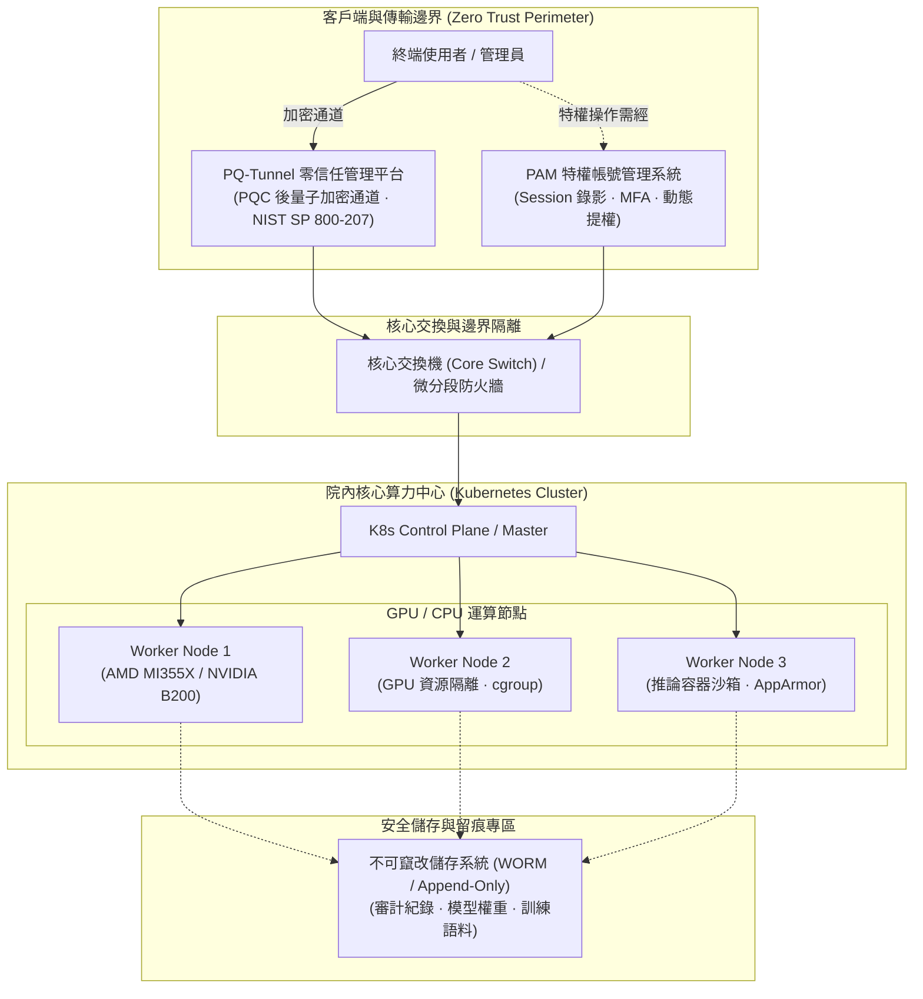

# 04. K8s 算力中心、PAM 與 PQ-Tunnel 零信任架構

- **對話輪次**：第 5 輪對話 (Turn 5 / Step 61)
- **記錄日期**：`2026-09-13`
- **所屬階段**：**Phase 1: 架構規劃、原則確立與資安補強**
- **核心關鍵字**：`算力中心` `Kubernetes` `PAM特權管理` `PQ_Tunnel` `零信任架構` `NIST_SP_800_207` `附圖一`
- **主題概述**：依據使用者提供之附圖一（圖73 資安方案與本案架構說明），深入設計院內算力中心 Kubernetes 叢集、特權帳號管理 (PAM)、以及後量子密碼學 (PQC) PQ-Tunnel 零信任存取架構。

---

## 🔗 知識脈絡與雙向關聯網絡 (Context & Bilateral Links)

* **上一篇 (Previous)**：[[03-Gemini審查機制與四大補強面向規劃]]：規劃了實體拓撲與算力架構的補強方向。
* **下一篇 (Next)**：[[05-護欄運作循序流程與五階防護機制]]：接續處理使用者提供的附圖二（護欄運作循序流程）。
* **中央索引 (Master Index)**：[[00-Index-AI-Service-Chain-Summary-Report-知識地圖]]
* **橫向架構關聯 (Cross References)**：
  - [[06-總結報告V4補充版架構擴充|06. 總結報告 V4 補充版擴充]]：將本篇內容具體實作為 Slide 19 投影片。
  - [[15-核心技術解讀-AppArmor與cgroup容器隔離|15. 核心技術解讀：AppArmor + cgroup]]：深入解析 K8s 工作節點內部容器沙箱的核心安全機制。

---

## 👤 使用者原始需求指令

> 同意上述 4 點補強規劃，請再加強：
> 1. SBOM，軟體料件清單管控
> 2. 參考附圖一的資安架構圖，院內算力中心使用 Kubernets(K8s) 架構及 PAM 特權帳號管理
> 3. 導入 PQC 的 PQ tunnel 零信任網路管理平台，符合 NISP SP 800-207
> 4. 參考附圖二的護欄運作循序流程圖
> 
> 先提出你的規劃內容，等我同意後再進行

---

## 🖼️ 架構參考依據：圖73 資安方案與本案架構說明

![[assets/fig73_k8s_pam_security_arch.jpg]]
*圖 73：資安方案與本案架構拓撲說明（院內算力中心、K8s 叢集、PAM 與網路拓撲）*

---

## 🤖 AI 助理深入研析與方案產出

### 1. 實體與邏輯拓撲架構

結合附圖一之架構配置，本案於地端與邊界建立高安全隔離分段：

---

### 2. 三大核心安全支柱深度解析

#### 支柱一：院內算力中心 Kubernetes (K8s) 架構
1. **多租戶資源切分**：以 Namespace 切分不同單位與機密專案，配置專屬 ResourceQuota 與 LimitRange，嚴格限制 GPU/CPU 算力佔用。
2. **網路安全政策 (NetworkPolicy)**：預設啟用 Default-Deny-All，僅開放 Pod 間經核可之標籤通訊；封鎖未授權之橫向移動 (Lateral Movement)。
3. **工作節點強化**：節點運行客製化 Linux 核心，整合 AppArmor 安全配置與 cgroup 資源限制，確保 Agent 程式碼無法越權存取宿主主機。

#### 支柱二：PAM (Privileged Access Management) 特權帳號治理
1. **特權存取受控**：算力叢集節點、資料庫與模型權重之管理權限全面收歸 PAM 系統，禁止系統管理員直連根帳號。
2. **即時會話監控與側錄**：所有 SSH/RDP/Kubectl 終端操作實施全程錄影與指令紀錄，嚴禁未授權之高危指令執行。
3. **一次性動態認證 (JIT / JEA)**：落實 Just-In-Time 授權與 Just-Enough-Access 原則，憑證即用即拋，消除靜態密鑰外洩風險。

#### 支柱三：PQC 之 PQ-Tunnel 零信任網路平台 (NIST SP 800-207)
1. **後量子密碼演算法 (PQC)**：通道採用 NIST 標準化抗量子加密演算法（如 ML-KEM / Kyber 密鑰封裝、ML-DSA / Dilithium 數位簽章），防範「先攔截、後解密」(Harvest Now, Decrypt Later) 之威脅。
2. **零信任持續驗證**：符合 NIST SP 800-207 標準，每次連線皆評估終端設備健康狀態、使用者身分、地理時序等屬性，不因身處內網而降低認證要求。
3. **微分段動態穿透**：使用者僅能存取經 OPA/Rego 策略明確授權的特定服務端點，完全隱蔽內部算力網路拓撲。

---

## 💡 深度理解與架構啟示

* **前瞻防禦的必要性**：軍事與國防資料具有極長之機密保密年限（20~30 年）。傳統 RSA/ECC 加密恐於未來量子電腦成熟時遭破解，因此**在資料傳輸層直接導入 PQC PQ-Tunnel 是保護國防核心資產的關鍵技術決策**。
* **軟硬體無縫銜接**：將軟體層的 Agent Harness 與基礎設施層的 K8s/PAM/PQC 深度整合，使安全防線下沉至網路封包與容器命名空間層級，杜絕單點失效。
