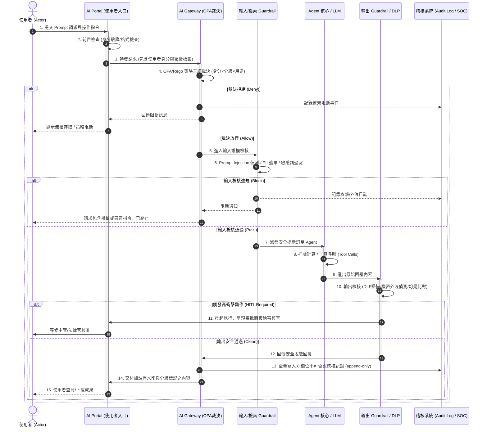

# 05. 護欄運作循序流程與五階防護機制

- **對話輪次**：第 5~6 輪對話 (Turn 5~6 / Step 61~63)
- **記錄日期**：`2026-09-13`
- **所屬階段**：**Phase 1: 架構規劃、原則確立與資安補強**
- **核心關鍵字**：`護欄循序流程` `SequenceDiagram` `處置矩陣` `提示注入防護` `附圖二` `五階防護`
- **主題概述**：依據使用者提供之附圖二（圖79 護欄運作循序流程說明），完整構建從使用者輸入、Portal 前置檢查、Gateway 政策裁決、Guardrail 雙向過濾、LLM 推論到不可否認 Audit Log 留痕的完整動態時序流程圖。

---

## 🔗 知識脈絡與雙向關聯網絡 (Context & Bilateral Links)

* **上一篇 (Previous)**：[[04-K8s算力中心PAM與PQ-Tunnel零信任架構]]：完成了實體拓撲與算力架構規劃。
* **下一篇 (Next)**：[[06-總結報告V4補充版架構擴充]]：使用者全面同意規劃，啟動 V4 補充版簡報製作。
* **中央索引 (Master Index)**：[[00-Index-AI-Service-Chain-Summary-Report-知識地圖]]
* **橫向架構關聯 (Cross References)**：
  - [[06-總結報告V4補充版架構擴充|06. 總結報告 V4 補充版擴充]]：將本流程實作為 Slide 20 投影片。
  - [[16-核心技術解讀-OPA與Rego政策三維裁決|16. 核心技術解讀：OPA / Rego 政策裁決]]：深入解析流程中 Step 3 Gateway 的裁決演算法。

---

## 🖼️ 架構參考依據：圖79 護欄運作循序流程說明

![[assets/fig79_guardrail_sequence_flow.jpg]]
*圖 79：護欄運作循序流程說明（使用者操作、Guardrail 雙向檢核、模型推論與稽核紀錄）*

---

## 🤖 AI 助理深入研析與方案產出

### 1. 護欄運作循序流程 (Detailed Sequence Diagram)



---

### 2. 五類護欄佈設與防護職責

| 護欄類型 | 佈設位置 | 核心檢核職責 | 典型攔截威脅 |
|:---|:---|:---|:---|
| **輸入護欄** (Input Guardrail) | Portal / Gateway 入口 | 身分檢驗、輸入長度規範、Prompt Injection 偵測、越獄防護。 | 惡意提示注入、越獄字串、格式破壞攻擊。 |
| **檢索護欄** (Retrieval Guardrail) | RAG Pipeline 檢索層 | 依使用者密級過濾向量索引、去除外部文件夾帶之隱含指令、標記外部語料為不可信。 | 間接提示注入 (Indirect Injection)、跨密級資料窺探。 |
| **工具/動作護欄** (Tool Guardrail) | Harness Middleware | 工具白名單限制、參數 Schema 強制校驗、副作用與資源範圍限制。 | 惡意指令執行、非預期系統寫入、超額調用。 |
| **輸出護欄** (Output Guardrail) | Gateway 出口前置層 | DLP 內容掃描、個資/座標自動遮蔽、引用依據比對、數位浮水印加註。 | 機敏資料外洩、模型幻覺、無來源虛構。 |
| **行為/迴圈護欄** (Behavior Guardrail) | Harness Runtime 執行層 | 步數上限熔斷、Token 配額限制、死迴圈與重複動作偵測、成本防暴衝。 | Agent 迴圈暴衝 (Fork Bomb)、資源耗盡攻擊 (DoS)。 |

---

### 3. 處置矩陣 (Decision & Action Matrix)

```
[檢核結果] ──┬── 通過 (Pass) ───────────→ 【放行 Allow】 (保留完整稽核紀錄)
              ├── 低度敏感/個資 ────────→ 【去識別 Redact】 (遮罩脫敏後放行)
              ├── 格式錯誤/輕微幻覺 ────→ 【改寫重試 Rewrite】 (限次自動退回修正)
              ├── 機密外洩/惡意注入 ────→ 【阻斷 Block】 (立即終止 + 觸發告警)
              └── 高衝擊/系統變更 ──────→ 【轉人工 Escalate】 (HITL 審批核可後放行)
```

---

## 💡 深度理解與架構啟示

* **動態防護與靜態防線的結合**：單有防火牆與權限白名單不足以抵禦 GenAI 特有的提示語意攻擊。本流程將護欄細分為輸入、檢索、工具、輸出、行為五個切入點，實現了**語意層級的縱深防禦**。
* **Fail-Closed 鋼鐵法則**：流程中任何一個檢查模組發生超時、宕機或內部異常，系統一律判定為「不通過」，絕不採取鬆懈放行策略。
