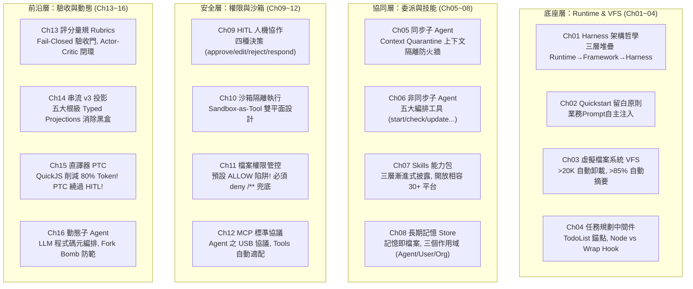

# 09. Deep Agents 16 章全景架構深度研析

- **對話輪次**：第 11 輪對話 (Turn 11 / Step 114)
- **記錄日期**：`2026-09-13`
- **所屬階段**：**Phase 3: DeepAgents 全景研讀與科技感視覺重構**
- **核心關鍵字**：`DeepAgents` `16章全景研讀` `並行代理人` `上下文工程` `VFS虛擬檔案系統` `心得報告`
- **主題概述**：啟動 4 組並行研究子代理人，全面精讀 `D:\JavaDO\Harness\Deep Agents\MD` 底下 16 篇技術 Markdown 檔案（共約 400KB），完成深度技術萃取並產出 18 頁高階《心得報告.pptx》。

---

## 🔗 知識脈絡與雙向關聯網絡 (Context & Bilateral Links)

* **上一篇 (Previous)**：[[08-23頁簡報逐頁演講備忘稿完整建置]]：完成 23 頁總結報告備忘稿。
* **下一篇 (Next)**：[[10-科技感視覺設計重構與閱讀層次優化]]：使用者要求修改簡報視覺，導入高質感科技感排版。
* **中央索引 (Master Index)**：[[00-Index-AI-Service-Chain-Summary-Report-知識地圖]]
* **橫向架構關聯 (Cross References)**：
  - [[02-Harness雙軌選型與國際標準補強|02. Harness 雙軌選型]]：深入為「客製化 Harness」提供詳盡的底層代碼級技術依據。
  - [[15-核心技術解讀-AppArmor與cgroup容器隔離|15. 核心技術解讀：AppArmor + cgroup]]：對應 Ch10 沙箱技術中 Sandbox-as-Tool 的深度實作。

---

## 👤 使用者原始需求指令

> 1. 深入理解 "D:\JavaDO\Harness\Deep Agents\MD" 下面的所有 md 檔，並深度思考後
> 2. 撰寫心得報告.pptx，存在 "D:\JavaDO\Harness\Deep Agents\MD" 資料夾中
> 3. 必要時可以搜尋相關技術文件

---

## 🤖 AI 助理深入研析與方案產出

### 1. 4 組並行研究子代理人調度

面對 16 篇章約 400KB 的繁複技術文件，啟動 4 組高階研究 Subagent 分工深讀：

```
[400KB / 16 章 技術文檔庫]
        ├── Agent 1 (Ch01~Ch04): 基礎架構、VFS、任務規劃中間件
        ├── Agent 2 (Ch05~Ch08): 子Agent委派、非同步編排、Skills規範、長期記憶
        ├── Agent 3 (Ch09~Ch12): HITL人機協作、沙箱隔離、檔案權限ACL、MCP協議
        └── Agent 4 (Ch13~Ch16): 評分量規驗收、串流可觀測性、JS直譯器PTC、動態編排
```

---

### 2. 16 章核心架構精華萃取



---

### 3. 核心洞見：四大防線聯防體系 (Four-Track Defense)

文件研讀後最重大的架構啟示在於——**沒有任何單一機制能覆蓋所有攻擊面**：

| 防禦軌道 | 核心覆蓋範圍 | 致命防禦邊界（不保護範圍） | 應對對策 |
|:---|:---|:---|:---|
| **軌道一：FilesystemPermission** (Ch11) | 內建 7 個 VFS 檔案工具之讀寫路徑控制。 | ❌ 完全不保護 MCP 工具、自訂工具與沙箱內指令。 | 必須多軌並行，不可依賴單一 ACL。 |
| **軌道二：Sandbox 執行沙箱** (Ch10) | 不可信程式碼隔離、宿主主機進程與環境變數保護。 | ❌ 不防 Prompt Injection 提示誘導、不防出站網路洩漏。 | 容器預設斷網 (No Network) + 輸入護欄過濾。 |
| **軌道三：MCP + Interceptor** (Ch12) | 企業微服務安全存取、憑證集中注入。 | ❌ Session 不存入 Checkpoint、需工具自身具備冪等性。 | 採用 Streamable HTTP + mTLS，強化重試冪等。 |
| **軌道四：HITL 人機協作** (Ch09) | 高衝擊寫入動作之終極人工核可閘門。 | ❌ PTC 程式碼直譯器會繞過 HITL！動態子 Agent 預設無級聯審查。 | PTC 白名單嚴禁加入寫入工具；動態子 Agent 強制配額限制。 |

---

### 4. 18 頁心得報告簡報架構

產出於 `D:\JavaDO\Harness\Deep Agents\MD\心得報告.pptx`，包含 18 頁高密度技術提報頁與 18 條演講備忘稿。

---

## 💡 深度理解與架構啟示

* **範式轉移：從 Prompt Stuffing 到 Context Engineering**：Deep Agents 的精髓不在於寫出多精巧的 Prompt，而在於**主動管理上下文邊界**。透過 VFS 自動卸載大檔案、子 Agent 隔離上下文污染、Skills 三層漸進加載，徹底化解了「上下文溢出」與「注意力稀釋」兩大痛點。
