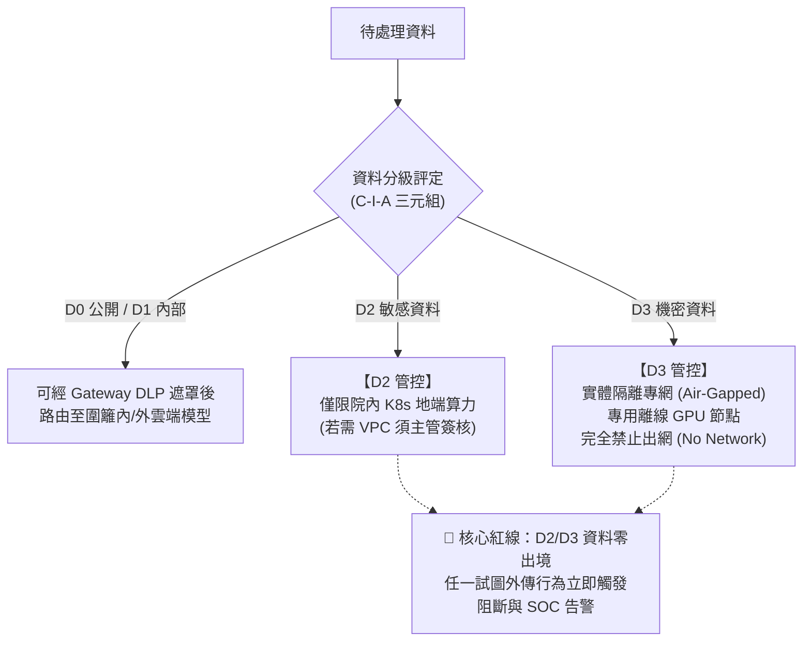

# 14. 核心技術解讀：D2 與 D3 敏感資料分級

- **對話輪次**：第 17 輪對話 (Turn 17 / Step 194)
- **記錄日期**：`2026-09-13`
- **所屬階段**：**Phase 4: 企業提案、專題解讀與成果歸檔**
- **核心關鍵字**：`資料分級` `D2敏感資料` `D3機密資料` `DISA_IL` `TLP標記` `資料零出境`
- **主題概述**：回應使用者「D2/D3 敏感資料是甚麼？」之提問，深入解構本架構中 D0~D3 四級體系、對標 DISA IL 等級、TLP 交通燈協議、以及「D2/D3 資料零出境」在三落點路由中的強制管控機制。

---

## 🔗 知識脈絡與雙向關聯網絡 (Context & Bilateral Links)

* **上一篇 (Previous)**：[[13-群暉科技Synology國防AI建置Proposal草稿]]：提案書中多次提及 D2/D3 敏感資料零出境指標。
* **下一篇 (Next)**：[[15-核心技術解讀-AppArmor與cgroup容器隔離]]：探討如何利用容器機制保護執行 D2/D3 資料推論的沙箱環境。
* **中央索引 (Master Index)**：[[00-Index-AI-Service-Chain-Summary-Report-知識地圖]]
* **橫向架構關聯 (Cross References)**：
  - [[01-五大原則與AI服務鏈初版總結報告|01. 五大原則初版報告]]：資料分級原則的微觀定義。
  - [[16-核心技術解讀-OPA與Rego政策三維裁決|16. 核心技術解讀：OPA / Rego 政策裁決]]：OPA 策略引擎中依據 D 等級動態決策之依據。

---

## 👤 使用者原始需求指令

> D2/D3 敏感資料是甚麼？

---

## 🤖 AI 助理深入研析與方案產出

### 1. D0 ~ D3 四級資料分級對照體系

在國防 AI 服務鏈規劃中，建立與美軍 DISA (Defense Information Systems Agency) 嚴格對標的四級資料分類標準：

| 等級代碼 | 分級名稱 | 對應 DISA IL 等級 | TLP 交通燈標記 | 資料內涵與實例 | 允許運算落點與限制 |
|:---|:---|:---|:---|:---|:---|
| **D0** | 公開資料 (Public) | **DISA IL-2** | `TLP:CLEAR` | 可對外公開之非敏感資訊、學術論文、公開技術文獻。 | 地端、圍籬內雲端 (VPC)、圍籬外公有雲皆可。 |
| **D1** | 內部資料 (Internal) | **DISA IL-3** | `TLP:GREEN` | 機構內部營運資料、行政公告、非機敏會議紀錄、一般報表。 | 地端院內機房、圍籬內雲端 (VPC)；公有雲需去識別化。 |
| **D2** | **敏感資料** (Sensitive) | **DISA IL-4** | `TLP:AMBER` | **營業秘密等級**：科研原始數據、演算法原始碼、人事個資、未公開專利。 | **僅限院內地端算力**；若需圍籬內雲端需**逐案專簽核准**；嚴禁送往公有雲。 |
| **D3** | **機密資料** (Confidential) | **DISA IL-5 ~ IL-6** | `TLP:RED` | **核心營業秘密 / 國防軍事機密**：武器作戰參數、雷達情資、戰術作戰計畫、加密密鑰。 | **絕對限制於地端實體隔離網域 (Air-Gapped)**；100% 自建離線模型；嚴禁任何外連。 |

---

### 2. 「D2/D3 資料零出境」的核心工程實踐

1. **三落點路由判定的硬性邊界**：
   - 落點認定原則：「以**資料被送到哪一區**認定，而非 AI 服務位於何處」。
   - 地端能達成者，絕不逕用雲端；D2/D3 資料在 Gateway 階段若目標為外部，OPA 引擎直接觸發 `deny`。
2. **標籤穿透與繼承 (Label Inheritance)**：
   - 檔案屬性與資料庫欄位中的 D2/D3 標籤，在經 RAG 切塊 (Chunking) 與向量化 (Embedding) 後，**向量切片強制繼承來源標籤**。
   - Agent 或使用者不得動態自行降級，防止「洗標籤」攻擊。

---

## 💡 深度理解與架構啟示

* **安全與效益的動態平衡**：並非所有資料都需要用最高規格實體隔離。D0/D1 允許彈性調用高效能雲端模型以節省地端算力，而 D2/D3 則構築「針插不進、水潑不進」的實體與密碼學壁壘。**清楚界定 D2/D3，是國防 AI 兼顧「先進生產力」與「絕對安全」的基石。**
