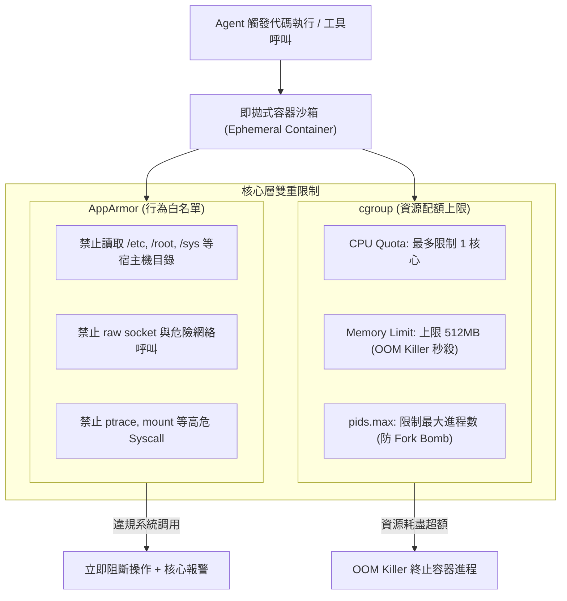

# 15. 核心技術解讀：AppArmor 與 cgroup 容器隔離

- **對話輪次**：第 18 輪對話 (Turn 18 / Step 196)
- **記錄日期**：`2026-09-13`
- **所屬階段**：**Phase 4: 企業提案、專題解讀與成果歸檔**
- **核心關鍵字**：`AppArmor` `cgroup` `容器沙箱` `資源配額` `強制存取控制` `縱深防禦`
- **主題概述**：回應使用者「AppArmor+cgroup 是甚麼」之提問，深入剖析 Linux 核心級安全機制在 AI 服務鏈第五節點（沙箱/容器）之協同防禦體系——AppArmor 管行為安全、cgroup 管資源穩定。

---

## 🔗 知識脈絡與雙向關聯網絡 (Context & Bilateral Links)

* **上一篇 (Previous)**：[[14-核心技術解讀-D2與D3敏感資料分級]]：解析了資料密級。
* **下一篇 (Next)**：[[16-核心技術解讀-OPA與Rego政策三維裁決]]：接續探討應用層政策裁決引擎 OPA/Rego。
* **中央索引 (Master Index)**：[[00-Index-AI-Service-Chain-Summary-Report-知識地圖]]
* **橫向架構關聯 (Cross References)**：
  - [[04-K8s算力中心PAM與PQ-Tunnel零信任架構|04. K8s 算力中心 PAM]]：AppArmor 與 cgroup 為 K8s 工作節點底層核心防禦支柱。
  - [[09-DeepAgents-16章全景架構深度研析|09. Deep Agents 16 章研析]]：對應 Ch10 沙箱技術 (Sandbox-as-Tool) 的系統層加固。

---

## 👤 使用者原始需求指令

> AppArmor+cgroup 是甚麼

---

## 🤖 AI 助理深入研析與方案產出

### 1. 兩大核心技術本質與職責劃分

在 Agent 執行不受信任的程式碼、直譯器腳本或工具呼叫時，作業系統核心層提供雙重保障：

```
┌────────────────────────────────────────────────────────────────────────┐
│             Linux 核心層雙軌安全屏障 (Container Hardening)             │
├───────────────────────────────────┬────────────────────────────────────┤
│   🛡️ AppArmor (Application Armor) │   ⚖️ cgroup (Control Groups)        │
├───────────────────────────────────┼────────────────────────────────────┤
│ • 本質：強制存取控制 (MAC) 核心模組│ • 本質：核心級進程資源配額管控機制 │
│ • 哲學：管「能做什麼」 (行為面安全)│ • 哲學：管「能用多少」 (資源面穩定)│
│ • 機制：為容器載入唯讀 Profile     │ • 機制：為進程群組劃定硬性資源邊界 │
│ • 範圍：限制檔案路徑、網路、Syscall│ • 範圍：CPU時間、記憶體、I/O、進程數│
│ • 類比：像是一張「嚴格的許可清單」│ • 類比：像是一份「剛性的資源預算」 │
└───────────────────────────────────┴────────────────────────────────────┘
```

---

### 2. 沙箱內部協同防禦機制



---

### 3. 本案 AI 服務鏈中的三大防護價值

1. **防範沙箱逃逸 (Sandbox Escape)**：
   - 即使 LLM 遭受高階提示注入，產生利用核心漏洞嘗試提升權限的代碼，**AppArmor 白名單直接封鎖底層 Syscall**，確保宿主作業系統進程不受感染。
2. **防範惡意暴衝與 Fork Bomb (資源耗盡攻擊)**：
   - 若 Agent 陷入死迴圈或被惡意指令誘導執行 `while True: fork()`，**cgroup 的 `pids.max` 與 CPU 配額會在秒級限制其資源佔用**，徹底保護 GPU 算力節點不被單一失控任務拖垮。
3. **搭配「四級沙箱」形成立體防線**：
   - L0 語言層驗證 → L1 程序層過濾 → **L2 容器層 (AppArmor+cgroup)** → L3 微虛擬機 (gVisor/Kata)。形成無懈可擊的層層防護。

---

## 💡 深度理解與架構啟示

* **「安全」與「穩定」不可偏廢**：許多系統只注重安全（防止駭客偷資料），卻忽視了穩定（防止系統被自己產生的 Agent 癱瘓）。**AppArmor 保障了安全邊界，而 cgroup 保障了系統可用性**，兩者是高併發 AI 算力中心得以穩健運行的底層守護神。
