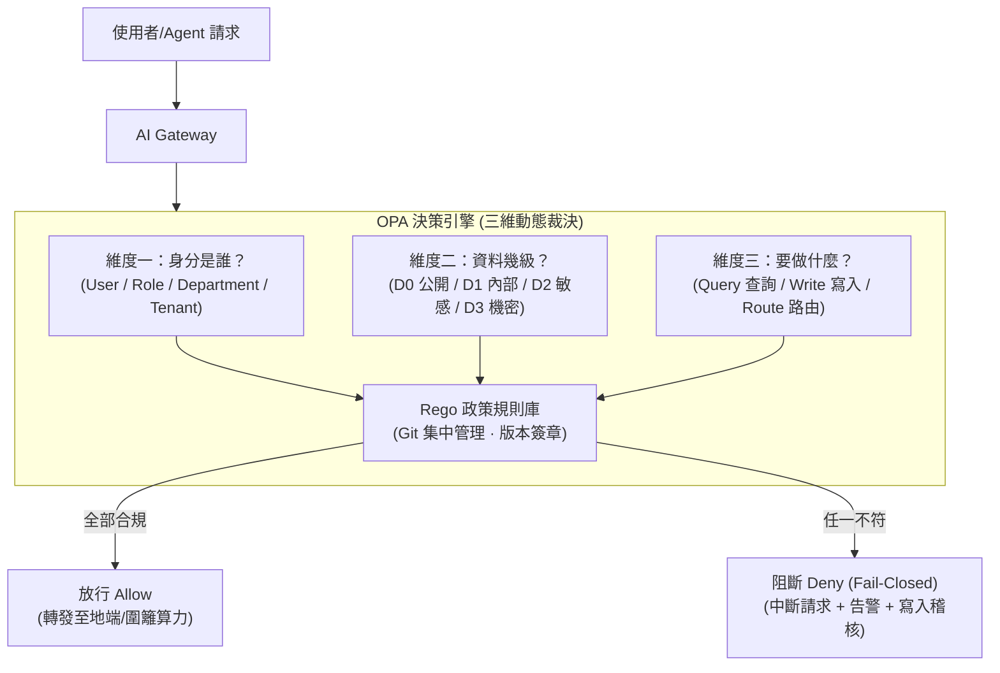

# 16. 核心技術解讀：OPA 與 Rego 政策三維裁決

- **對話輪次**：第 19 輪對話 (Turn 19 / Step 198)
- **記錄日期**：`2026-09-13`
- **所屬階段**：**Phase 4: 企業提案、專題解讀與成果歸檔**
- **核心關鍵字**：`OPA` `Rego` `PolicyAsCode` `三維裁決` `單一閘道` `FailClosed`
- **主題概述**：回應使用者「OPA/Rego 是甚麼？」之提問，深入剖析 Open Policy Agent (OPA) 與宣告式政策語言 Rego 在 AI Gateway 執行「政策即程式碼」(Policy as Code) 之架構設計與「身分 × 分級 × 用途」三維授權裁決。

---

## 🔗 知識脈絡與雙向關聯網絡 (Context & Bilateral Links)

* **上一篇 (Previous)**：[[15-核心技術解讀-AppArmor與cgroup容器隔離]]：探討作業系統核心層之沙箱隔離機制。
* **下一篇 (Next)**：[[17-總結報告科技感版手工修訂基準確立]]：完成核心技術研析後，回歸交付物版本基準之確認。
* **中央索引 (Master Index)**：[[00-Index-AI-Service-Chain-Summary-Report-知識地圖]]
* **橫向架構關聯 (Cross References)**：
  - [[01-五大原則與AI服務鏈初版總結報告|01. 五大原則初版報告]]：單一閘道原則的控制中樞。
  - [[05-護欄運作循序流程與五階防護機制|05. 護欄運作循序流程]]：時序圖中 Step 4 裁決運算的核心邏輯。
  - [[14-核心技術解讀-D2與D3敏感資料分級|14. 核心技術解讀：D2/D3 資料分級]]：三維裁決中「資料分級」維度的規則基線。

---

## 👤 使用者原始需求指令

> OPA/Rego 是甚麼？

---

## 🤖 AI 助理深入研析與方案產出

### 1. OPA 與 Rego 的本質與關係

```
┌────────────────────────────────────────────────────────────────────────┐
│                      OPA (Open Policy Agent) 與 Rego                   │
├───────────────────────────────────┬────────────────────────────────────┤
│   🏛️ OPA (Open Policy Agent)      │   📜 Rego 政策描述語言             │
├───────────────────┼────────────────────────────────────┤
│ • CNCF 頂級畢業專案，通用開源政策引擎│ • OPA 專用的宣告式政策描述語言     │
│ • 職責：充當「獨立且客觀的法官」   │ • 職責：充當「清晰可讀的法律條文」 │
│ • 特色：將「授權政策」與「業務代碼」│ • 特色：專注於資料查詢與結構匹配   │
│   徹底解耦，獨立部署、版本化控管   │   表達能力強、高度最佳化求值速度   │
└───────────────────────────────────┴────────────────────────────────────┘
```

---

### 2. AI Gateway 中的三維裁決架構

在全院 AI 服務鏈中，OPA 部署於 **AI Gateway（第三節點）**，充當進入模型推論前的唯一裁判關卡：



---

### 3. Rego 實戰規則代碼示範

```rego
package aigroups.defense.gateway

default allow = false  # 鋼鐵防線：預設拒絕 (Fail-Closed)

# 規則 1：一般研究員只能存取 D1 以下資料並使用 L1/L2 模型
allow {
    input.user.role == "researcher"
    input.data.classification <= "D1"
    input.request.purpose == "knowledge_search"
}

# 規則 2：D2/D3 敏感與機密資料絕對禁止送往雲端模型 (硬性紅線)
deny {
    input.data.classification in ["D2", "D3"]
    input.target.environment == "cloud"
}

# 規則 3：高衝擊動作（資料庫寫入、對外派工）強制要求 HITL 審核簽章
allow {
    input.action.impact_level == "high"
    input.hitl_approval.signed == true
    input.hitl_approval.role in ["commander", "legal_officer"]
}
```

---

### 4. 為什麼用 OPA 而非在程式碼中寫 `if-else`？

| 比較維度 | 寫死在 Gateway 程式碼中 (`if-else`) | 採用 OPA / Rego 政策即程式碼 |
|:---|:---|:---|
| **規則更新** | 每次變更需修改代碼、重新編譯、重啟 Gateway。 | **即時生效**：更新 Rego 檔案，毫秒級熱重載生效。 |
| **版本管控與審計** | 規則隱藏在千行代碼中，難以審計。 | **GitOps 版本化**：每條安全規則獨立 Commit、Code Review。 |
| **可維護性** | 易產生義大利麵條代碼與邏輯漏洞。 | **聲明式邏輯**：高階政策直觀表達，一目了然。 |
| **安全性** | 容易被例外繞過或遺漏預設處理。 | **強一致性 Fail-Closed**：未明確允許者一律拒絕。 |

---

## 💡 深度理解與架構啟示

* **「政策即程式碼」(Policy as Code) 的革命性意義**：在現代國防資安架構中，「誰能做什麼」絕不能依賴程序員的手寫邏輯，而必須成為可量化、可測試、可審計的「代碼化政策」。OPA 將法規政策（ISO 42001, NIST SP 800-53）直接轉譯為機器可執行的 Rego 規則，真正實現了**資安防護的數學級嚴密性**。
